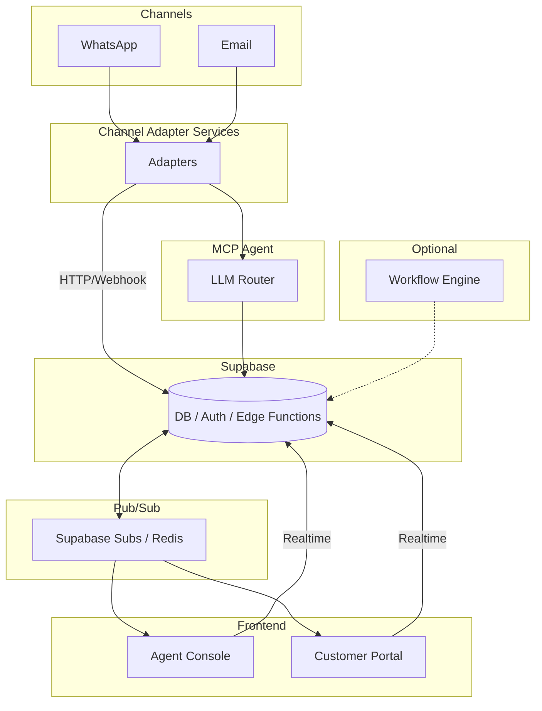

# Faladesk

Faladesk is an open-source, multi-tenant SaaS platform for customer support (SAC) tailored for Brazil and Latin America. It integrates chat and ticket management across popular channels and provides AI-powered agents that can automatically resolve customer queries.

## Project Summary

**Purpose:** Provide businesses with a single platform to handle customer support from WhatsApp, email, and other channels while using AI to automate replies or escalate to human agents.

**Audience:** Small and medium businesses or integrators who need an extensible SAC platform.

**Technologies:** Built with [Supabase](https://supabase.com/) for authentication and realtime data, a React frontend (using Gluestack UI), and optional Kubernetes deployment.

## Key Features

- Multi-tenant organizations with role-based access (admin, agent)
- Conversational support with tickets stored in Supabase
- Channel adapters for WhatsApp (Twilio, 360Dialog) and Email
- MCP agents using OpenAI for automated support
- Realtime syncing with Supabase subscriptions
- Optional customer portal for viewing ticket history
- Custom workflow rules (e.g., auto-response, escalation triggers)
- Designed for Kubernetes deployment

## Architecture Diagram


```

## Database Schema

The database schema lives in [`supabase/schema.sql`](./supabase/schema.sql) and
defines a minimal set of tables:

- **organizations** – tenant companies using the platform.
- **memberships** – links `auth.users` to organizations.
- **conversations** – support threads tied to an organization and channel.
- **messages** – individual messages within a conversation.
- **workflows** – automation rules that can trigger actions.

## Deploying the Schema

Run `supabase db push` from the `supabase` directory to apply the schema to your
Supabase project. If you prefer migrations, commit the generated SQL with
`supabase db commit` and apply it in your deployment pipeline.

## Environment Variables

Copy `supabase/.env.example` to `supabase/.env` and provide your own
credentials for Supabase and OpenAI:

```bash
cp supabase/.env.example supabase/.env
```

Edit the new `.env` file and set the following variables:

- `SUPABASE_URL` – your Supabase project URL
- `SUPABASE_SERVICE_ROLE_KEY` – service role key
- `SUPABASE_ANON_KEY` – anonymous key
- `OPENAI_API_KEY` – OpenAI API token

## Channel Adapters and Realtime Updates

Channel adapters send incoming webhooks to the `message-handler` edge function
(`supabase/functions/channel-webhook.ts`). This function persists messages to the
`messages` table. The React frontend subscribes to realtime changes on that table
so new messages appear instantly for agents.

When no human agent is assigned to a conversation, the
[`ai-respond.ts`](./supabase/functions/ai-respond.ts) function is invoked
automatically to generate a reply using OpenAI.

## Folder Structure

- [`/apps/frontend`](./apps/frontend) – React interface for agents and customers
- [`/supabase`](./supabase) – Edge functions and SQL migrations
- [`/functions`](./functions) – Channel adapter webhooks (e.g., WhatsApp, Email)
- [`/docs`](./docs) – Diagrams and documentation
- [`/k8s`](./k8s) – Kubernetes manifests
- [`/docker`](./docker) – Dockerfiles and Compose configuration

## License

Faladesk is released under the Business Source License 1.1. It is free for personal or internal business use. Commercial resale or providing it as a service requires a separate license. See [`LICENSE`](./LICENSE) for details.
