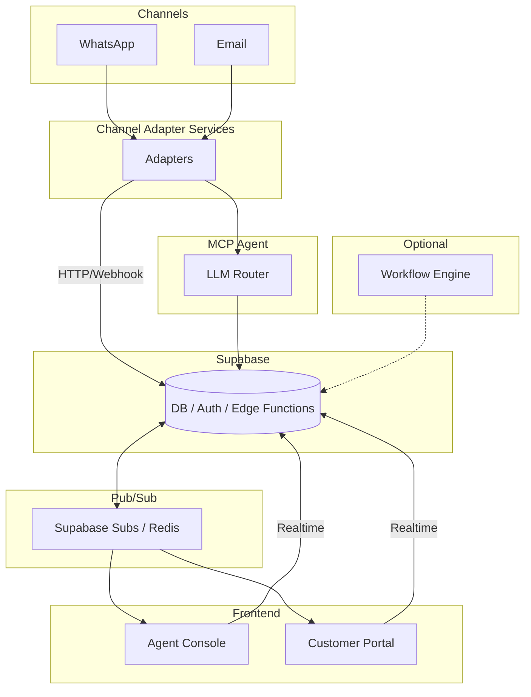

# Faladesk

Faladesk is an open-source, multi-tenant SaaS platform for customer support (SAC) tailored for Brazil and Latin America. It integrates chat and ticket management across popular channels and provides AI-powered agents that can automatically resolve customer queries.

## Project Summary

**Purpose:** Provide businesses with a single platform to handle customer support from WhatsApp, email, and other channels while using AI to automate replies or escalate to human agents.

**Audience:** Small and medium businesses or integrators who need an extensible SAC platform.

**Technologies:** Built with [Supabase](https://supabase.com/) for authentication and realtime data, a React frontend (using Gluestack UI), and optional Kubernetes deployment.

## Key Features

- Multi-tenant organizations with role-based access (admin, agent)
- Conversational support with tickets stored in Supabase
- Channel adapters for WhatsApp (Twilio, 360Dialog) and Email
- MCP agents using OpenAI for automated support
- Realtime syncing with Supabase subscriptions
- Admins can invite teammates by email
- Optional customer portal for viewing ticket history
- Custom workflow rules (e.g., auto-response, escalation triggers)
- Designed for Kubernetes deployment

## Architecture Diagram



## Database Schema

The database schema lives in [`supabase/schema.sql`](./supabase/schema.sql) and
defines a minimal set of tables:

- **organizations** – tenant companies using the platform.
- **users** – platform users tied to an organization.
- **conversations** – support threads tied to an organization and channel.
- **messages** – individual messages within a conversation.
- **workflows** – automation rules that can trigger actions.
- **invites** – pending invitations for new users.

## Deploying the Schema

Run `supabase db push` from the `supabase` directory to apply the schema to your
Supabase project. If you prefer migrations, commit the generated SQL with
`supabase db commit` and apply it in your deployment pipeline.

## Environment Variables

Copy `supabase/.env.example` to `supabase/.env` and provide your own
credentials for Supabase and OpenAI:

```bash
cp supabase/.env.example supabase/.env
```

Edit the new `.env` file and set the following variables:

- `SUPABASE_URL` – your Supabase project URL
- `SUPABASE_SERVICE_ROLE_KEY` – service role key
- `SUPABASE_ANON_KEY` – anonymous key
- `OPENAI_API_KEY` – OpenAI API token

For the React app, copy `.env.example` to `.env` in the project root and set:

- `VITE_SUPABASE_URL` – your Supabase project URL
- `VITE_SUPABASE_ANON_KEY` – anonymous key for the client

You can run `./init.sh` to create the required `.env` files automatically and
apply the database schema if the Supabase CLI is installed.

## Channel Adapters and Realtime Updates

Channel adapters send incoming webhooks to the `message-handler` edge function
(`supabase/functions/channel-webhook.ts`). This function persists messages to the
`messages` table. The React frontend subscribes to realtime changes on that table
so new messages appear instantly for agents.

When no human agent is assigned to a conversation, the
[`route-to-ai.ts`](./supabase/functions/route-to-ai.ts) function (the MCP
Agent) is invoked to generate a reply using OpenAI.

## Folder Structure

- [`web/`](./web) – React interface for agents and customers
- [`supabase/`](./supabase) – Edge functions and SQL migrations
- `functions/` – Channel adapter webhooks (planned)
- `docs/` – Diagrams and documentation (planned)
- `k8s/` – Kubernetes manifests (planned)
- `docker/` – Dockerfiles and Compose configuration (planned)

## Running the React Interface and Edge Functions

### Prerequisites

- **Node.js** 18 or newer
- **Supabase CLI** installed globally (`npm install -g supabase`)
- **Deno** (used for Supabase edge functions)

### Start the React interface

The React agent console lives in [`web/`](./web). To run it locally:

```bash
cd web
npm install --legacy-peer-deps  # instala dependências nativas do Gluestack
npm run dev
```

This launches the app with Vite at `http://localhost:5173`.
When opened in the browser you should see the login form with the button
labelled **"Entrar"**.

Alternatively, build and run everything with Docker Compose. This will start a
local Supabase stack alongside the frontend:

```bash
cp .env.example .env # fill in Supabase keys
docker compose up --build
```

The frontend is available at `http://localhost:3000` and Supabase exposes its
services on ports `54321`, `54322` and `8000`.

### Deploying edge functions

Supabase edge functions reside in [`supabase/functions`](./supabase/functions).
To serve them locally:

```bash
cd supabase
supabase functions serve --no-verify-jwt
```

When you're ready to deploy:

```bash
supabase functions deploy ai-respond
supabase functions deploy channel-webhook
supabase functions deploy message-handler
supabase functions deploy route-to-ai
supabase functions deploy invite-user
```

Ensure your Supabase URL and keys are configured in your environment before deploying.

## Public Landing Page

A minimal Node server under `server/` renders a search‑engine friendly landing
page at `/`. The markup lives in `server/landing.html`. After building the React
interface you can launch it with:

```bash
npm run build --prefix web
node server/server.js
```

Visit `http://localhost:8080` to view the marketing page. The "Create Account"
button links to the React application under `/app`.

## Testing

Vitest is used for frontend unit and integration tests located in `apps/frontend/tests`. Deno's built-in `deno test` runs the edge function tests under `supabase/functions/tests`.

Run all tests:

```bash
# Frontend
cd web && npm install
npm run test

# Edge functions
cd ../supabase/functions
deno test -A
```

## License

Faladesk is released under the Business Source License 1.1. It is free for personal or internal business use. Commercial resale or providing it as a service requires a separate license. See [`LICENSE`](./LICENSE) for details.
