# 3. Modelo de Dados

## Visão Modular

| Módulo Django | Propósito | Entidades Principais |
| --- | --- | --- |
| `core` | Identidade multi-tenant, usuários, papéis, auditoria | `tenant`, `tenant_domain`, `tenant_setting`, `tenant_subscription`, `tenant_invitation`, `user`, `tenant_user`, `tenant_user_preference`, `role`, `permission`, `role_permission`, `role_assignment`, `login_token`, `service_account`, `service_account_key`, `audit_log` |
| `organizations` | Estrutura operacional e SLAs | `org_unit`, `org_unit_membership`, `org_unit_escalation`, `schedule`, `schedule_exception`, `sla_policy`, `sla_target`, `sla_event`, `queue_rule`, `org_unit_tag` |
| `channels` | Conectores externos e contas de canal | `channel_connector`, `channel_account`, `channel_capability`, `channel_token`, `channel_webhook`, `channel_health_check`, `channel_usage_log`, `channel_mapping`, `channel_fallback` |
| `contacts` | Gestão de contatos e identificadores | `contact`, `contact_identity`, `contact_attribute`, `contact_preference`, `contact_consent`, `contact_segment` |
| `messaging` | Conversas, mensagens e anexos | `conversation`, `conversation_participant`, `conversation_assignment`, `conversation_state`, `message`, `message_segment`, `message_attachment`, `message_delivery`, `message_reaction`, `conversation_event`, `conversation_timer`, `conversation_queue_entry`, `conversation_tag` |
| `tickets` | Tickets e workflow | `ticket`, `ticket_assignment`, `ticket_participant`, `ticket_status_history`, `ticket_comment`, `ticket_attachment`, `ticket_worklog`, `ticket_custom_field`, `ticket_custom_field_value`, `ticket_tag` |
| `knowledge` | Conteúdo reutilizável e respostas | `quick_reply`, `knowledge_category`, `knowledge_article`, `knowledge_article_version`, `knowledge_article_feedback`, `knowledge_article_tag`, `knowledge_portal`, `knowledge_portal_article`, `knowledge_suggestion`, `knowledge_attachment` |
| `automation` | Fluxos automatizados e execuções | `automation_flow`, `automation_flow_version`, `automation_trigger`, `automation_node_template`, `automation_node_instance`, `automation_run`, `automation_run_step`, `automation_job`, `automation_variable`, `automation_audit`, `automation_connection`, `automation_connection_secret` |
| `analytics` | Métricas agregadas | `analytics_event`, `analytics_event_meta`, `analytics_dimension`, `analytics_snapshot`, `analytics_materialized_view`, `analytics_job`, `analytics_alert`, `analytics_dashboard` |
| `tags` | Taxonomia multiuso | `tag_category`, `tag`, `tag_group`, `tag_group_item`, `tag_link`, `tag_rule`, `tag_audit` |
| `gamification` | Engajamento & rankings | `gamification_profile`, `gamification_level`, `gamification_rule`, `gamification_event`, `gamification_transaction`, `gamification_badge`, `gamification_badge_assignment`, `gamification_leaderboard`, `gamification_leaderboard_entry`, `gamification_challenge`, `gamification_feedback` |
| `notifications` | Alertas inteligentes | `notification_preference`, `notification_template`, `notification_rule`, `notification_inbox`, `notification_digest`, `notification_channel_token`, `notification_queue`, `notification_subscription` |
| `internal_chat` | Comunicação interna estilo Slack/Discord | `internal_chat_channel`, `internal_chat_channel_member`, `internal_chat_thread`, `internal_chat_message`, `internal_chat_message_attachment`, `internal_chat_message_reaction`, `internal_chat_presence`, `internal_chat_voice_session`, `internal_chat_voice_participant`, `internal_chat_voice_recording`, `internal_chat_call_log`, `internal_chat_status` |

## Detalhamento por Módulo

### Módulo `core`

| Entidade | Campos Principais | Notas LGPD/RLS |
| --- | --- | --- |
| `tenant` | `id (UUID✓ idx)`, `schema_name`, `nome (str✓)`, `slug (str✓ idx)`, `default_language`, `status` | Escopo lógico para RLS; base para sharding. |
| `tenant_domain` | `id`, `tenant_id (FK✓ idx)`, `domínio (str✓ uniq)` | Subdomínios e links mágicos. |
| `tenant_setting` | `id`, `tenant_id`, `chave`, `valor (JSONB)` | Configuração granular (branding, LGPD, billing). |
| `tenant_subscription` | `id`, `tenant_id`, `plano`, `licencas`, `status` | Controle de cobrança e limites. |
| `tenant_invitation` | `id`, `tenant_id`, `email`, `token`, `expires_at`, `role_default_id?` | Fluxo de convite e onboarding. |
| `user` | `id`, `email (str✓ uniq)`, `nome (str✓)`, `idioma (enum)` | PII criptografada em repouso. |
| `tenant_user` | `id`, `tenant_id (FK✓ idx)`, `user_id (FK✓ idx)`, `status (enum✓)` | Controla membership multi-tenant. |
| `tenant_user_preference` | `id`, `tenant_user_id`, `theme`, `notifications (JSONB)` | Preferências individuais. |
| `role` | `id`, `tenant_id`, `nome (str✓)`, `escopo (enum)` | RBAC customizável por tenant. |
| `permission` | `id`, `codigo`, `categoria` | Catálogo global de permissões. |
| `role_permission` | `id`, `role_id`, `permission_id`, `restricoes (JSONB?)` | Permite granularidade. |
| `role_assignment` | `id`, `tenant_user_id`, `role_id`, `org_unit_id?`, `scope_type?` | Limita escopo por unidade/time. |
| `login_token` | `id`, `tenant_id?`, `user_id`, `token`, `expires_at` | Autenticação por link mágico. |
| `service_account` | `id`, `tenant_id`, `nome`, `status` | Integrações internas/API. |
| `service_account_key` | `id`, `service_account_id`, `key_id`, `hashed_secret`, `expires_at?` | Rotação de credenciais. |
| `audit_log` | `id`, `tenant_id`, `actor_id`, `evento`, `payload`, `registrado_em` | Imutável e consultável por compliance. |

> Para detalhes completos, ver `docs/modules/core.md`.

### Módulo `organizations`

| Entidade | Campos Principais | Notas |
| --- | --- | --- |
| `org_unit` | `id`, `tenant_id`, `parent_id?`, `nome`, `tipo`, `status`, `sla_policy_id?`, `schedule_id?`, `ordem` | Representa departamentos/filas/squads. |
| `org_unit_membership` | `id`, `org_unit_id`, `tenant_user_id`, `papel`, `prioridade`, `ativo` | Relaciona usuários às unidades. |
| `org_unit_escalation` | `id`, `org_unit_id`, `ordem`, `destino_type`, `destino_id`, `condicao`, `timeout_minutes?` | Regras de transbordo. |
| `schedule` | `id`, `tenant_id`, `nome`, `timezone`, `config (JSON)` | Agenda padrão. |
| `schedule_exception` | `id`, `schedule_id`, `data_inicio`, `data_fim`, `status_atendimento` | Feriados/ajustes. |
| `sla_policy` | `id`, `tenant_id`, `nome`, `tempo_resposta`, `tempo_resolução`, `horário_trabalho (FK schedule)`, `tolerancia` | Regras dinâmicas. |
| `sla_target` | `id`, `sla_policy_id`, `canal`, `prioridade`, `tempo_resposta`, `tempo_resolução` | Ajustes por canal/prioridade. |
| `sla_event` | `id`, `tenant_id`, `org_unit_id?`, `alvo_type`, `alvo_id`, `status`, `deadline`, `violado_em`, `resolvido_em` | Controle de prazos. |
| `queue_rule` | `id`, `org_unit_id`, `ordem`, `condicao (JSON)`, `acao (JSON)`, `ativo` | Roteamento e prioridades. |
| `org_unit_tag` | `id`, `org_unit_id`, `tag_id`, `escopo` | Tags automáticas por unidade. |

### Módulo `channels`

| Entidade | Campos Principais | Notas |
| --- | --- | --- |
| `channel_connector` | `id`, `tenant_id`, `tipo (enum)`, `config (JSON)`, `status`, `ultimo_heartbeat` | Armazena credenciais (criptografadas) por provedor. |
| `channel_account` | `id`, `connector_id`, `identidade (str)`, `nome_exibição`, `status`, `org_unit_id?`, `intake_flow_id?`, `webhook_url?` | Contas específicas do conector com roteamento. |
| `channel_capability` | `id`, `connector_id`, `feature`, `enabled`, `constraints (JSON)` | Recursos suportados. |
| `channel_token` | `id`, `connector_id`, `kind`, `valor_encrypted`, `expires_at` | Tokens/API keys. |
| `channel_webhook` | `id`, `connector_id`, `evento`, `url`, `segredo?`, `status` | Destinos por evento. |
| `channel_health_check` | `id`, `connector_id`, `status`, `mensagem`, `executado_em`, `duracao_ms?` | Monitoramento de saúde. |
| `channel_usage_log` | `id`, `connector_id`, `account_id?`, `tipo`, `quantidade`, `data` | Métricas de uso diário. |
| `channel_mapping` | `id`, `connector_id`, `chave_externa`, `entidade_type`, `entidade_id` | Mapeia IDs externos para internos. |
| `channel_fallback` | `id`, `account_id`, `tipo`, `destino`, `ativo` | Rotas de contingência. |

> Para detalhes completos, ver `docs/modules/channels.md`.

### Módulo `contacts`

| Entidade | Campos Principais | Notas LGPD |
| --- | --- | --- |
| `contact` | `id`, `tenant_id`, `nome`, `documento`, `empresa`, `nota_privada` | Dados pessoais com mask/encryption. |
| `contact_identity` | `id`, `contact_id`, `tipo (enum)`, `valor (str✓ idx)`, `verificado (bool)`, `principal (bool)` | Normaliza identidades. |
| `contact_attribute` | `id`, `tenant_id`, `chave`, `tipo`, `opcoes (JSON)`, `sensivel` | Campos personalizados. |
| `contact_attribute_value` | `id`, `contact_id`, `attribute_id`, `valor (JSON)`, `atualizado_em` | Valores por contato. |
| `contact_note` | `id`, `contact_id`, `autor_id`, `conteudo`, `fixada`, `created_at` | Notas internas. |
| `contact_attachment` | `id`, `contact_id`, `arquivo_url`, `mime`, `tamanho`, `uploaded_by_id` | Arquivos vinculados. |
| `contact_preference` | `id`, `contact_id`, `canal`, `opt_in`, `motivo`, `valid_until` | Preferências de comunicação. |
| `contact_consent` | `id`, `contact_id`, `tipo`, `status`, `registrado_em`, `origem` | Consentimentos LGPD. |
| `contact_relationship` | `id`, `contact_source_id`, `contact_target_id`, `tipo`, `metadata` | Relacionamentos entre contatos. |
| `contact_merge_request` | `id`, `primary_contact_id`, `duplicate_contact_id`, `status`, `detalhes` | Fluxo de fusão. |
| `contact_segment` | `id`, `tenant_id`, `nome`, `criterios (JSON)`, `tipo`, `status` | Segmentos dinâmicos/estáticos. |
| `contact_segment_membership` | `id`, `segment_id`, `contact_id`, `atualizado_em` | Associação contato-segmento. |

> Para detalhes completos, ver `docs/modules/contacts.md`.

### Módulo `messaging`

| Entidade | Campos Principais | Notas |
| --- | --- | --- |
| `conversation` | `id`, `tenant_id`, `channel_account_id`, `contact_id`, `org_unit_id?`, `status`, `priority`, `last_message_at`, `ticket_id?` | Caixa de entrada unificada. |
| `conversation_participant` | `id`, `conversation_id`, `tenant_user_id`, `papel`, `joined_at`, `left_at?`, `active` | Histórico de participantes. |
| `conversation_assignment` | `id`, `conversation_id`, `assigned_to_id`, `org_unit_id`, `tipo`, `motivo`, `started_at`, `ended_at?` | Auditoria de atribuições. |
| `conversation_state` | `id`, `conversation_id`, `locked_by_id?`, `typing_users (JSON)`, `drafts (JSON)` | Estado volátil persistido. |
| `message` | `id`, `conversation_id`, `sender_type`, `sender_id`, `direction`, `kind`, `payload`, `status`, `sent_at?` | Payload criptografado quando sensível. |
| `message_segment` | `id`, `message_id`, `ordem`, `tipo`, `conteudo (JSON)` | Segmentos estruturados. |
| `message_attachment` | `id`, `message_id`, `arquivo_url`, `mime`, `tamanho`, `av_status` | Presigned URLs + antivírus opcional. |
| `message_delivery` | `id`, `message_id`, `status`, `provider_status?`, `registrado_em` | Histórico de entrega. |
| `message_reaction` | `id`, `message_id`, `tenant_user_id`, `emoji`, `registrado_em` | Reações internas. |
| `conversation_event` | `id`, `conversation_id`, `tipo`, `payload (JSON)`, `registrado_por_type`, `registrado_em` | Linha do tempo de eventos. |
| `conversation_timer` | `id`, `conversation_id`, `tipo`, `status`, `due_at`, `metadata` | Timers de SLA/follow-up. |
| `conversation_queue_entry` | `id`, `conversation_id`, `org_unit_id`, `prioridade_score`, `enqueued_at`, `dequeued_at?` | Fila de espera. |
| `conversation_tag` | `id`, `conversation_id`, `tag_id`, `aplicado_por_id?`, `aplicado_em` | Alias otimizado de `tag_link`. |

> Para detalhes completos, ver `docs/modules/messaging.md`.

### Módulo `tickets`

| Entidade | Campos Principais | Notas |
| --- | --- | --- |
| `ticket` | `id`, `tenant_id`, `org_unit_id`, `conversation_id?`, `contact_id`, `numero`, `titulo`, `status`, `prioridade`, `origem`, `sla_policy_id?` | Registro central de demanda. |
| `ticket_category` | `id`, `tenant_id`, `nome`, `slug`, `parent_id?`, `ordem` | Taxonomia hierárquica. |
| `ticket_assignment` | `id`, `ticket_id`, `assigned_to_id`, `org_unit_id`, `tipo`, `motivo`, `started_at`, `ended_at?` | Histórico de responsáveis. |
| `ticket_participant` | `id`, `ticket_id`, `tenant_user_id`, `papel`, `added_at`, `removed_at?` | Participantes extras. |
| `ticket_status_history` | `id`, `ticket_id`, `status_anterior`, `status_novo`, `motivo`, `alterado_em`, `comentario?` | Auditoria de status. |
| `ticket_comment` | `id`, `ticket_id`, `autor_type`, `autor_id`, `tipo`, `conteudo`, `created_at` | Comentários internos/externos. |
| `ticket_attachment` | `id`, `ticket_id`, `arquivo_url`, `mime_type`, `tamanho`, `uploaded_by_type`, `uploaded_by_id`, `av_status` | Anexos controlados. |
| `ticket_worklog` | `id`, `ticket_id`, `tenant_user_id`, `tempo_minutos`, `descricao`, `registrado_em` | Tempo trabalhado. |
| `ticket_custom_field` | `id`, `tenant_id`, `chave`, `tipo`, `escopo`, `obrigatorio`, `sensivel` | Campos extras configuráveis. |
| `ticket_custom_field_value` | `id`, `ticket_id`, `field_id`, `valor (JSON)`, `updated_at` | Valores customizados. |
| `ticket_tag` | `id`, `ticket_id`, `tag_id`, `aplicado_por_id?`, `aplicado_em` | Alias otimizado de `tag_link`. |

> Para detalhes completos, ver `docs/modules/tickets.md`.

### Módulo `knowledge`

| Entidade | Campos Principais | Notas |
| --- | --- | --- |
| `quick_reply` | `id`, `tenant_id`, `org_unit_id?`, `titulo`, `conteúdo`, `idioma`, `atalho?`, `status`, `usage_count?` | Respostas rápidas multi-idioma. |
| `knowledge_category` | `id`, `tenant_id`, `nome`, `slug`, `parent_id?`, `ordem` | Taxonomia de artigos. |
| `knowledge_article` | `id`, `tenant_id`, `category_id?`, `titulo`, `slug`, `conteúdo`, `idioma`, `tipo`, `status`, `versao` | Repositório público/privado. |
| `knowledge_article_version` | `id`, `article_id`, `versao`, `conteudo`, `status`, `autor_id`, `criado_em` | Histórico de versões. |
| `knowledge_article_feedback` | `id`, `article_id`, `source_type`, `score`, `comentario?`, `registrado_em` | Feedback/CSAT de artigos. |
| `knowledge_article_tag` | `id`, `article_id`, `tag_id` | Alias otimizado de `tag_link`. |
| `knowledge_portal` | `id`, `tenant_id`, `slug`, `titulo`, `tipo`, `idiomas (JSON)`, `status`, `tema?`, `homepage_section_id?` | Portal externo/interno. |
| `knowledge_portal_section` | `id`, `portal_id`, `parent_id?`, `titulo`, `slug`, `ordem`, `tipo`, `visibilidade`, `icone?` | Sitemap hierárquico. |
| `knowledge_portal_article` | `id`, `portal_id`, `section_id?`, `article_id`, `ordem?`, `destacado` | Posicionamento no portal. |
| `knowledge_suggestion` | `id`, `article_id`, `conversation_id?`, `ticket_id?`, `suggested_by`, `context (JSON)`, `accepted?`, `created_at` | Sugestões contextuais. |
| `knowledge_attachment` | `id`, `article_id`, `arquivo_url`, `mime_type`, `tamanho`, `uploaded_by_id`, `created_at` | Anexos de artigo. |

### Módulo `automation`

| Entidade | Campos Principais | Notas |
| --- | --- | --- |
| `automation_flow` | `id`, `tenant_id`, `nome`, `slug`, `categoria`, `versao`, `status`, `builder_schema`, `entry_nodes`, `permissions` | Fluxos estilo n8n. |
| `automation_flow_version` | `id`, `flow_id`, `versao`, `builder_schema`, `changelog`, `published_by_id`, `published_at` | Snapshot versionado. |
| `automation_trigger` | `id`, `flow_id`, `tipo`, `config (JSON)`, `active`, `priority`, `auth_required` | Gatilhos de execução. |
| `automation_node_template` | `id`, `tipo`, `slug`, `nome`, `schema (JSON)`, `category`, `supports_bulk` | Catálogo de nós. |
| `automation_node_instance` | `id`, `flow_id`, `template_id`, `key`, `config (JSON)`, `position (JSON)`, `connections (JSON)` | Instâncias no fluxo. |
| `automation_run` | `id`, `flow_id`, `trigger_id?`, `status`, `context (JSON)`, `error`, `attempts`, `metrics` | Execuções. |
| `automation_run_step` | `id`, `run_id`, `node_id`, `status`, `output (JSON)`, `error (JSON)`, `started_at`, `finished_at` | Passos da run. |
| `automation_job` | `id`, `tenant_id`, `flow_id`, `type`, `payload (JSON)`, `scheduled_at`, `attempts`, `max_attempts`, `status` | Jobs agendados/delay/retry. |
| `automation_variable` | `id`, `tenant_id`, `flow_id?`, `chave`, `valor (JSON)`, `tipo`, `escopo`, `encrypted` | Variáveis/segredos. |
| `automation_audit` | `id`, `tenant_id`, `flow_id?`, `event`, `payload (JSON)`, `actor_type`, `actor_id?`, `created_at` | Auditoria.
| `automation_connection` | `id`, `tenant_id`, `tipo`, `nome`, `config (JSON)`, `status`, `metadata?`, `created_at` | Conexões externas. |
| `automation_connection_secret` | `id`, `connection_id`, `nome`, `valor_encrypted`, `rotacionado_em?` | Segredos associados. |

### Módulo `analytics`

| Entidade | Campos Principais | Notas |
| --- | --- | --- |
| `analytics_event` | `id`, `tenant_id`, `module`, `event_type`, `occurred_at`, `payload (JSON)` | Eventos normalizados multi-módulo. |
| `analytics_event_meta` | `id`, `event_id`, `status`, `processing_time_ms`, `retries`, `error?` | Telemetria da ingestão. |
| `analytics_dimension` | `id`, `tenant_id`, `tipo`, `chave`, `valor (JSON)`, `valid_from`, `valid_to?` | Dimensões historificadas. |
| `analytics_snapshot` | `id`, `tenant_id`, `escopo`, `periodo_inicio`, `periodo_fim`, `granularidade`, `metricas (JSON)` | Métricas agregadas. |
| `analytics_materialized_view` | `id`, `tenant_id`, `nome`, `consulta`, `schedule`, `status`, `ultimo_refresh_em?`, `erro?` | Views recalculáveis. |
| `analytics_job` | `id`, `tipo`, `tenant_id`, `payload (JSON)`, `status`, `scheduled_at`, `finished_at?`, `error?` | Reprocessamento/retention. |
| `analytics_alert` | `id`, `tenant_id`, `tipo`, `filtro (JSON)`, `threshold (JSON)`, `status`, `destinatarios`, `ultimo_disparo_em?` | Alertas automáticos. |
| `analytics_dashboard` | `id`, `tenant_id`, `nome`, `config (JSON)`, `visibilidade`, `created_by_id`, `created_at` | Dashboards configuráveis. |

> Para detalhes completos, ver `docs/modules/analytics.md`.

### Módulo `tags`

| Entidade | Campos Principais | Notas |
| --- | --- | --- |
| `tag_category` | `id`, `tenant_id`, `nome`, `slug`, `ordem` | Agrupa tags por domínio. |
| `tag` | `id`, `tenant_id`, `categoria_id?`, `nome`, `slug`, `cor`, `escopo`, `restrito`, `status` | Etiquetas reutilizáveis. |
| `tag_group` | `id`, `tenant_id`, `nome`, `tipo`, `descricao` | Bundles de tags. |
| `tag_group_item` | `id`, `group_id`, `tag_id`, `ordem?` | Itens do bundle. |
| `tag_link` | `id`, `tag_id`, `alvo_type`, `alvo_id`, `aplicado_por_id?`, `metadata` | Aplicação polimórfica. |
| `tag_rule` | `id`, `tenant_id`, `nome`, `condicao (JSON)`, `acoes (JSON)`, `aplica_em`, `ativo` | Regras automáticas. |
| `tag_audit` | `id`, `tenant_id`, `tag_id`, `alvo_type`, `alvo_id`, `acao`, `executado_por_type`, `executado_por_id?`, `executado_em` | Histórico de aplicação. |

> Para detalhes completos, ver `docs/modules/tags.md`.

### Módulo `gamification`

| Entidade | Campos Principais | Notas |
| --- | --- | --- |
| `gamification_profile` | `id`, `tenant_user_id`, `pontos_total`, `pontos_sazonais`, `nivel_id?`, `progresso_nivel`, `badge_count`, `last_activity_at` | Perfil por agente. |
| `gamification_level` | `id`, `tenant_id`, `nome`, `ordem`, `pontos_min`, `beneficios (JSON)` | Níveis configuráveis. |
| `gamification_rule` | `id`, `tenant_id`, `codigo`, `origem`, `pontos`, `limite_diario?`, `anonimo`, `metadata` | Regras de pontuação. |
| `gamification_event` | `id`, `tenant_id`, `rule_id`, `origin_type`, `origin_id`, `giver_id?`, `receiver_id`, `cliente_feedback_id?`, `valor_pontos`, `anonimo`, `registrado_em` | Evento que gera pontos. |
| `gamification_transaction` | `id`, `profile_id`, `event_id`, `pontos`, `saldo_total`, `saldo_sazonal`, `created_at` | Movimento de pontos. |
| `gamification_badge` | `id`, `tenant_id`, `nome`, `slug`, `descricao?`, `icone?`, `criterios (JSON)`, `tipo` | Badges disponíveis. |
| `gamification_badge_assignment` | `id`, `badge_id`, `profile_id`, `atribuido_em`, `origem_event_id?`, `expira_em?` | Badges concedidos. |
| `gamification_leaderboard` | `id`, `tenant_id`, `nome`, `escopo`, `periodo_inicio`, `periodo_fim`, `status`, `config (JSON)` | Leaderboards. |
| `gamification_leaderboard_entry` | `id`, `leaderboard_id`, `profile_id`, `posicao`, `pontuacao`, `metricas (JSON)` | Ranking por perfil. |
| `gamification_challenge` | `id`, `tenant_id`, `nome`, `descricao?`, `periodo_inicio`, `periodo_fim`, `org_unit_id?`, `metas (JSON)`, `recompensas (JSON)`, `status` | Desafios/quests. |
| `gamification_feedback` | `id`, `tenant_id`, `tipo`, `giver_id?`, `receiver_id`, `ticket_id?`, `message_id?`, `nota?`, `comentario?`, `anonimo`, `registrado_em` | Feedbacks internos/externos. |

> Para detalhes completos, ver `docs/modules/gamification.md`.
### Módulo `internal_chat`

| Entidade | Campos Principais | Notas |
| --- | --- | --- |
| `internal_chat_channel` | `id`, `tenant_id`, `nome`, `slug`, `tipo (enum: dm, text, voice, stage, anúncio)`, `privado`, `archived`, `bitrate?`, `max_participantes?`, `dm_composta?` | Canais estilo Slack/Discord. |
| `internal_chat_channel_member` | `id`, `channel_id`, `tenant_user_id`, `papel`, `muted`, `silenciado_voz?`, `notificações (JSON)` | Preferências por usuário. |
| `internal_chat_thread` | `id`, `channel_id`, `parent_message_id`, `assunto`, `status`, `criado_em` | Threads assíncronas. |
| `internal_chat_message` | `id`, `channel_id`, `thread_id?`, `tenant_user_id`, `conteúdo (JSON)`, `tipo (enum: texto, arquivo, menção, sistema, áudio, vídeo, integração)`, `fixado_em?`, `revisado_por?` | Mensagens ricas. |
| `internal_chat_message_reaction` | `id`, `message_id`, `tenant_user_id`, `emoji`, `registrado_em` | Reações rápidas. |
| `internal_chat_message_attachment` | `id`, `message_id`, `arquivo_url`, `mime`, `tamanho`, `checksum`, `av_status`, `expires_at?` | Anexos. |
| `internal_chat_presence` | `id`, `tenant_user_id`, `status`, `contexto (JSON)`, `atualizado_em` | Presença consolidada. |
| `internal_chat_voice_session` | `id`, `channel_id`, `iniciada_por_id`, `status`, `modo`, `iniciada_em`, `encerrada_em?` | Sessões de áudio. |
| `internal_chat_voice_participant` | `id`, `voice_session_id`, `tenant_user_id`, `papel`, `muted`, `hand_raised`, `joined_at`, `left_at?` | Participação em voz. |
| `internal_chat_voice_recording` | `id`, `voice_session_id`, `arquivo_url`, `mime`, `tamanho`, `duracao_seg`, `gerado_por`, `created_at` | Gravações opcionais. |
| `internal_chat_call_log` | `id`, `channel_id?`, `initiator_id`, `receiver_id`, `status`, `started_at`, `ended_at?`, `duracao_seg?`, `metadata` | Chamadas diretas. |
| `internal_chat_status` | `id`, `tenant_user_id`, `emoji`, `texto`, `expires_at?`, `atualizado_em` | Status customizados. |

### Módulo `notifications`

| Entidade | Campos Principais | Notas |
| --- | --- | --- |
| `notification_preference` | `id`, `tenant_user_id`, `categoria`, `canal (JSON)`, `quiet_hours (JSON)`, `digest_enabled`, `updated_at` | Preferências por categoria/canal. |
| `notification_template` | `id`, `tenant_id`, `codigo`, `canal`, `titulo`, `corpo`, `metadata`, `ativo` | Templates reutilizáveis. |
| `notification_rule` | `id`, `tenant_id`, `origem`, `evento`, `filtro (JSON)`, `template_id`, `prioridade`, `auto_dismiss_sec?`, `ativo` | Regras de disparo. |
| `notification_inbox` | `id`, `tenant_user_id`, `titulo`, `mensagem`, `canal`, `origem_tipo`, `origem_id`, `prioridade`, `action_url?`, `estado`, `cta_executada`, `emitido_em`, `lido_em?` | Notificações in-app/histórico. |
| `notification_digest` | `id`, `tenant_user_id`, `periodo_inicio`, `periodo_fim`, `conteudo (JSON)`, `enviado_por`, `enviado_em` | Resumos periódicos. |
| `notification_channel_token` | `id`, `tenant_user_id`, `tipo`, `token`, `valid_until?`, `metadata`, `ativo` | Tokens push/e-mail/sms. |
| `notification_queue` | `id`, `rule_id`, `tenant_user_id`, `evento_id`, `payload (JSON)`, `agendado_para?`, `status`, `tentativas`, `erro?` | Fila de envio. |
| `notification_subscription` | `id`, `tenant_user_id`, `origem`, `origem_id`, `created_at` | Subscrições opt-in por item. |

> Para detalhes completos, ver `docs/modules/internal_chat.md`.

## Diagrama ER (Mermaid)

```mermaid
erDiagram
  TENANT ||--o{ TENANT_DOMAIN : usa
  TENANT ||--o{ TENANT_USER : possui
  USER ||--o{ TENANT_USER : participa
  TENANT ||--o{ ROLE : define
  ROLE ||--o{ ROLE_ASSIGNMENT : recebe
  TENANT_USER ||--o{ ROLE_ASSIGNMENT : possui
  TENANT ||--o{ ORG_UNIT : organiza
  ORG_UNIT ||--o{ ORG_UNIT : hierarquia
  ORG_UNIT ||--o{ ORG_UNIT_MEMBERSHIP : inclui
  TENANT_USER ||--o{ ORG_UNIT_MEMBERSHIP : participa
  ORG_UNIT ||--o{ ORG_UNIT_ESCALATION : transborda
  ORG_UNIT ||--o{ QUEUE_RULE : roteia
  ORG_UNIT ||--o{ ORG_UNIT_TAG : etiqueta
  TENANT ||--o{ CHANNEL_CONNECTOR : integra
  CHANNEL_CONNECTOR ||--o{ CHANNEL_ACCOUNT : publica
  ORG_UNIT ||--o{ CHANNEL_ACCOUNT : roteia
  AUTOMATION_FLOW ||--o{ CHANNEL_ACCOUNT : intake
  CHANNEL_ACCOUNT ||--o{ CONVERSATION : inicia
  TENANT ||--o{ CONTACT : gerencia
  CONTACT ||--o{ CONTACT_IDENTITY : lista
  TENANT ||--o{ CONTACT_ATTRIBUTE : define
  CONTACT_ATTRIBUTE ||--o{ CONTACT_ATTRIBUTE_VALUE : armazena
  CONTACT ||--o{ CONTACT_ATTRIBUTE_VALUE : possui
  CONTACT ||--o{ CONTACT_NOTE : anota
  CONTACT ||--o{ CONTACT_ATTACHMENT : anexa
  CONTACT ||--o{ CONTACT_PREFERENCE : prefere
  CONTACT ||--o{ CONTACT_CONSENT : consente
  CONTACT ||--o{ CONTACT_RELATIONSHIP : relaciona
  CONTACT ||--o{ CONTACT_SEGMENT_MEMBERSHIP : segmenta
  CONTACT_SEGMENT ||--o{ CONTACT_SEGMENT_MEMBERSHIP : associa
  TENANT ||--o{ CONTACT_SEGMENT : segmenta
  CONVERSATION ||--o{ CONVERSATION_PARTICIPANT : envolve
  CONVERSATION ||--o{ CONVERSATION_ASSIGNMENT : delega
  CONVERSATION ||--o{ MESSAGE : contém
  MESSAGE ||--o{ MESSAGE_SEGMENT : compoe
  MESSAGE ||--o{ MESSAGE_ATTACHMENT : anexa
  MESSAGE ||--o{ MESSAGE_DELIVERY : status
  MESSAGE ||--o{ MESSAGE_REACTION : reage
  CONVERSATION ||--o{ CONVERSATION_EVENT : registra
  CONVERSATION ||--o{ CONVERSATION_TIMER : temporiza
  CONVERSATION ||--o{ CONVERSATION_TAG : etiqueta
  CONVERSATION ||--o{ CONVERSATION_QUEUE_ENTRY : enfileira
  CONVERSATION ||--|| CONVERSATION_STATE : estado
  ORG_UNIT ||--o{ CONVERSATION : trata
  CHANNEL_ACCOUNT ||--o{ CONVERSATION : inicia
  CONTACT ||--o{ CONVERSATION : abre
  CONVERSATION ||--o{ CONVERSATION_PARTICIPANT : envolve
  TENANT_USER ||--o{ CONVERSATION_PARTICIPANT : atua
  CONVERSATION ||--o{ MESSAGE : contém
  MESSAGE ||--o{ MESSAGE_ATTACHMENT : anexa
  CONVERSATION ||--o| TICKET : vincula
  TICKET ||--o{ TICKET_ASSIGNMENT : registra
  TICKET ||--o{ TICKET_PARTICIPANT : participa
  TICKET ||--o{ TICKET_STATUS_HISTORY : audita
  TICKET ||--o{ TICKET_COMMENT : comenta
  TICKET ||--o{ TICKET_ATTACHMENT : anexa
  TICKET ||--o{ TICKET_WORKLOG : trabalha
  TICKET ||--o{ TICKET_CUSTOM_FIELD_VALUE : personaliza
  TICKET ||--o{ TICKET_TAG : etiqueta
  TICKET_CATEGORY ||--o{ TICKET : classifica
  TICKET_CUSTOM_FIELD ||--o{ TICKET_CUSTOM_FIELD_VALUE : define
  TAG ||--o{ TICKET_TAG : marca
  CONTACT ||--o{ TICKET : abre
  ORG_UNIT ||--o{ TICKET : trata
  SLA_POLICY ||--o{ ORG_UNIT : aplica
  SLA_POLICY ||--o{ SLA_EVENT : gera
  ORG_UNIT ||--o{ SLA_EVENT : monitora
  CONVERSATION ||--o{ SLA_EVENT : monitora
  TICKET ||--o{ SLA_EVENT : monitora
  TENANT ||--o{ TAG_CATEGORY : agrupa
  TAG_CATEGORY ||--o{ TAG : define
  TENANT ||--o{ TAG_GROUP : pacote
  TAG_GROUP ||--o{ TAG_GROUP_ITEM : inclui
  TAG ||--o{ TAG_GROUP_ITEM : compoe
  TAG ||--o{ TAG_LINK : marca
  TAG ||--o{ TAG_AUDIT : audita
  TENANT ||--o{ TAG_RULE : rege
  TENANT ||--o{ QUICK_REPLY : oferece
  QUICK_REPLY ||--o{ CONVERSATION : inspira
  TENANT ||--o{ KNOWLEDGE_CATEGORY : organiza
  KNOWLEDGE_CATEGORY ||--o{ KNOWLEDGE_ARTICLE : agrupa
  KNOWLEDGE_ARTICLE ||--o{ KNOWLEDGE_ARTICLE_VERSION : versiona
  KNOWLEDGE_ARTICLE ||--o{ KNOWLEDGE_ARTICLE_FEEDBACK : avalia
  KNOWLEDGE_ARTICLE ||--o{ KNOWLEDGE_ATTACHMENT : anexa
  KNOWLEDGE_ARTICLE ||--o{ KNOWLEDGE_ARTICLE_TAG : etiqueta
  TAG ||--o{ KNOWLEDGE_ARTICLE_TAG : marca
  TENANT ||--o{ KNOWLEDGE_PORTAL : publica
  KNOWLEDGE_PORTAL ||--o{ KNOWLEDGE_PORTAL_SECTION : secciona
  KNOWLEDGE_PORTAL_SECTION ||--o{ KNOWLEDGE_PORTAL_SECTION : hierarquia
  KNOWLEDGE_PORTAL_SECTION ||--o{ KNOWLEDGE_PORTAL_ARTICLE : lista
  KNOWLEDGE_PORTAL ||--o{ KNOWLEDGE_PORTAL_ARTICLE : replica
  KNOWLEDGE_PORTAL_ARTICLE ||--o{ KNOWLEDGE_ARTICLE : referencia
  KNOWLEDGE_ARTICLE ||--o{ KNOWLEDGE_SUGGESTION : sugere
  CONVERSATION ||--o{ KNOWLEDGE_SUGGESTION : recomenda
  TICKET ||--o{ KNOWLEDGE_SUGGESTION : recomenda
  TENANT ||--o{ AUTOMATION_FLOW : automatiza
  AUTOMATION_FLOW ||--o{ AUTOMATION_FLOW_VERSION : versiona
  AUTOMATION_FLOW ||--o{ AUTOMATION_TRIGGER : dispara
  AUTOMATION_FLOW ||--o{ AUTOMATION_NODE_INSTANCE : compoe
  AUTOMATION_NODE_INSTANCE ||--o{ AUTOMATION_RUN_STEP : instancia
  AUTOMATION_NODE_TEMPLATE ||--o{ AUTOMATION_NODE_INSTANCE : modela
  AUTOMATION_FLOW ||--o{ AUTOMATION_RUN : executa
  AUTOMATION_RUN ||--o{ AUTOMATION_RUN_STEP : detalha
  AUTOMATION_FLOW ||--o{ AUTOMATION_JOB : agenda
  AUTOMATION_FLOW ||--o{ AUTOMATION_VARIABLE : configura
  AUTOMATION_FLOW ||--o{ AUTOMATION_AUDIT : audita
  AUTOMATION_CONNECTION ||--o{ AUTOMATION_CONNECTION_SECRET : protege
  AUTOMATION_FLOW ||--o{ AUTOMATION_CONNECTION : integra
  QUICK_REPLY ||--o{ CONVERSATION : sugere
  TENANT ||--o{ QUICK_REPLY : oferece
  TENANT ||--o{ KNOWLEDGE_ARTICLE : publica
  TENANT ||--o{ AUTOMATION_FLOW : configura
  AUTOMATION_FLOW ||--o{ AUTOMATION_RUN : executa
  TENANT ||--o{ AUDIT_LOG : grava
  TENANT ||--o{ ANALYTICS_EVENT : emite
  ANALYTICS_EVENT ||--|| ANALYTICS_EVENT_META : meta
  ANALYTICS_EVENT ||--o{ ANALYTICS_DIMENSION : referencia
  TENANT ||--o{ ANALYTICS_DIMENSION : define
  ANALYTICS_EVENT ||--o{ ANALYTICS_SNAPSHOT : alimenta
  TENANT ||--o{ ANALYTICS_SNAPSHOT : resume
  ANALYTICS_SNAPSHOT ||--o{ ANALYTICS_MATERIALIZED_VIEW : consolida
  TENANT ||--o{ ANALYTICS_MATERIALIZED_VIEW : configura
  TENANT ||--o{ ANALYTICS_JOB : agenda
  ANALYTICS_JOB ||--o{ ANALYTICS_SNAPSHOT : recalcula
  ANALYTICS_JOB ||--o{ ANALYTICS_MATERIALIZED_VIEW : atualiza
  TENANT ||--o{ ANALYTICS_ALERT : monitora
  ANALYTICS_ALERT ||--o{ ANALYTICS_SNAPSHOT : observa
  TENANT ||--o{ ANALYTICS_DASHBOARD : visualiza
  ANALYTICS_DASHBOARD ||--o{ ANALYTICS_MATERIALIZED_VIEW : utiliza
  TENANT ||--o{ INTERNAL_CHAT_CHANNEL : coordena
  TENANT ||--o{ TENANT_SETTING : configura
  TENANT ||--|| TENANT_SUBSCRIPTION : assina
  TENANT ||--o{ TENANT_INVITATION : convida
  TENANT ||--o{ SERVICE_ACCOUNT : integra
  INTERNAL_CHAT_CHANNEL ||--o{ INTERNAL_CHAT_CHANNEL_MEMBER : inclui
  TENANT_USER ||--o{ INTERNAL_CHAT_CHANNEL_MEMBER : participa
  INTERNAL_CHAT_CHANNEL ||--o{ INTERNAL_CHAT_THREAD : organiza
  INTERNAL_CHAT_CHANNEL ||--o{ INTERNAL_CHAT_MESSAGE : registra
  INTERNAL_CHAT_THREAD ||--o{ INTERNAL_CHAT_MESSAGE : agrupa
  INTERNAL_CHAT_MESSAGE ||--o{ INTERNAL_CHAT_MESSAGE_ATTACHMENT : anexa
  INTERNAL_CHAT_MESSAGE ||--o{ INTERNAL_CHAT_MESSAGE_REACTION : recebe
  INTERNAL_CHAT_CHANNEL ||--o{ INTERNAL_CHAT_VOICE_SESSION : cria
  INTERNAL_CHAT_VOICE_SESSION ||--o{ INTERNAL_CHAT_VOICE_PARTICIPANT : participa
  INTERNAL_CHAT_VOICE_SESSION ||--o{ INTERNAL_CHAT_VOICE_RECORDING : registra
  INTERNAL_CHAT_CALL_LOG ||--o{ INTERNAL_CHAT_VOICE_RECORDING : referencia
  TENANT_USER ||--o{ INTERNAL_CHAT_MESSAGE : envia
  TENANT_USER ||--o{ INTERNAL_CHAT_MESSAGE_REACTION : reage
  TENANT_USER ||--o{ INTERNAL_CHAT_PRESENCE : atualiza
  TENANT_USER ||--o{ INTERNAL_CHAT_VOICE_PARTICIPANT : fala
  TENANT_USER ||--o{ INTERNAL_CHAT_CALL_LOG : chama
  TENANT_USER ||--o{ INTERNAL_CHAT_STATUS : exibe
  TENANT ||--o{ GAMIFICATION_PROFILE : pontua
  TENANT ||--o{ GAMIFICATION_LEVEL : define
  TENANT ||--o{ GAMIFICATION_RULE : configura
  TENANT ||--o{ GAMIFICATION_BADGE : recompensa
  TENANT ||--o{ GAMIFICATION_LEADERBOARD : ranqueia
  TENANT ||--o{ GAMIFICATION_CHALLENGE : desafia
  GAMIFICATION_RULE ||--o{ GAMIFICATION_EVENT : gera
  GAMIFICATION_EVENT ||--o{ GAMIFICATION_TRANSACTION : movimenta
  GAMIFICATION_PROFILE ||--o{ GAMIFICATION_TRANSACTION : registra
  GAMIFICATION_PROFILE ||--o{ GAMIFICATION_BADGE_ASSIGNMENT : conquista
  GAMIFICATION_BADGE ||--o{ GAMIFICATION_BADGE_ASSIGNMENT : concede
  GAMIFICATION_LEADERBOARD ||--o{ GAMIFICATION_LEADERBOARD_ENTRY : classifica
  GAMIFICATION_PROFILE ||--o{ GAMIFICATION_LEADERBOARD_ENTRY : participa
  GAMIFICATION_CHALLENGE ||--o{ GAMIFICATION_EVENT : recompensa
  GAMIFICATION_PROFILE ||--o{ GAMIFICATION_FEEDBACK : recebe
  GAMIFICATION_FEEDBACK ||--o{ GAMIFICATION_EVENT : referencia
  TENANT_USER ||--o{ NOTIFICATION_PREFERENCE : prefere
  TENANT ||--o{ NOTIFICATION_TEMPLATE : notifica
  NOTIFICATION_TEMPLATE ||--o{ NOTIFICATION_RULE : utiliza
  NOTIFICATION_RULE ||--o{ NOTIFICATION_QUEUE : gera
  NOTIFICATION_QUEUE ||--o{ NOTIFICATION_INBOX : entrega
  NOTIFICATION_QUEUE ||--o{ NOTIFICATION_DIGEST : agrega
  TENANT_USER ||--o{ NOTIFICATION_INBOX : recebe
  TENANT_USER ||--o{ NOTIFICATION_DIGEST : revisa
  TENANT_USER ||--o{ NOTIFICATION_CHANNEL_TOKEN : tokens
  TENANT_USER ||--o{ NOTIFICATION_SUBSCRIPTION : segue
  TENANT_USER ||--o{ TENANT_USER_PREFERENCE : prefere
  ROLE ||--o{ ROLE_PERMISSION : agrega
  PERMISSION ||--o{ ROLE_PERMISSION : compoe
  USER ||--o{ LOGIN_TOKEN : autentica
  SERVICE_ACCOUNT ||--o{ SERVICE_ACCOUNT_KEY : rotaciona
  USER ||--o{ AUDIT_LOG : aciona
  SERVICE_ACCOUNT ||--o{ AUDIT_LOG : gera
```

