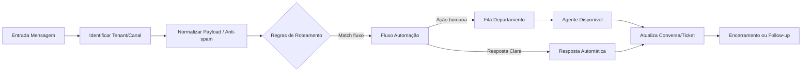
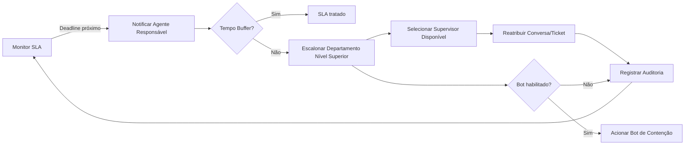
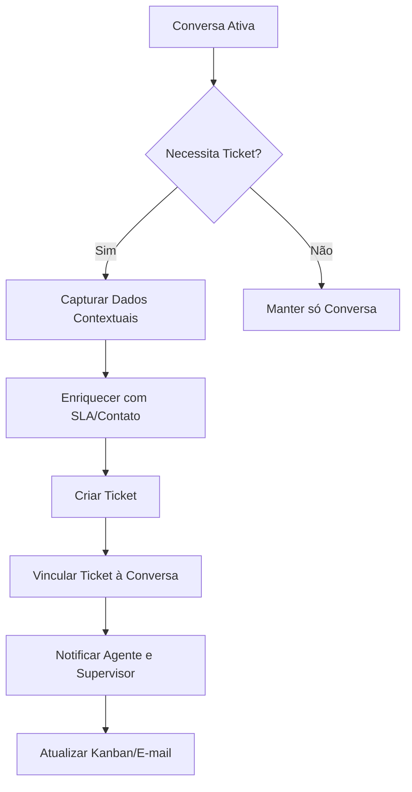

# 4. Fluxos (Mermaid)

## Roteamento de Mensagens

```mermaid
flowchart LR
  In[Entrada Mensagem] --> I[Identificar Tenant/Canal]
  I --> N[Normalizar Payload / Anti-spam]
  N --> R{Regras de Roteamento}
  R -->|Match fluxo| F[Fluxo Automação]
  F -->|Ação humana| Q[Fila Departamento]
  Q --> A[Agente Disponível]
  F -->|Resposta Clara| B[Resposta Automática]
  A --> U[Atualiza Conversa/Ticket]
  B --> U
  U --> C[Encerramento ou Follow-up]
```

## Transbordo por SLA

```mermaid
flowchart LR
  SLA[Monitor SLA] -->|Deadline próximo| Notif[Notificar Agente Responsável]
  Notif --> Wait{Tempo Buffer?}
  Wait -->|Sim| Done[SLA tratado]
  Wait -->|Não| Esc[Escalonar Departamento Nível Superior]
  Esc --> Select[Selecionar Supervisor Disponível]
  Select --> Assign[Reatribuir Conversa/Ticket]
  Assign --> Log[Registrar Auditoria]
  Esc --> Bot?{Bot habilitado?}
  Bot? -->|Sim| Assist[Acionar Bot de Contenção]
  Bot? -->|Não| Log
  Log --> SLA
```

## Criação de Ticket a partir da Conversa

```mermaid
flowchart TD
  Conv[Conversa Ativa] --> Cond{Necessita Ticket?}
  Cond -->|Sim| Capt[Capturar Dados Contextuais]
  Capt --> Form[Enriquecer com SLA/Contato]
  Form --> Create[Criar Ticket]
  Create --> Link[Vincular Ticket à Conversa]
  Link --> Notify[Notificar Agente e Supervisor]
  Notify --> Board[Atualizar Kanban/E-mail]
  Cond -->|Não| Fim[Manter só Conversa]
```
