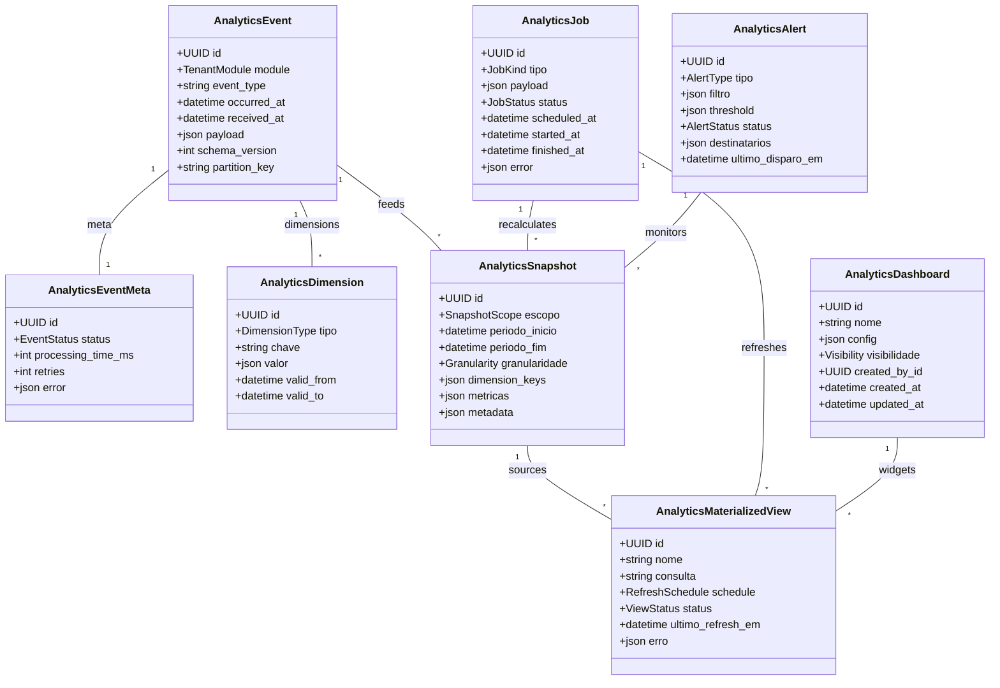

# Módulo `analytics`

## Objetivo
Coletar, transformar e disponibilizar métricas operacionais (tempo de atendimento, uso por canal, CSAT, produtividade) em escala multi-tenant sem sobrecarregar sistemas transacionais.

## Estratégia de Arquitetura
- **Event Sourcing Parcial:** cada módulo (messaging, tickets, channels, automation, knowledge, internal_chat, core) emite eventos normalizados via fila (`analytics_event`).
- **Ingestão Assíncrona:** workers dedicados consomem eventos, validam schema e armazenam-nos em um log bruto antes de atualizar snapshots agregados.
- **Transformações Incrementais:** jobs periódicos agregam dados por janelas (hora/dia/semana) e dimensões (tenant, org_unit, canal, tag) com idempotência.
- **Camada de Consulta:** API GraphQL/REST consulta snapshots com filtros dinâmicos; dashboards usam cache (Redis/ClickHouse) para visualizações quase em tempo real.
- **Backpressure & Observabilidade:** métricas de fila, latência e taxa de falhas são monitoradas; se houver pico, aplica-se backoff e priorizam-se eventos críticos (SLA, erros).

## Responsabilidades
- Normalizar e validar eventos de domínio garantindo contratos versionados.
- Persistir eventos brutos para reprocessamento/auditoria e enriquecer com dimensões (org_unit, canal, tags, agentes).
- Gerar snapshots multi-tenant com métricas chave (volume, FRT, TMA, SLA, CSAT, uso de automações) em diferentes granularidades.
- Disponibilizar APIs, conectores (Grafana/Metabase) e exports (CSV/Parquet) com filtros ricos.
- Gerenciar jobs de recalculo, backfill e retenção (ex.: eventos por 90 dias, snapshots por 24 meses).
- Publicar dashboards embutidos (widgets) consumidos no frontend Ionic.

## Entidades

### Entidade `analytics_event`

| Campo | Tipo | Obrigatório | Índice | Notas |
| --- | --- | --- | --- | --- |
| `id` | UUID | Sim | PK | Usa `event_id` original para idempotência.
| `tenant_id` | FK -> tenant | Sim | IDX | |
| `module` | Enum(messaging, tickets, channels, automation, knowledge, internal_chat, core) | Sim | | |
| `event_type` | String | Sim | IDX | Ex.: `conversation.created`.
| `occurred_at` | DateTime | Sim | IDX | Horário do evento na origem.
| `received_at` | DateTime | Sim | | Horário em que entrou na fila Analytics.
| `payload` | JSONB | Sim | | Dados normalizados (IDs, status, métricas brutas).
| `schema_version` | Integer | Sim | | Controle de evolução.
| `partition_key` | String | Não | | Ajuda em sharding (ex.: `tenant#2024-05-28`).

### Entidade `analytics_event_meta`

| Campo | Tipo | Obrigatório | Índice | Notas |
| --- | --- | --- | --- | --- |
| `id` | UUID | Sim | PK | |
| `event_id` | FK -> analytics_event | Sim | Único | |
| `status` | Enum(queued, processing, processed, failed, discarded) | Sim | IDX | Estado da ingestão.
| `processing_time_ms` | Integer | Não | | Latência por evento.
| `retries` | Integer | Sim | | Tentativas de reprocessar.
| `error` | JSONB | Não | | Detalhes de falha.

### Entidade `analytics_dimension`

| Campo | Tipo | Obrigatório | Índice | Notas |
| --- | --- | --- | --- | --- |
| `id` | UUID | Sim | PK | |
| `tenant_id` | FK -> tenant | Sim | IDX | |
| `tipo` | Enum(channel, org_unit, tag, agent, customer_segment, automation_flow, portal) | Sim | | |
| `chave` | String | Sim | IDX | Identificador estável (slug/id externo).
| `valor` | JSONB | Sim | | Metadados (nome, atributos, cor, thresholds).
| `valid_from` | DateTime | Sim | | Historiza alterações.
| `valid_to` | DateTime | Não | | Quando nulo, vigente.

### Entidade `analytics_snapshot`

| Campo | Tipo | Obrigatório | Índice | Notas |
| --- | --- | --- | --- | --- |
| `id` | UUID | Sim | PK | |
| `tenant_id` | FK -> tenant | Sim | IDX | |
| `escopo` | Enum(conversation, ticket, channel, agent, org_unit, portal, automation_flow, knowledge_article) | Sim | IDX | |
| `periodo_inicio` | DateTime | Sim | IDX | |
| `periodo_fim` | DateTime | Sim | IDX | |
| `granularidade` | Enum(hourly, daily, weekly, monthly, realtime) | Sim | | |
| `dimension_keys` | JSONB | Sim | | Ex.: `{ "channel": "whatsapp_official", "org_unit": "support" }`.
| `metricas` | JSONB | Sim | | Ex.: `{ "volume": 420, "sla_breached": 3, "avg_handle_sec": 95 }`.
| `metadata` | JSONB | Não | | Config (fonte, comparativos).

### Entidade `analytics_materialized_view`

| Campo | Tipo | Obrigatório | Índice | Notas |
| --- | --- | --- | --- | --- |
| `id` | UUID | Sim | PK | |
| `tenant_id` | FK -> tenant | Sim | IDX | |
| `nome` | String | Sim | | Ex.: `daily_sla_dashboard`.
| `consulta` | Text | Sim | | SQL/DSL usada para gerar view.
| `schedule` | Enum(on_demand, hourly, daily) | Sim | | Frequência atualização.
| `status` | Enum(active, archived) | Sim | | |
| `ultimo_refresh_em` | DateTime | Não | | |
| `erro` | JSONB | Não | | Última falha.

### Entidade `analytics_job`

| Campo | Tipo | Obrigatório | Índice | Notas |
| --- | --- | --- | --- | --- |
| `id` | UUID | Sim | PK | |
| `tipo` | Enum(snapshot_recalc, materialized_refresh, retention_cleanup, backfill) | Sim | IDX | |
| `tenant_id` | FK -> tenant | Sim | IDX | |
| `payload` | JSONB | Sim | | Parâmetros (período, escopo).
| `status` | Enum(pending, running, completed, failed) | Sim | | |
| `scheduled_at` | DateTime | Sim | | |
| `started_at` | DateTime | Não | | |
| `finished_at` | DateTime | Não | | |
| `error` | JSONB | Não | | Detalhes de falha.

### Entidade `analytics_alert`

| Campo | Tipo | Obrigatório | Índice | Notas |
| --- | --- | --- | --- | --- |
| `id` | UUID | Sim | PK | |
| `tenant_id` | FK -> tenant | Sim | IDX | |
| `tipo` | Enum(sla_breach_rate, backlog_growth, csat_drop, automation_failure, channel_health) | Sim | | |
| `filtro` | JSONB | Sim | | Critérios (org_unit, canal, prioridade).
| `threshold` | JSONB | Sim | | Ex.: `{ "metric": "sla_breached", "value": 5, "window": "15m" }`.
| `status` | Enum(active, paused) | Sim | | |
| `destinatarios` | JSONB | Sim | | E-mail, webhook, internal_chat channel.
| `ultimo_disparo_em` | DateTime | Não | | |

### Entidade `analytics_dashboard`

| Campo | Tipo | Obrigatório | Índice | Notas |
| --- | --- | --- | --- | --- |
| `id` | UUID | Sim | PK | |
| `tenant_id` | FK -> tenant | Sim | IDX | |
| `nome` | String | Sim | | |
| `config` | JSONB | Sim | | Layout, widgets, filtros default.
| `visibilidade` | Enum(private, org_unit, tenant) | Sim | | Quem vê.
| `created_by_id` | FK -> tenant_user | Sim | | |
| `created_at` | DateTime | Sim | | |
| `updated_at` | DateTime | Sim | | |

## Diagrama de Classes

## Regras de Negócio
- Todo evento deve ser idempotente (`analytics_event.id`), permitindo reprocessamento sem duplicação.
- Schemas evoluem com `schema_version`; versão de consumidor valida retrocompatibilidade.
- Eventos críticos (SLA, erros) têm prioridade mais alta na fila e alertas dedicados.
- Snapshots `granularidade = realtime` são armazenados em cache (Redis, validade 60s) antes de persistir.
- Jobs de recalculo massivo (backfill) executam fora do horário comercial por tenant quando possível.
- Dimensões possuem vigência temporal; quando algo muda (ex.: rename de org_unit) cria-se nova linha com `valid_from` atualizado.
- Dashboards podem referenciar materialized views; atualização manual dispara job `materialized_refresh`.
- Alertas disparam via internal_chat webhook, e-mail ou automação; repetição controlada por `threshold` e `ultimo_disparo_em`.

## Eventos & Integração
- Conecta-se ao bus de eventos interno (Celery/Redis) e exporta logs para data lake (S3/Parquet) para análises avançadas.
- Integra com `automation`: fluxos podem consultar snapshots ou disparar alertas customizados.
- Exposição externa via API e Webhooks (`analytics.alert.triggered`) permite integrações com ferramentas BI externas.
- Alimenta dashboards no frontend com widgets (volume por canal, SLA, CSAT, backlog, uso de automações, performance de quick replies).

## Segurança & LGPD
- Eventos podem conter PII; aplicar mascaramento/anonimização no payload antes de persistir (mantém IDs, remove texto sensível).
- Retenção configurável por tenant e por tipo de dado (ex.: manter CSAT por 24 meses, descartar mensagens brutas após 90 dias).
- Acesso a dashboards/metrics respeita `org_unit`/roles (`analytics.view`, `analytics.manage`).
- Logs de consulta são enviados para `audit_log` do core.

## Testes Recomendados
- Unitários para validação de schema de evento, ingestão e agregação incremental.
- Integração: gerar eventos reais (conversa/ticket) e verificar snapshots/alertas.
- Testes de carga: simular 10k eventos/minuto e monitorar latência/backpressure.
- Testes de retenção: garantir que jobs de cleanup não removem dados ativos.

## Backlog de Evolução
- Suporte a análises preditivas (forecast de volume, churn) usando ML externos.
- Comparativos inter-tenant anonimizados (benchmarking) mediante opt-in.
- Editor de dashboards drag-and-drop com biblioteca de widgets.
- Export incremental para data warehouse corporativo (BigQuery, Snowflake).

## Assunções
- Stack primária: PostgreSQL (tabelas agregadas) + Redis (cache) + ClickHouse/Parquet opcional para histórico pesado.
- Emissões de eventos são assíncronas; módulos não bloqueiam espera de ingestão.
- Analytics opera em cluster separado para evitar impacto no OLTP.
