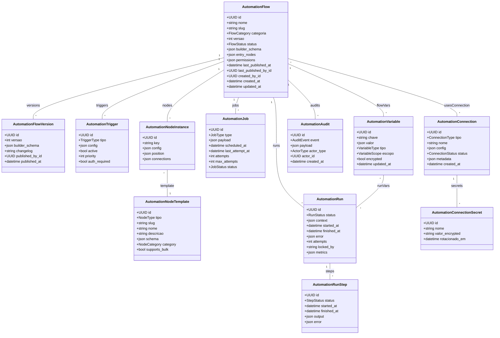

# Módulo `automation`

## Objetivo
Construir a camada de orquestração de fluxos (estilo n8n) para ingestão de mensagens, roteamento, automações reativas e jobs agendados, conectando canais, org_units, tickets, knowledge e integrações externas.

## Responsabilidades
- Processar mensagens de entrada (pré-fila) aplicando regras, enriquecimento e antivírus antes de chegar ao atendimento humano.
- Permitir criação visual de fluxos (builder) com gatilhos, nós de ação e condição reutilizáveis.
- Executar automações em tempo real (event-driven) e agendadas (cron/delay/backoff).
- Suportar integrações com APIs externas, filas Celery/Redis, e webhooks (in/outbound).
- Garantir monitoramento, retries e observabilidade de runs, além de versionamento básico de fluxos.

## Entidades

### Entidade `automation_flow`

| Campo | Tipo | Obrigatório | Índice | Notas |
| --- | --- | --- | --- | --- |
| `id` | UUID | Sim | PK | |
| `tenant_id` | FK -> tenant | Sim | IDX | |
| `nome` | String | Sim | | |
| `slug` | String | Sim | Único (tenant, slug) | |
| `descricao` | Text | Não | | |
| `categoria` | Enum(intake, routing, escalation, notification, maintenance) | Sim | | |
| `versao` | Integer | Sim | | Incremental por publicação.
| `status` | Enum(draft, published, archived) | Sim | | |
| `builder_schema` | JSONB | Sim | | Definição visual (nós e conexões).
| `entry_nodes` | JSONB | Sim | | Lista de nós iniciais (gatilhos).
| `permissions` | JSONB | Não | | Controle de edição/execução (roles/org_units).
| `last_published_at` | DateTime | Não | | |
| `last_published_by_id` | FK -> tenant_user | Não | | |
| `created_by_id` | FK -> tenant_user | Sim | | |
| `created_at` | DateTime | Sim | | |
| `updated_at` | DateTime | Sim | | |

### Entidade `automation_flow_version`

| Campo | Tipo | Obrigatório | Índice | Notas |
| --- | --- | --- | --- | --- |
| `id` | UUID | Sim | PK | |
| `flow_id` | FK -> automation_flow | Sim | IDX | |
| `versao` | Integer | Sim | | |
| `builder_schema` | JSONB | Sim | | Snapshot do fluxo.
| `changelog` | Text | Não | | Nota de versão.
| `published_by_id` | FK -> tenant_user | Não | | |
| `published_at` | DateTime | Não | | |

### Entidade `automation_trigger`

| Campo | Tipo | Obrigatório | Índice | Notas |
| --- | --- | --- | --- | --- |
| `id` | UUID | Sim | PK | |
| `flow_id` | FK -> automation_flow | Sim | IDX | |
| `tipo` | Enum(webhook_in, channel_intake, conversation_event, ticket_event, scheduler, manual, api_call) | Sim | | |
| `config` | JSONB | Sim | | Ex.: rota webhook, cron expression, filtros.
| `active` | Bool | Sim | | |
| `priority` | Integer | Não | | Para intake.
| `auth_required` | Bool | Sim | | Webhook com assinatura/token.

### Entidade `automation_node_template`

| Campo | Tipo | Obrigatório | Índice | Notas |
| --- | --- | --- | --- | --- |
| `id` | UUID | Sim | PK | |
| `tipo` | Enum(trigger, action, condition, loop, integration, handler) | Sim | | |
| `slug` | String | Sim | Único | |
| `nome` | String | Sim | | Ex.: “Set Priority”, “Call Webhook”.
| `descricao` | Text | Não | | |
| `schema` | JSONB | Sim | | Campos configuráveis do nó.
| `category` | Enum(intake, routing, messaging, ticketing, knowledge, integrations, utils) | Sim | | |
| `supports_bulk` | Bool | Sim | | Pode processar lotes.

### Entidade `automation_node_instance`

| Campo | Tipo | Obrigatório | Índice | Notas |
| --- | --- | --- | --- | --- |
| `id` | UUID | Sim | PK | |
| `flow_id` | FK -> automation_flow | Sim | IDX | |
| `template_id` | FK -> automation_node_template | Sim | | |
| `key` | String | Sim | | Identificador dentro do fluxo.
| `config` | JSONB | Sim | | Config do nó instanciado.
| `position` | JSONB | Sim | | Coordenadas no builder.
| `connections` | JSONB | Sim | | Próximos nós, condicional.

### Entidade `automation_run`

| Campo | Tipo | Obrigatório | Índice | Notas |
| --- | --- | --- | --- | --- |
| `id` | UUID | Sim | PK | |
| `flow_id` | FK -> automation_flow | Sim | IDX | |
| `trigger_id` | FK -> automation_trigger | Não | IDX | |
| `context` | JSONB | Sim | | Payload inicial (mensagem, conversa, ticket).
| `status` | Enum(pending, running, completed, failed, canceled, retrying, paused) | Sim | | |
| `started_at` | DateTime | Sim | | |
| `finished_at` | DateTime | Não | | |
| `error` | JSONB | Não | | Stack trace, message, node.
| `attempts` | Integer | Sim | | Contagem de retries.
| `locked_by` | String | Não | | Worker responsável.
| `metrics` | JSONB | Não | | Duração por nó, contagens.

### Entidade `automation_run_step`

| Campo | Tipo | Obrigatório | Índice | Notas |
| --- | --- | --- | --- | --- |
| `id` | UUID | Sim | PK | |
| `run_id` | FK -> automation_run | Sim | IDX | |
| `node_id` | FK -> automation_node_instance | Sim | IDX | |
| `status` | Enum(pending, running, completed, failed, skipped, retried) | Sim | | |
| `started_at` | DateTime | Não | | |
| `finished_at` | DateTime | Não | | |
| `output` | JSONB | Não | | Resultado do nó (ex.: novo priority).
| `error` | JSONB | Não | | Falha parcial.

### Entidade `automation_job`

| Campo | Tipo | Obrigatório | Índice | Notas |
| --- | --- | --- | --- | --- |
| `id` | UUID | Sim | PK | |
| `tenant_id` | FK -> tenant | Sim | IDX | |
| `flow_id` | FK -> automation_flow | Sim | IDX | |
| `type` | Enum(schedule, delay, retry, webhook_out, integration_poll) | Sim | | |
| `payload` | JSONB | Sim | | Dados para execução futura.
| `scheduled_at` | DateTime | Sim | | Próxima execução.
| `last_attempt_at` | DateTime | Não | | |
| `attempts` | Integer | Sim | | |
| `max_attempts` | Integer | Sim | | |
| `status` | Enum(pending, running, completed, failed, canceled) | Sim | | |

### Entidade `automation_variable`

| Campo | Tipo | Obrigatório | Índice | Notas |
| --- | --- | --- | --- | --- |
| `id` | UUID | Sim | PK | |
| `tenant_id` | FK -> tenant | Sim | IDX | |
| `flow_id` | FK -> automation_flow | Não | IDX | Quando `null`, é variável global.
| `chave` | String | Sim | | |
| `valor` | JSONB | Sim | | Secrets variáveis, outputs.
| `tipo` | Enum(text, secret, json, credential) | Sim | | |
| `escopo` | Enum(global, flow, run) | Sim | | |
| `encrypted` | Bool | Sim | | Indica segredo.
| `updated_at` | DateTime | Sim | | |

### Entidade `automation_audit`

| Campo | Tipo | Obrigatório | Índice | Notas |
| --- | --- | --- | --- | --- |
| `id` | UUID | Sim | PK | |
| `tenant_id` | FK -> tenant | Sim | IDX | |
| `flow_id` | FK -> automation_flow | Não | IDX | |
| `event` | Enum(flow_published, flow_run_failed, job_retry, variable_changed) | Sim | | |
| `payload` | JSONB | Sim | | Dados da auditoria.
| `actor_type` | Enum(user, system, automation) | Sim | | |
| `actor_id` | UUID | Não | | |
| `created_at` | DateTime | Sim | | |

### Entidade `automation_connection`

| Campo | Tipo | Obrigatório | Índice | Notas |
| --- | --- | --- | --- | --- |
| `id` | UUID | Sim | PK | |
| `tenant_id` | FK -> tenant | Sim | IDX | |
| `tipo` | Enum(http, webhook_out, smtp, imap, whatsapp_provider, telegram_bot, s3, database, custom) | Sim | | |
| `nome` | String | Sim | | |
| `config` | JSONB | Sim | | Credenciais/params.
| `status` | Enum(active, inactive) | Sim | | |
| `metadata` | JSONB | Não | | |
| `created_at` | DateTime | Sim | | |

### Entidade `automation_connection_secret`

| Campo | Tipo | Obrigatório | Índice | Notas |
| --- | --- | --- | --- | --- |
| `id` | UUID | Sim | PK | |
| `connection_id` | FK -> automation_connection | Sim | IDX | |
| `nome` | String | Sim | | |
| `valor_encrypted` | Text | Sim | | Criptografado via KMS.
| `rotacionado_em` | DateTime | Não | | |

## Diagrama de Classes

## Regras de Negócio
- Fluxos `categoria = intake` devem possuir ao menos um trigger do tipo `channel_intake` ou `webhook_in` e são executados antes de `conversation_queue_entry`.
- `automation_node_instance` deve ser consistente com `automation_node_template.schema` (validação no builder).
- `automation_run` tem limite global de tentativas; falhas repetidas enviam alerta (`automation_audit` + `audit_log`).
- `automation_job` é gerenciado por Celery; `status = failed` respeita `max_attempts` e aplica backoff exponencial.
- Variáveis `tipo = credential` exigem criptografia e podem ser referenciadas nos nodes via placeholders (`{{var.api_key}}`).
- Execuções podem pausar (`status = paused`) aguardando entrada externa (ex.: aprovação humana) e retomar via API.
- `automation_connection` define integrações reutilizáveis (WhatsApp provider, HTTP webhook, banco); rotacionar secrets periodicamente.
- Start/Stop de flows publicados gera entrada em `automation_audit` e notificação para observabilidade.

## Eventos & Integração
- Integração com `messaging`: triggers `channel_intake` recebem payload da mensagem antes de criar conversa; outputs podem decidir criar/ignorar/descartar.
- Integração com `tickets`: triggers `ticket_event` respondem a mudanças de status/atribuição, criando follow-ups automáticos.
- Integração com `channels`: triggers `webhook_in` substituem endpoints fixos e alimentam `automation_run` com contexto normalizado.
- API: endpoints para executar flow manual (`POST /automation/flows/{id}/run`) e gerenciar jobs (`POST /automation/jobs/{id}/retry`).
- Observabilidade: métricas expostas (Prometheus) por `automation_run` (duração, sucesso/falha) e `automation_job`.

## Segurança & LGPD
- Credenciais e variáveis marcadas como secret armazenadas criptografadas; acesso auditado.
- Logs de runs devem evitar exposição de PII (masking automático no builder).
- Fluxos intake devem aplicar validações e antivírus (nó template dedicado) antes de persistir anexos.
- Controles de permissão: somente roles com `automation.manage` podem publicar; `automation.view_logs` para visualizar execuções.

## Testes Recomendados
- Unitários para validação do builder (schema → instância), parsing de triggers e nodes.
- Integração: ingestão de mensagem → automation intake → criação de conversa/ticket.
- Testes de carga: múltiplos runs concorrentes, com verificação de locking e retries.
- E2E: fluxo completo com aprovação humana (pausa e retomada).

## Backlog de Evolução
- Monitor visual de execuções em tempo real (gantt/step-by-step).
- Marketplace de templates de fluxos e nodes (import/export JSON).
- Suporte a ML nodes (classificação de intenção, sumarização).
- Auto-scaling das workers com base em volume de runs e jobs.

## Assunções
- Engine de execução usa Celery + Redis; nodes podem chamar serviços internos/externos.
- Fluxos intake aplicam padrões (enriquecimento, deduplicação) antes de enviar à fila `org_unit`.
- Confidencialidade de credenciais via Vault/KMS; placeholders resolvidos apenas em runtime.
