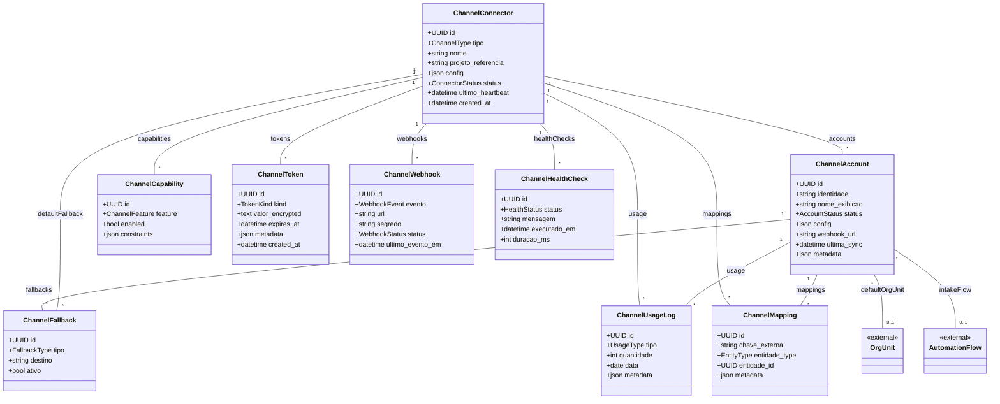

# Módulo `channels`

## Objetivo
Gerenciar conectores externos e contas de canal para contatos omnichannel, garantindo que cada entrada seja roteada para uma unidade organizacional (`org_unit`) ou fluxo de automação específico.

## Responsabilidades
- Registrar credenciais e configurações de provedores externos com segurança.
- Controlar múltiplas contas por conector (ex.: vários números WhatsApp ou caixas de e-mail).
- Associar cada conta a uma `org_unit` padrão ou a um fluxo de entrada (`automation_flow`) responsável pelo roteamento.
- Manter status de conectividade, limites de uso, webhooks e filas de ingestão por canal.
- Fornecer contratos para sincronização de mensagens inbound/outbound com o módulo `messaging`.
- Expor métricas de saúde e logs técnicos para observabilidade e suporte.

## Entidades

### Entidade `channel_connector`

| Campo | Tipo | Obrigatório | Índice | Notas |
| --- | --- | --- | --- | --- |
| `id` | UUID | Sim | PK | |
| `tenant_id` | FK -> tenant | Sim | IDX | |
| `tipo` | Enum(whatsapp_official, whatsapp_unofficial, telegram, email, webchat, future) | Sim | | |
| `nome` | String | Sim | | Ex.: “WhatsApp Oficial - Meta”. |
| `projeto_referencia` | String | Não | | ID externo (ex.: app_id Meta). |
| `config` | JSONB | Sim | | Tokens, URLs, parâmetros.
| `status` | Enum(active, pending, error, archived) | Sim | | |
| `ultimo_heartbeat` | DateTime | Não | | Monitoramento.
| `created_at` | DateTime | Sim | | |

### Entidade `channel_account`

| Campo | Tipo | Obrigatório | Índice | Notas |
| --- | --- | --- | --- | --- |
| `id` | UUID | Sim | PK | |
| `connector_id` | FK -> channel_connector | Sim | IDX | |
| `identidade` | String | Sim | Único (por connector) | Número, e-mail, slug.
| `nome_exibicao` | String | Não | | |
| `status` | Enum(active, inactive, pending) | Sim | | |
| `org_unit_id` | FK -> org_unit | Não | IDX | Unidade padrão de roteamento.
| `intake_flow_id` | FK -> automation_flow | Não | IDX | Fluxo de entrada alternativo.
| `config` | JSONB | Não | | Configs específico (assinaturas, replies). |
| `webhook_url` | String | Não | | Endpoint dedicado por conta.
| `ultima_sync` | DateTime | Não | | |
| `metadata` | JSONB | Não | | Infos extras (provedor, rótulos). |

### Entidade `channel_capability`

| Campo | Tipo | Obrigatório | Índice | Notas |
| --- | --- | --- | --- | --- |
| `id` | UUID | Sim | PK | |
| `connector_id` | FK -> channel_connector | Sim | IDX | |
| `feature` | Enum(messages, templates, media_upload, typing, read_receipts, buttons) | Sim | | |
| `enabled` | Bool | Sim | | |
| `constraints` | JSONB | Não | | Limites (ex.: 20 msg/min). |

### Entidade `channel_token`

| Campo | Tipo | Obrigatório | Índice | Notas |
| --- | --- | --- | --- | --- |
| `id` | UUID | Sim | PK | |
| `connector_id` | FK -> channel_connector | Sim | IDX | |
| `kind` | Enum(access_token, refresh_token, api_key, secret) | Sim | | |
| `valor_encrypted` | Text | Sim | | Armazenado com KMS/pgcrypto.
| `expires_at` | DateTime | Não | | |
| `metadata` | JSONB | Não | | Scopes, permissões.
| `created_at` | DateTime | Sim | | |

### Entidade `channel_webhook`

| Campo | Tipo | Obrigatório | Índice | Notas |
| --- | --- | --- | --- | --- |
| `id` | UUID | Sim | PK | |
| `connector_id` | FK -> channel_connector | Sim | IDX | |
| `evento` | Enum(message_in, message_status, delivery, contact_update, fallback) | Sim | | |
| `url` | String | Sim | | Destino configurado. |
| `segredo` | String | Não | | Assinatura HMAC.
| `status` | Enum(active, disabled) | Sim | | |
| `ultimo_evento_em` | DateTime | Não | | |

### Entidade `channel_health_check`

| Campo | Tipo | Obrigatório | Índice | Notas |
| --- | --- | --- | --- | --- |
| `id` | UUID | Sim | PK | |
| `connector_id` | FK -> channel_connector | Sim | IDX | |
| `status` | Enum(passed, failed, warning) | Sim | | |
| `mensagem` | Text | Não | | Descrição do teste. |
| `executado_em` | DateTime | Sim | IDX | |
| `duracao_ms` | Integer | Não | | Latência do teste. |

### Entidade `channel_usage_log`

| Campo | Tipo | Obrigatório | Índice | Notas |
| --- | --- | --- | --- | --- |
| `id` | UUID | Sim | PK | |
| `connector_id` | FK -> channel_connector | Sim | IDX | |
| `account_id` | FK -> channel_account | Não | IDX | |
| `tipo` | Enum(message_in, message_out, template_send, file_upload, rule_trigger) | Sim | | |
| `quantidade` | Integer | Sim | | |
| `data` | Date | Sim | IDX | Aggregação diária. |
| `metadata` | JSONB | Não | | Detalhes extras (custo, status). |

### Entidade `channel_mapping`

| Campo | Tipo | Obrigatório | Índice | Notas |
| --- | --- | --- | --- | --- |
| `id` | UUID | Sim | PK | |
| `connector_id` | FK -> channel_connector | Sim | IDX | |
| `chave_externa` | String | Sim | | ID do provedor. |
| `entidade_type` | Enum(contact, conversation, message) | Sim | | |
| `entidade_id` | UUID | Sim | IDX | Relaciona com entidades internas. |
| `metadata` | JSONB | Não | | Armazena mapeamentos adicionais. |

### Entidade `channel_fallback`

| Campo | Tipo | Obrigatório | Índice | Notas |
| --- | --- | --- | --- | --- |
| `id` | UUID | Sim | PK | |
| `account_id` | FK -> channel_account | Sim | IDX | |
| `tipo` | Enum(fallback_number, email_forward, voicemail) | Sim | | |
| `destino` | String | Sim | | DN, e-mail, etc. |
| `ativo` | Bool | Sim | | |

## Diagrama de Classes

## Regras de Negócio
- Cada `channel_connector` deve ter ao menos uma `channel_token` válida (quando requerido pelo provedor).
- `channel_account.status = active` exige que `channel_connector.status = active`.
- `channel_account` deve possuir `org_unit_id` ou `intake_flow_id` (ao menos um) para garantir roteamento.
- `intake_flow_id` referencia um fluxo publicado (categoria `intake`) no módulo `automation`.
- `channel_capability` inicial é populada a partir de presets do provedor; atualizações via sync.
- Tokens expiram e devem ser renovados via Celery antes de `expires_at` (ex.: 5 minutos antes).
- `channel_usage_log` agrega volume diário por tipo; combinado com billing para limites.
- `channel_fallback` é aplicado quando `channel_health_check` falha repetidamente (política configurável).
- `channel_mapping` garante unicidade por (`connector_id`, `chave_externa`, `entidade_type`).
- `channel_webhook` com `status=active` exige `segredo` definido para verificação HMAC.

## Eventos & Integração
- Webhooks inbound normalizados para o módulo `messaging` (`message.received`, `delivery.updated`).
- Quando `intake_flow_id` está configurado, o webhook aciona o fluxo antes de criar/atualizar conversas.
- Eventos internos: `channel.connector.status_changed`, `channel.token.expiring`, `channel.account.sync_required`.
- Observabilidade: métricas de latency e erros via `channel_health_check` reportadas para Prometheus/Grafana.
- Integração com `automation` para pausar rotas quando `channel_health_check` retorna `failed`.

## Segurança & LGPD
- Credenciais em `channel_token` criptografadas com KMS e acessadas via service account.
- Logs de uso não armazenam payloads de mensagens, apenas contagens e metadados não sensíveis.
- Acesso a configuração restrito a papéis com `channel.manage`.
- Webhooks autenticados com assinatura HMAC ou tokens rotativos.

## Testes Recomendados
- Unitários para stack de renovação de tokens (Celery tasks, fallback e notificações).
- Integração simulando webhook inbound (assinar e validar HMAC).
- Testes de carga para ingestion (mensagens simultâneas via `channel_usage_log`).
- Monitoramento: testes automatizados de `channel_health_check` com verificação de thresholds.

## Backlog de Evolução
- Feature para simular mensagens de teste direto pela UI.
- Limites dinâmicos por tenant/canal com alertas proativos.
- Auto-provisionamento de contas (ex.: criar número WhatsApp via API) quando suportado.
- Módulo de faturamento de canais (custo por mensagem/template).

## Assunções
- Conectores WhatsApp se dividem em oficial (Meta) e não oficial (provedores third-party) com campos específicos em `config`.
- E-mail usa `config` para SMTP/IMAP, `channel_token` opcional (OAuth2).
- Web Chat não precisa token, mas utiliza `channel_account` para slugs/widget_id.
