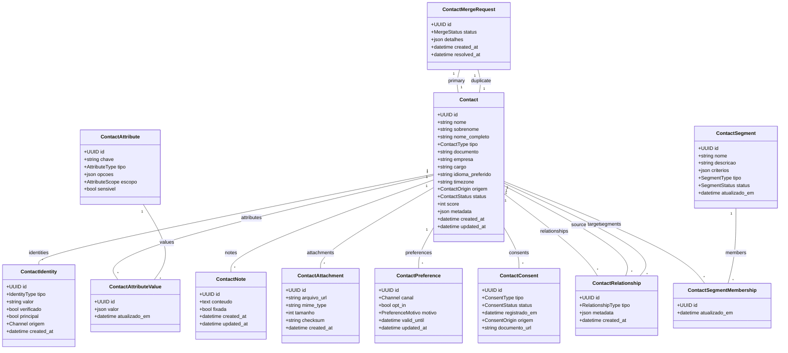

# Módulo `contacts`

## Objetivo
Centralizar dados de clientes/contatos, consolidando múltiplas identidades, preferências, consentimentos e relacionamentos para habilitar uma visão 360° nos módulos de atendimento, automação e analytics.

## Responsabilidades
- Registrar contatos multi-tenant com dados pessoais minimizados, seguindo LGPD.
- Normalizar múltiplas identidades (telefones, e-mails, handles) e garantir unicidade.
- Controlar consentimentos, preferências de comunicação e idiomas por canal.
- Manter notas internas, anexos e interações relevantes para o atendimento.
- Suportar relacionamentos (conta corporativa, dependentes) e fusões de registros duplicados.
- Alimentar segmentos dinâmicos usados por automações e campanhas outbound.

## Entidades

### Entidade `contact`

| Campo | Tipo | Obrigatório | Índice | Notas |
| --- | --- | --- | --- | --- |
| `id` | UUID | Sim | PK | |
| `tenant_id` | FK -> tenant | Sim | IDX | |
| `nome` | String(150) | Sim | | |
| `sobrenome` | String(150) | Não | | |
| `nome_completo` | String | Sim | | Denormalizado para buscas.
| `tipo` | Enum(individual, empresa) | Sim | | |
| `documento` | String | Não | IDX | CPF/CNPJ/ID externo (mascarado).
| `empresa` | String | Não | IDX | Nome da empresa empregadora.
| `cargo` | String | Não | | |
| `idioma_preferido` | Enum(pt-BR, en-US, es-ES, ...) | Não | | |
| `timezone` | String | Não | | |
| `origem` | Enum(manual, import, webhook, api, automation) | Sim | | |
| `status` | Enum(active, inactive, blocked) | Sim | | |
| `score` | Integer | Não | | Propensão/valor.
| `metadata` | JSONB | Não | | Campos adicionais controlados pelo tenant.
| `created_at` | DateTime | Sim | | |
| `updated_at` | DateTime | Sim | | |

### Entidade `contact_identity`

| Campo | Tipo | Obrigatório | Índice | Notas |
| --- | --- | --- | --- | --- |
| `id` | UUID | Sim | PK | |
| `contact_id` | FK -> contact | Sim | IDX | |
| `tipo` | Enum(email, phone, telegram, whatsapp, webchat, external_id, social) | Sim | | |
| `valor` | String | Sim | IDX único (`tenant_id`, `tipo`, `valor`) | Armazenado normalizado (E.164, lower).
| `verificado` | Bool | Sim | | |
| `principal` | Bool | Sim | | Apenas uma por tipo pode ser principal.
| `canal_origem` | Enum(whatsapp, telegram, email, webchat, api, import) | Não | | |
| `created_at` | DateTime | Sim | | |

### Entidade `contact_attribute`

| Campo | Tipo | Obrigatório | Índice | Notas |
| --- | --- | --- | --- | --- |
| `id` | UUID | Sim | PK | |
| `tenant_id` | FK -> tenant | Sim | IDX | |
| `chave` | String | Sim | IDX | Ex.: `industry`, `segment`.
| `tipo` | Enum(string, number, boolean, date, enum, json) | Sim | | |
| `opcoes` | JSONB | Não | | Quando tipo enum.
| `escopo` | Enum(contact, company) | Sim | | |
| `sensivel` | Bool | Sim | | Define mascaramento/auditoria extra.

### Entidade `contact_attribute_value`

| Campo | Tipo | Obrigatório | Índice | Notas |
| --- | --- | --- | --- | --- |
| `id` | UUID | Sim | PK | |
| `contact_id` | FK -> contact | Sim | IDX | |
| `attribute_id` | FK -> contact_attribute | Sim | IDX | |
| `valor` | JSONB | Sim | | Tipado conforme atributo.
| `atualizado_em` | DateTime | Sim | | |

### Entidade `contact_note`

| Campo | Tipo | Obrigatório | Índice | Notas |
| --- | --- | --- | --- | --- |
| `id` | UUID | Sim | PK | |
| `tenant_id` | FK -> tenant | Sim | IDX | |
| `contact_id` | FK -> contact | Sim | IDX | |
| `autor_id` | FK -> tenant_user | Sim | | Quem escreveu a nota.
| `conteudo` | Text | Sim | | |
| `fixada` | Bool | Sim | | |
| `created_at` | DateTime | Sim | | |
| `updated_at` | DateTime | Sim | | |

### Entidade `contact_attachment`

| Campo | Tipo | Obrigatório | Índice | Notas |
| --- | --- | --- | --- | --- |
| `id` | UUID | Sim | PK | |
| `contact_id` | FK -> contact | Sim | IDX | |
| `arquivo_url` | String | Sim | | Presigned URL.
| `mime_type` | String | Sim | | |
| `tamanho` | Integer | Sim | | |
| `checksum` | String | Não | | |
| `uploaded_by_id` | FK -> tenant_user | Não | | |
| `created_at` | DateTime | Sim | | |

### Entidade `contact_preference`

| Campo | Tipo | Obrigatório | Índice | Notas |
| --- | --- | --- | --- | --- |
| `id` | UUID | Sim | PK | |
| `contact_id` | FK -> contact | Sim | IDX | |
| `canal` | Enum(whatsapp, email, telegram, sms, call) | Sim | | |
| `opt_in` | Bool | Sim | | |
| `motivo` | Enum(user_opt, admin_opt, bounced, complaint, legal) | Não | | |
| `valid_until` | DateTime | Não | | |
| `updated_at` | DateTime | Sim | | |

### Entidade `contact_consent`

| Campo | Tipo | Obrigatório | Índice | Notas |
| --- | --- | --- | --- | --- |
| `id` | UUID | Sim | PK | |
| `contact_id` | FK -> contact | Sim | IDX | |
| `tipo` | Enum(marketing, atendimento, termos_servico, privacidade) | Sim | | |
| `status` | Enum(granted, denied, revoked, pending) | Sim | | |
| `registrado_em` | DateTime | Sim | | |
| `origem` | Enum(portal, agente, import, api) | Sim | | |
| `documento_url` | String | Não | | Evidência do consentimento.

### Entidade `contact_relationship`

| Campo | Tipo | Obrigatório | Índice | Notas |
| --- | --- | --- | --- | --- |
| `id` | UUID | Sim | PK | |
| `tenant_id` | FK -> tenant | Sim | IDX | |
| `contact_source_id` | FK -> contact | Sim | IDX | |
| `contact_target_id` | FK -> contact | Sim | IDX | |
| `tipo` | Enum(employee_of, dependent_of, linked_profile, duplicate_candidate, sponsor) | Sim | | |
| `metadata` | JSONB | Não | | |
| `created_at` | DateTime | Sim | | |

### Entidade `contact_merge_request`

| Campo | Tipo | Obrigatório | Índice | Notas |
| --- | --- | --- | --- | --- |
| `id` | UUID | Sim | PK | |
| `tenant_id` | FK -> tenant | Sim | IDX | |
| `primary_contact_id` | FK -> contact | Sim | | Contato que permanece.
| `duplicate_contact_id` | FK -> contact | Sim | | Contato a ser fundido.
| `status` | Enum(pending, approved, rejected, executed) | Sim | | |
| `detalhes` | JSONB | Não | | Diferenças mapeadas.
| `solicitado_por_id` | FK -> tenant_user | Sim | | |
| `resolvido_por_id` | FK -> tenant_user | Não | | |
| `created_at` | DateTime | Sim | | |
| `resolved_at` | DateTime | Não | | |

### Entidade `contact_segment`

| Campo | Tipo | Obrigatório | Índice | Notas |
| --- | --- | --- | --- | --- |
| `id` | UUID | Sim | PK | |
| `tenant_id` | FK -> tenant | Sim | IDX | |
| `nome` | String | Sim | | |
| `descricao` | Text | Não | | |
| `criterios` | JSONB | Sim | | DSL de filtros (atributos, tags, atividade).
| `tipo` | Enum(dynamic, static) | Sim | | Segments atualizados automaticamente ou manualmente.
| `status` | Enum(active, paused, archived) | Sim | | |
| `atualizado_em` | DateTime | Sim | | |

### Entidade `contact_segment_membership`

| Campo | Tipo | Obrigatório | Índice | Notas |
| --- | --- | --- | --- | --- |
| `id` | UUID | Sim | PK | |
| `segment_id` | FK -> contact_segment | Sim | IDX | |
| `contact_id` | FK -> contact | Sim | IDX | |
| `atualizado_em` | DateTime | Sim | | |

## Diagrama de Classes

## Regras de Negócio
- `contact_identity.valor` deve ser único por tenant+tipo; tentativas de duplicação geram merge suggestion.
- Apenas uma identidade por tipo pode ter `principal = true`.
- `contact_attribute.sensivel = true` exige criptografia/máscara ao exibir e logs de acesso.
- `contact_attribute_value` respeita validação de tipo (parser + serializer custom).
- `contact_consent` deve manter histórico (não sobrescrever registros anteriores); utilizar soft insert.
- `contact_merge_request` só pode ser executado por papéis com permissão `contacts.merge`; movimenta mensagens e tickets para o contato primário.
- `contact_preference.opt_in = false` bloqueia disparos outbound pelo canal (checado em automations/campaigns).
- Segmentos dinâmicos devem ser recalculados via Celery; membership atualiza `updated_at`.

## Eventos & Integração
- Eventos internos: `contact.created`, `contact.updated`, `contact.merged`, `contact.consent.changed`.
- Integração com automations: triggers quando contato entra/sai de segment ou muda de score.
- Webhooks externos opcionais para sincronizar CRM/ERP (
  `POST /webhooks/contacts`).

## Segurança & LGPD
- Aplicar RLS por `tenant_id`; campos sensíveis (documento, identidades) criptografados com `pgcrypto`.
- Logs de acesso a dados sensíveis enviados para `audit_log` (categoria `PII_ACCESS`).
- Implementar políticas de retenção: permitir anonimização (`contact.status = blocked`) preservando métricas.
- Solicitações de remoção devem acionar fluxo que elimina identidades/atributos sensíveis ou os anonimiza.

## Testes Recomendados
- Unitários para normalização de identidades (telefone/email) e validação de atributos.
- Integração para merge de contatos, garantindo migração de conversas/tickets.
- Testes de performance para segmentação dinâmica (uso de índices JSONB e materializações).

## Backlog de Evolução
- Enriquecimento automático via APIs externas (Clearbit, Serasa) com opt-in.
- Perfil público do contato com ajustes de preferências via e-mail seguro.
- Feature de timeline 360º integrando mensagens, tickets e notas em uma única visão.
- Regras de deduplicação configuráveis (scoring por similaridade).

## Assunções
- Segmentos dinâmicos atualizam no máximo a cada 5 minutos via Celery.
- Contatos corporativos podem ter múltiplos contatos filhos vinculados via `contact_relationship`.
- Consentimentos são armazenados por tenant; integração SSO externa terá seus próprios registros.
