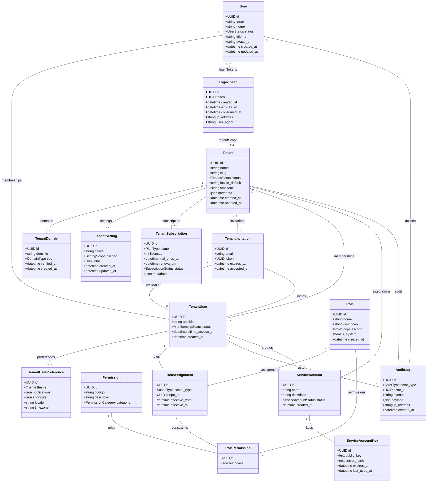

# Módulo `core`

## Objetivo
Centralizar identidade multi-tenant, gestão de usuários, autenticação por link mágico, assinatura/licenciamento e auditoria corporativa, provendo contratos estáveis para todos os demais módulos.

## Responsabilidades
- Provisionar e administrar tenants, domínios e configurações globais.
- Controlar ciclo de vida de usuários, convites, memberships, preferências e acessos.
- Disponibilizar RBAC flexível com suporte a escopo por departamento/time.
- Gerenciar assinaturas/licenças, limites e elegibilidade a recursos avançados.
- Registrar eventos de auditoria e expor ganchos para observabilidade.
- Sustentar autenticação passwordless (magic link), dispositivos confiáveis e contas de serviço.

## Entidades

### Entidade `tenant`

| Campo | Tipo | Obrigatório | Índice | Notas |
| --- | --- | --- | --- | --- |
| `id` | UUID | Sim | PK | Identificador global. |
| `nome` | String(120) | Sim | | Exibido em UI e e-mails. |
| `slug` | String(63) | Sim | Único | Base para subdomínio. |
| `status` | Enum(active, suspended, trial, closed) | Sim | | Reflete elegibilidade de acesso. |
| `locale_default` | Enum(pt-BR, en-US, es-ES) | Sim | | Idioma padrão. |
| `timezone` | String | Sim | | E.g. `America/Sao_Paulo`. |
| `metadata` | JSONB | Não | | Campos adicionais (logo, cores). |
| `created_at` | DateTime | Sim | | |
| `updated_at` | DateTime | Sim | | |

### Entidade `tenant_domain`

| Campo | Tipo | Obrigatório | Índice | Notas |
| --- | --- | --- | --- | --- |
| `id` | UUID | Sim | PK | |
| `tenant_id` | FK -> tenant | Sim | IDX | Relaciona domínio ao tenant. |
| `dominio` | String | Sim | Único | Ex.: `acme.faladesk.com`. |
| `tipo` | Enum(primary, secondary, vanity) | Sim | | |
| `verified_at` | DateTime | Não | | Verificação DNS. |
| `created_at` | DateTime | Sim | | |

### Entidade `tenant_setting`

| Campo | Tipo | Obrigatório | Índice | Notas |
| --- | --- | --- | --- | --- |
| `id` | UUID | Sim | PK | |
| `tenant_id` | FK -> tenant | Sim | IDX | |
| `chave` | String | Sim | IDX composto (`tenant_id`, `chave`). |
| `valor` | JSONB | Sim | | Configurações avançadas (ex.: LGPD retenção). |
| `escopo` | Enum(global, auth, billing, branding) | Sim | | |
| `created_at` | DateTime | Sim | | |
| `updated_at` | DateTime | Sim | | |

### Entidade `tenant_subscription`

| Campo | Tipo | Obrigatório | Índice | Notas |
| --- | --- | --- | --- | --- |
| `id` | UUID | Sim | PK | |
| `tenant_id` | FK -> tenant | Sim | Único | 1:1 com tenant. |
| `plano` | Enum(free, pro, enterprise) | Sim | | Usa modelo de cobrança por usuário. |
| `licencas` | Integer | Sim | | Número contratado. |
| `trial_ends_at` | DateTime | Não | | Controle de trial. |
| `renova_em` | DateTime | Sim | | Próxima renovação. |
| `status` | Enum(active, past_due, canceled) | Sim | | |
| `metadata` | JSONB | Não | | Integração com billing externo. |

### Entidade `tenant_invitation`

| Campo | Tipo | Obrigatório | Índice | Notas |
| --- | --- | --- | --- | --- |
| `id` | UUID | Sim | PK | |
| `tenant_id` | FK -> tenant | Sim | IDX | |
| `email` | String | Sim | IDX | Convidado. |
| `role_default_id` | FK -> role | Não | | Papel sugerido. |
| `org_units` | Array<FK org_unit> | Não | | Escopo sugerido para unidades específicas. |
| `token` | UUID | Sim | Único | Link mágico de convite. |
| `expires_at` | DateTime | Sim | | |
| `accepted_at` | DateTime | Não | | |
| `invited_by_id` | FK -> tenant_user | Sim | | Quem convidou. |

### Entidade `user`

| Campo | Tipo | Obrigatório | Índice | Notas |
| --- | --- | --- | --- | --- |
| `id` | UUID | Sim | PK | |
| `email` | String | Sim | Único | Usado para login mágico. |
| `nome` | String | Sim | | |
| `idioma` | Enum | Sim | | Preferência geral. |
| `status` | Enum(active, inactive, banned) | Sim | | |
| `avatar_url` | String | Não | | |
| `created_at` | DateTime | Sim | | |
| `updated_at` | DateTime | Sim | | |

### Entidade `tenant_user`

| Campo | Tipo | Obrigatório | Índice | Notas |
| --- | --- | --- | --- | --- |
| `id` | UUID | Sim | PK | |
| `tenant_id` | FK -> tenant | Sim | IDX composto com `user_id`. |
| `user_id` | FK -> user | Sim | IDX | |
| `apelido` | String | Não | | Nome interno. |
| `status` | Enum(active, suspended, pending) | Sim | | Escopo por tenant. |
| `ultimo_acesso_em` | DateTime | Não | | |
| `created_at` | DateTime | Sim | | |

### Entidade `tenant_user_preference`

| Campo | Tipo | Obrigatório | Índice | Notas |
| --- | --- | --- | --- | --- |
| `id` | UUID | Sim | PK | |
| `tenant_user_id` | FK -> tenant_user | Sim | Único | 1:1. |
| `theme` | Enum(light, dark, system) | Não | | |
| `notifications` | JSONB | Não | | Configuração granular por canal. |
| `shortcuts` | JSONB | Não | | Atalhos customizados. |
| `locale` | Enum | Não | | Sobrepõe idioma padrão. |
| `timezone` | String | Não | | Sobrepõe timezone tenant. |

### Entidade `role`

| Campo | Tipo | Obrigatório | Índice | Notas |
| --- | --- | --- | --- | --- |
| `id` | UUID | Sim | PK | |
| `tenant_id` | FK -> tenant | Sim | IDX | |
| `nome` | String | Sim | | Ex.: `Supervisor Atendimento`. |
| `descricao` | Text | Não | | |
| `escopo` | Enum(global, department, team, ticket_queue) | Sim | | Limita alcance padrão. |
| `is_system` | Bool | Sim | | Bloqueia edição de papéis padrão. |
| `created_at` | DateTime | Sim | | |

### Entidade `permission`

| Campo | Tipo | Obrigatório | Índice | Notas |
| --- | --- | --- | --- | --- |
| `id` | UUID | Sim | PK | |
| `codigo` | String | Sim | Único | Ex.: `conversation.assign`. |
| `descricao` | Text | Não | | |
| `categoria` | Enum(auth, messaging, tickets, automation, analytics, admin) | Sim | | |

### Entidade `role_permission`

| Campo | Tipo | Obrigatório | Índice | Notas |
| --- | --- | --- | --- | --- |
| `id` | UUID | Sim | PK | |
| `role_id` | FK -> role | Sim | IDX | |
| `permission_id` | FK -> permission | Sim | IDX | |
| `restricoes` | JSONB | Não | | Ex.: limitar a org_units específicas. |

### Entidade `role_assignment`

| Campo | Tipo | Obrigatório | Índice | Notas |
| --- | --- | --- | --- | --- |
| `id` | UUID | Sim | PK | |
| `tenant_user_id` | FK -> tenant_user | Sim | IDX | |
| `role_id` | FK -> role | Sim | IDX composto | |
| `scope_type` | Enum(department, team, conversation, ticket, global) | Não | | Permite exceções.
| `scope_id` | UUID | Não | | Referencia entidade específica via Polymorphic FK. |
| `effective_from` | DateTime | Não | | |
| `effective_to` | DateTime | Não | | |

### Entidade `login_token`

| Campo | Tipo | Obrigatório | Índice | Notas |
| --- | --- | --- | --- | --- |
| `id` | UUID | Sim | PK | |
| `tenant_id` | FK -> tenant | Não | IDX | Nulo para login cross-tenant. |
| `user_id` | FK -> user | Sim | IDX | |
| `token` | UUID | Sim | Único | Validação one-time. |
| `created_at` | DateTime | Sim | | |
| `expires_at` | DateTime | Sim | | |
| `consumed_at` | DateTime | Não | | Prevenção de reuso. |
| `ip_address` | Inet | Não | | Auditoria de acesso. |
| `user_agent` | String | Não | | |

### Entidade `service_account`

| Campo | Tipo | Obrigatório | Índice | Notas |
| --- | --- | --- | --- | --- |
| `id` | UUID | Sim | PK | |
| `tenant_id` | FK -> tenant | Sim | IDX | |
| `nome` | String | Sim | | Usado para integrações internas. |
| `descricao` | Text | Não | | |
| `created_by_id` | FK -> tenant_user | Sim | | Controle de origem. |
| `status` | Enum(active, suspended) | Sim | | |
| `created_at` | DateTime | Sim | | |

### Entidade `service_account_key`

| Campo | Tipo | Obrigatório | Índice | Notas |
| --- | --- | --- | --- | --- |
| `id` | UUID | Sim | PK | |
| `service_account_id` | FK -> service_account | Sim | IDX | |
| `public_key` | Text | Sim | | FIDO/JWT signing. |
| `secret_hash` | Text | Sim | | Hash armazenado. |
| `expires_at` | DateTime | Não | | |
| `last_used_at` | DateTime | Não | | |

### Entidade `audit_log`

| Campo | Tipo | Obrigatório | Índice | Notas |
| --- | --- | --- | --- | --- |
| `id` | UUID | Sim | PK | |
| `tenant_id` | FK -> tenant | Sim | IDX | |
| `actor_type` | Enum(user, service_account, system) | Sim | | |
| `actor_id` | UUID | Sim | IDX | Referencia user/tenant_user/service_account. |
| `evento` | String | Sim | | Nome do evento. |
| `payload` | JSONB | Sim | | Dados estruturados (minimizados). |
| `ip_address` | Inet | Não | | |
| `created_at` | DateTime | Sim | | |

## Diagrama de Classes

## Regras de Negócio
- `tenant_subscription.licencas` deve ser ≥ quantidade de `tenant_user` ativos (exceto contas de serviço com flag `is_service`).
- `tenant_user.status = suspended` impede acesso a qualquer módulo, porém preserva auditoria/histórico.
- `role.is_system = true` bloqueia exclusão e controla set mínimo (Admin, Supervisor, Agente, Financeiro, Developer).
- `role_assignment.scope_type` deve ser coerente com `role.escopo` (validação em serializer).
- `login_token` expira em 15 minutos e é single-use; autenticações repetidas geram novo token.
- Logs devem anonymizar IP quando política de privacidade exigir (`tenant_setting` => escopo LGPD).
- `service_account_key.secret_hash` usa algoritmo compatível com HMAC SHA256; chave exibida apenas 1 vez após criação.

## Eventos & Integrações
- **Webhooks internos**: `tenant.subscription.updated`, `tenant.user.invited`, `tenant.user.joined`, `tenant.role.assignment.changed`.
- **Observabilidade**: emissão para pipeline de auditoria (ELK/Datadog) via Celery quando `audit_log` gravado.
- **Admin API**: permitir automação de provisioning (criar tenant + service account) para onboarding parceiro.

## Segurança & LGPD
- Encriptar campos sensíveis (e-mails, IPs, tokens) usando `pgcrypto` ou libs equivalentes.
- Aplicar `RowLevelSecurity` por `tenant_id` nas tabelas multi-tenant.
- Rotacionar `service_account_key` automaticamente a cada 90 dias.
- Registrar consentimento de convites (`tenant_invitation.accepted_at`) para auditoria.

## Testes Recomendados
- Unitários de serializers/validators (escopo de role, contagem de licenças, expiração de tokens).
- Integração para fluxo de convite → aceite → criação de `tenant_user`.
- Testes de concorrência para criação simultânea de `login_token` (garantir invalidade de tokens antigos).
- Contract tests para webhooks administrativos.

## Backlog de Evolução
- Suporte a SSO corporativo (SAML/OAuth) reutilizando `service_account` para metadata.
- Delegação de administração (sub-tenants ou espaços) com hierarquia.
- Feature flags por tenant/role utilizando `tenant_setting` com escopo dedicado.
- Migração automatizada para separar dados em bancos distintos (pré-step microservices).

## Assunções
- Billing externo (Stripe/Pagar.me) é integrado via `tenant_subscription.metadata`.
- Todos os usuários usam autenticação passwordless; fallback com senha não contemplado no MVP.
