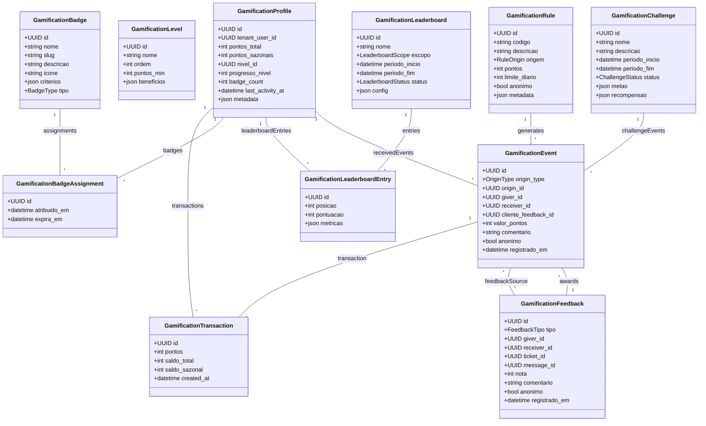

# Módulo `gamification`

## Objetivo
Estimular engajamento e qualidade do atendimento por meio de pontuação, níveis, badges e leaderboards, considerando interações internas (internal chat) e externas (atendimentos a clientes), com mecanismos de feedback anônimo entre colaboradores e avaliações explícitas de clientes.

## Responsabilidades
- Registrar perfis de gamificação para cada `tenant_user`, consolidando pontos e níveis multi-tenant com seeds padrão.
- Aplicar regras/badges out-of-the-box (sem configuração inicial) para feedbacks, SLAs, participação em voz, colaboração interna e CSAT.
- Receber eventos vindos de outros módulos (tickets, messaging, knowledge, internal_chat, analytics) e convertê-los em transações de pontos.
- Permitir feedback entre colaboradores (anônimo) e avaliações de clientes (CSAT/NPS) atribuindo pontos e badges.
- Manter temporadas/leaderboards (semanal, mensal, trimestral) com filtros por org_unit, canal ou role.
- Gerar badges, conquistas e desafios default integrados ao frontend, com possibilidade de evolução futura para customização.

## Entidades

### Entidade `gamification_profile`

| Campo | Tipo | Obrigatório | Índice | Notas |
| --- | --- | --- | --- | --- |
| `id` | UUID | Sim | PK | |
| `tenant_user_id` | FK -> tenant_user | Sim | Único | Um perfil por usuário/tenant.
| `pontos_total` | Integer | Sim | | Pontos acumulados.
| `pontos_sazonais` | Integer | Sim | | Reset por temporada.
| `nivel_id` | FK -> gamification_level | Não | | Nível atual.
| `progresso_nivel` | Integer | Sim | | Percentual 0-100.
| `badge_count` | Integer | Sim | | Quantidade de badges ativos.
| `last_activity_at` | DateTime | Não | | Última transação relevante.
| `metadata` | JSONB | Não | | Personalizações.

### Entidade `gamification_level`

| Campo | Tipo | Obrigatório | Índice | Notas |
| --- | --- | --- | --- | --- |
| `id` | UUID | Sim | PK | |
| `tenant_id` | FK -> tenant | Sim | IDX | |
| `nome` | String | Sim | | Ex.: Bronze, Silver.
| `ordem` | Integer | Sim | | Define sequência.
| `pontos_min` | Integer | Sim | | Threshold para atingir o nível.
| `beneficios` | JSONB | Não | | Ex.: recompensas, destaques.

### Entidade `gamification_rule`

| Campo | Tipo | Obrigatório | Índice | Notas |
| --- | --- | --- | --- | --- |
| `id` | UUID | Sim | PK | |
| `tenant_id` | FK -> tenant | Sim | IDX | |
| `codigo` | String | Sim | Único (tenant, codigo) | Ex.: `sla_on_time`, `peer_kudos` (seed).
| `descricao` | Text | Não | | |
| `origem` | Enum(automation_event, ticket_feedback, internal_reaction, manual, challenge) | Sim | | |
| `pontos` | Integer | Sim | | Pode ser negativo.
| `limite_diario` | Integer | Não | | Evita abuso.
| `anonimo` | Bool | Sim | | Indica se feedback é anônimo.
| `metadata` | JSONB | Não | | Config extra (ex.: peso por canal).

### Entidade `gamification_event`

| Campo | Tipo | Obrigatório | Índice | Notas |
| --- | --- | --- | --- | --- |
| `id` | UUID | Sim | PK | |
| `tenant_id` | FK -> tenant | Sim | IDX | |
| `rule_id` | FK -> gamification_rule | Sim | IDX | |
| `origin_type` | Enum(conversation, ticket, message, voice_session, knowledge_article, automation_run) | Sim | | |
| `origin_id` | UUID | Sim | | Referência ao registro de origem.
| `giver_id` | FK -> tenant_user | Não | | Quem atribuiu (pode ser null se cliente).
| `receiver_id` | FK -> tenant_user | Sim | IDX | Quem recebe pontos.
| `cliente_feedback_id` | FK -> ticket_comment | Não | | Feedback cliente (não anônimo).
| `valor_pontos` | Integer | Sim | | Pontos aplicados.
| `comentario` | Text | Não | | Texto opcional (interno/cliente).
| `anonimo` | Bool | Sim | | Se `true`, ocultar giver.
| `registrado_em` | DateTime | Sim | | |

### Entidade `gamification_transaction`

| Campo | Tipo | Obrigatório | Índice | Notas |
| --- | --- | --- | --- | --- |
| `id` | UUID | Sim | PK | |
| `profile_id` | FK -> gamification_profile | Sim | IDX | |
| `event_id` | FK -> gamification_event | Sim | IDX | |
| `pontos` | Integer | Sim | | Delta aplicado.
| `saldo_total` | Integer | Sim | | Após aplicação.
| `saldo_sazonal` | Integer | Sim | | Após aplicação.
| `created_at` | DateTime | Sim | | |

### Entidade `gamification_badge`

| Campo | Tipo | Obrigatório | Índice | Notas |
| --- | --- | --- | --- | --- |
| `id` | UUID | Sim | PK | |
| `tenant_id` | FK -> tenant | Sim | IDX | |
| `nome` | String | Sim | | |
| `slug` | String | Sim | Único | |
| `descricao` | Text | Não | | |
| `icone` | String | Não | | |
| `criterios` | JSONB | Sim | | Ex.: atingir X pontos, Y feedbacks positivos.
| `tipo` | Enum(achievement, seasonal, challenge, recognition) | Sim | | |

### Entidade `gamification_badge_assignment`

| Campo | Tipo | Obrigatório | Índice | Notas |
| --- | --- | --- | --- | --- |
| `id` | UUID | Sim | PK | |
| `badge_id` | FK -> gamification_badge | Sim | IDX | |
| `profile_id` | FK -> gamification_profile | Sim | IDX | |
| `atribuido_em` | DateTime | Sim | | |
| `origem_event_id` | FK -> gamification_event | Não | | Evento que deu origem.
| `expira_em` | DateTime | Não | | Badges temporários.

### Entidade `gamification_leaderboard`

| Campo | Tipo | Obrigatório | Índice | Notas |
| --- | --- | --- | --- | --- |
| `id` | UUID | Sim | PK | |
| `tenant_id` | FK -> tenant | Sim | IDX | |
| `nome` | String | Sim | | Ex.: “Top Atendentes Mensal”.
| `escopo` | Enum(global, org_unit, channel, badge, challenge) | Sim | | |
| `periodo_inicio` | DateTime | Sim | | |
| `periodo_fim` | DateTime | Sim | | |
| `status` | Enum(active, closed) | Sim | | |
| `config` | JSONB | Não | | Critérios adicionais.

### Entidade `gamification_leaderboard_entry`

| Campo | Tipo | Obrigatório | Índice | Notas |
| --- | --- | --- | --- | --- |
| `id` | UUID | Sim | PK | |
| `leaderboard_id` | FK -> gamification_leaderboard | Sim | IDX | |
| `profile_id` | FK -> gamification_profile | Sim | IDX | |
| `posicao` | Integer | Sim | | Ranking.
| `pontuacao` | Integer | Sim | | Pontos no período.
| `metricas` | JSONB | Não | | Detalhes (SLA, CSAT, feedbacks).

### Entidade `gamification_challenge`

| Campo | Tipo | Obrigatório | Índice | Notas |
| --- | --- | --- | --- | --- |
| `id` | UUID | Sim | PK | |
| `tenant_id` | FK -> tenant | Sim | IDX | |
| `nome` | String | Sim | | Ex.: “Maratona de Feedback”.
| `descricao` | Text | Não | | |
| `periodo_inicio` | DateTime | Sim | | |
| `periodo_fim` | DateTime | Sim | | |
| `org_unit_id` | FK -> org_unit | Não | | Challenge específico.
| `metas` | JSONB | Sim | | Ex.: `>=10 feedbacks positivos`. |
| `recompensas` | JSONB | Não | | Badges, pontos extras.
| `status` | Enum(active, upcoming, closed) | Sim | | |

### Entidade `gamification_feedback`

| Campo | Tipo | Obrigatório | Índice | Notas |
| --- | --- | --- | --- | --- |
| `id` | UUID | Sim | PK | |
| `tenant_id` | FK -> tenant | Sim | IDX | |
| `tipo` | Enum(peer, customer) | Sim | | Anônimo (peer) ou identificado (customer).
| `giver_id` | FK -> tenant_user | Não | | Null quando cliente.
| `receiver_id` | FK -> tenant_user | Sim | IDX | |
| `ticket_id` | FK -> ticket | Não | | Quando feedback vem do cliente.
| `message_id` | FK -> internal_chat_message | Não | | Feedback via chat interno.
| `nota` | Integer | Não | | Escala 1-5.
| `comentario` | Text | Não | | |
| `anonimo` | Bool | Sim | | Peer feedback anonimizado.
| `registrado_em` | DateTime | Sim | | |

## Diagrama de Classes

- Pontos são sempre registrados via `gamification_transaction`, garantindo histórico e idempotência (usar `event_id`).
- O sistema sobe com regras, níveis, badges e challenges padrão sem necessidade de configuração inicial.
- Feedback entre colaboradores (`tipo = peer`) é anônimo para o receiver, mas auditável para admins.
- Feedback de clientes (`tipo = customer`) mapeia CSAT/NPS e sempre identifica o cliente/atendimento (ticket).
- Limites diários padrão (ex.: 5 kudos/dia) evitam abuso; customizar limites fica como melhoria futura.
- Leaderboards podem ser reiniciados por temporada; ao fechar (`status = closed`), pontos sazonais são resetados.
- Badges com `expira_em` expiram automaticamente; triggers em Celery removem e atualizam UI.
- Challenges padrão (ex.: “Semana da Resposta Rápida”) vêm ativados; custom challenges ficam para evolução.
- Perfis podem optar por ocultar ranking público (flag em `metadata`), porém pontos ainda contabilizam para relatórios internos.

## Eventos & Integração
- Integra-se ao pipeline de eventos (analytics_event): cada evento relevante gera `gamification_event` via Celery.
- Feedback em tickets: após CSAT, uma automação converte nota em pontos e badges.
- Internal chat: reações especiais (kudos) e participação em voice sessions alimentam gamificação.
- Automations podem consultar perfis para conceder recompensas personalizadas (ex.: `automation_flow` chama API `POST /gamification/points`).
- Widgets no frontend mostram leaderboard, pontos atuais, badges conquistadas e progresso de desafios.

## Segurança & LGPD
- Dados de feedback anônimo são armazenados com actor auditável (somente admins têm acesso); UI oculta colaborador que deu o feedback.
- Consentimento para exibir ranking pode ser configurado por tenant; dados pessoais limitados em exports públicos.
- Logs de alteração de pontos e badges são enviados também para `audit_log` (categoria `gamification`).
- Gravações/feedbacks de voz ainda respeitam políticas de retenção (linkados ao internal_chat).

## Testes Recomendados
- Unitários para cálculo de pontos, limites diários e ajustes ao recalcular leaderboard.
- Integração: fluxo CSAT → evento → pontos → atualização de leaderboard.
- E2E: desafio interno com feedback entre colaboradores e ranking em tempo real.
- Performance: múltiplos eventos simultâneos (ex.: 1000 chats) alimentando gamificação sem atrasos perceptíveis.

## Backlog de Evolução
- UI para customizar regras/pesos/limites por tenant.
- Marketplace de recompensas (benefícios internos) integrado a automações de RH.
- Loot boxes/quests semanais com missão personalizada por org_unit.
- Integração com gamificação externa (API para gift-cards, badges corporativos).
- Modelos de IA para sugerir reconhecimento automático com base em sentimento/conteúdo.

## Assunções
- Gamificação é opt-in por tenant e pode ser desabilitada a qualquer momento.
- Perfis podem ser resetados por temporada (pontos sazonais zerados) sem perder histórico global.
- Leaderboards e badges são exibidos no app Ionic para agentes e também no portal interno.
