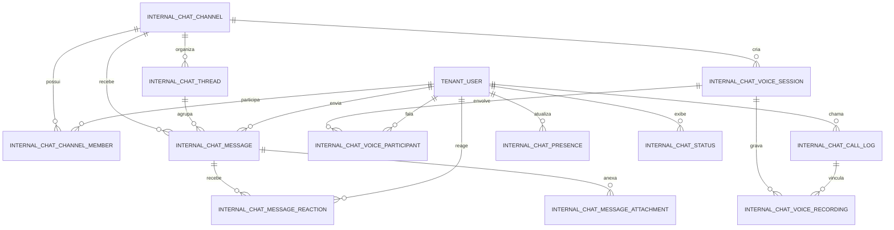

# Módulo `internal_chat`

## Objetivo
Fornecer comunicação interna multi-tenant inspirada em Slack/Discord, com canais de texto e voz, DMs, threads, reações, anexos e presença rica, alinhado às regras de retenção corporativa e LGPD.

## Entidades

| Entidade | Descrição | Campos Principais |
| --- | --- | --- |
| `internal_chat_channel` | Define canais internos por tenant. | `id (UUID)`, `tenant_id (FK)`, `nome`, `slug`, `tipo (enum: dm, text, voice, stage, anúncio)`, `privado (bool)`, `archived (bool)`, `icone?`, `bitrate?`, `max_participantes?`, `dm_composta (bool)`, `criado_em`, `atualizado_em`. |
| `internal_chat_channel_member` | Vincula usuários a canais. | `id`, `channel_id (FK)`, `tenant_user_id (FK)`, `papel (enum: owner, admin, member)`, `notificações (JSON)`, `muted (bool)`, `silenciado_voz (bool)`, `adicionado_em`. |
| `internal_chat_thread` | Agrupa respostas em threads. | `id`, `channel_id (FK)`, `parent_message_id (FK message)`, `assunto`, `status (enum: aberto, resolvido)`, `criado_em`, `atualizado_em`. |
| `internal_chat_message` | Mensagens enviadas. | `id`, `channel_id`, `thread_id?`, `tenant_user_id`, `conteúdo (JSON)`, `tipo (enum: texto, arquivo, menção, sistema, áudio, vídeo, integração)`, `fixado_em?`, `revisado_por?`, `criado_em`. |
| `internal_chat_message_reaction` | Reações por emoji. | `id`, `message_id (FK)`, `tenant_user_id`, `emoji`, `registrado_em`. |
| `internal_chat_message_attachment` | Metadados de arquivos. | `id`, `message_id`, `arquivo_url`, `mime`, `tamanho`, `checksum`, `av_status`, `expires_at?`. |
| `internal_chat_presence` | Controle de presença e status. | `id`, `tenant_user_id`, `status (enum: online, ausente, ocupado, offline, invisível)`, `contexto (JSON)`, `atualizado_em`. |
| `internal_chat_voice_session` | Sessões/calls em canais de voz. | `id`, `channel_id (FK)`, `iniciada_por_id`, `status (enum: ativa, encerrada)`, `modo (enum: free_talk, stage)`, `iniciada_em`, `encerrada_em?`. |
| `internal_chat_voice_participant` | Participação em sessão de voz. | `id`, `voice_session_id`, `tenant_user_id`, `papel (enum: host, speaker, listener)`, `muted (bool)`, `hand_raised (bool)`, `joined_at`, `left_at?`. |
| `internal_chat_voice_recording` | Gravações opcionais de áudio. | `id`, `voice_session_id`, `arquivo_url`, `mime`, `tamanho`, `duracao_seg`, `gerado_por`, `created_at`. |
| `internal_chat_call_log` | Chamadas diretas/adhoc. | `id`, `channel_id?`, `dm_channel_id?`, `initiator_id`, `receiver_id`, `status (enum: ringing, accepted, missed, canceled)`, `started_at`, `ended_at?`, `duracao_seg?`, `metadata`. |
| `internal_chat_status` | Status customizado para usuários. | `id`, `tenant_user_id`, `emoji`, `texto`, `expires_at?`, `atualizado_em`. |

## Relacionamentos (Mermaid)

## Considerações de Implementação

- **Particionamento**: todas as tabelas filtradas por `tenant_id` via `tenant_user` quando aplicável.
- **Retenção**: política configurável por tenant; mensagens, gravações e call logs respeitam expirations diferentes.
- **Busca**: índices para `channel_id`, `thread_id`, `criado_em`, `conteúdo` (full-text opcional) e catálogo de gravações com transcrições.
- **Sinalização**: WebSockets via Django Channels; voz utiliza WebRTC/MediaSoup com sinalização em `ws/{tenant_slug}/internal-chat/{channel}`.
- **LGPD**: exclusão/anonimização sob demanda; gravações somente com consentimento e acesso restrito.
- **Integração**: hooks para citar conversas/tickets, transcrever áudio via `automation_flow`, publicar resumos no knowledge.
- **DMs**: canais `tipo = dm` suportam 1:1 e grupos pequenos, com notificações/mentions específicas e histórico independente.
- **DX**: seeds para canais texto + templates de voice rooms ao criar tenant; feature flags para áudio.
- **Moderation**: `voice_session` modo stage habilita controle de speakers (promote/demote) e logs auditáveis.

## Próximos Incrementos

- Tópicos/etiquetas por canal e pastas agrupadoras.
- Histórico de alterações em mensagens com diff e restauração.
- Estatísticas de texto/voz (tempo falado, ocupação de salas) integradas ao analytics.
- Webhooks internos para integrações (stand-ups, incident reports).
- Transcrição automática + resumos de voz via automations/LLM.
- Stage events com inscrição/lotação e streaming externo opcional.
