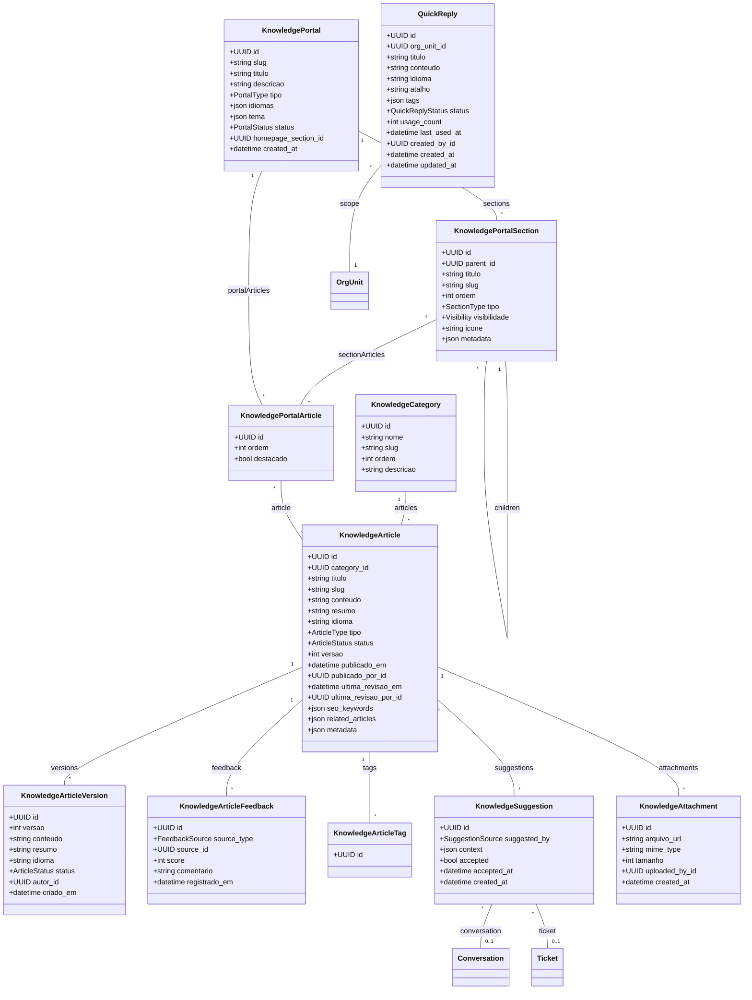

# Módulo `knowledge`

## Objetivo
Centralizar conteúdos reutilizáveis (respostas rápidas, artigos de base de conhecimento, FAQ) para apoiar agentes e automações, com suporte multi-idioma, níveis de acesso e publicação externa.

## Responsabilidades
- Gerenciar respostas rápidas e snippets para uso em conversas/tickets.
- Manter artigos de conhecimento público e privado com versionamento leve.
- Controlar níveis de acesso por `org_unit`, idioma e categorias.
- Orquestrar portais externos (clientes) e internos (colaboradores) como um mini CMS com sitemap hierárquico.
- Disponibilizar API/portal público, portal interno e integrações com widgets (help center, app interno).
- Registrar métricas de uso e feedback (likes, relevância, CSAT) para decisões editoriais.
- Integrar com automações (ex.: sugerir artigo baseado em tags/conteúdo).

## Entidades

### Entidade `quick_reply`

| Campo | Tipo | Obrigatório | Índice | Notas |
| --- | --- | --- | --- | --- |
| `id` | UUID | Sim | PK | |
| `tenant_id` | FK -> tenant | Sim | IDX | |
| `org_unit_id` | FK -> org_unit | Não | IDX | Escopo específico.
| `titulo` | String | Sim | | |
| `conteudo` | Text | Sim | | Markdown/HTML curto.
| `idioma` | Enum(pt-BR, en-US, es-ES, ...) | Sim | | |
| `atalho` | String | Não | IDX | Trigger rápido `/faq1`.
| `tags` | JSONB | Não | | Lista de tags relacionadas.
| `status` | Enum(active, draft, archived) | Sim | | |
| `usage_count` | Integer | Não | | Métrica de uso.
| `last_used_at` | DateTime | Não | | |
| `created_by_id` | FK -> tenant_user | Sim | | |
| `created_at` | DateTime | Sim | | |
| `updated_at` | DateTime | Sim | | |

### Entidade `knowledge_category`

| Campo | Tipo | Obrigatório | Índice | Notas |
| --- | --- | --- | --- | --- |
| `id` | UUID | Sim | PK | |
| `tenant_id` | FK -> tenant | Sim | IDX | |
| `nome` | String | Sim | | |
| `slug` | String | Sim | Único (tenant, slug) | |
| `parent_id` | FK -> knowledge_category | Não | | Hierarquia multi-nível.
| `ordem` | Integer | Não | | |
| `descricao` | Text | Não | | |

### Entidade `knowledge_article`

| Campo | Tipo | Obrigatório | Índice | Notas |
| --- | --- | --- | --- | --- |
| `id` | UUID | Sim | PK | |
| `tenant_id` | FK -> tenant | Sim | IDX | |
| `category_id` | FK -> knowledge_category | Não | IDX | |
| `titulo` | String | Sim | | |
| `slug` | String | Sim | Único (tenant, slug) | |
| `conteudo` | Text | Sim | | Markdown/HTML rico.
| `resumo` | Text | Não | | |
| `idioma` | Enum(pt-BR, en-US, es-ES, ...) | Sim | | |
| `tipo` | Enum(public, private, internal_only) | Sim | | |
| `status` | Enum(draft, review, published, archived) | Sim | | |
| `versao` | Integer | Sim | | Incremental.
| `publicado_em` | DateTime | Não | | |
| `publicado_por_id` | FK -> tenant_user | Não | | |
| `ultima_revisao_em` | DateTime | Não | | |
| `ultima_revisao_por_id` | FK -> tenant_user | Não | | |
| `seo_keywords` | JSONB | Não | | Para portal público.
| `related_articles` | JSONB | Não | | IDs ou slugs relacionados.
| `metadata` | JSONB | Não | | Campos extras.

### Entidade `knowledge_article_version`

| Campo | Tipo | Obrigatório | Índice | Notas |
| --- | --- | --- | --- | --- |
| `id` | UUID | Sim | PK | |
| `article_id` | FK -> knowledge_article | Sim | IDX | |
| `versao` | Integer | Sim | | |
| `conteudo` | Text | Sim | | Snapshot.
| `resumo` | Text | Não | | |
| `idioma` | Enum(...) | Sim | | |
| `status` | Enum(draft, published, archived) | Sim | | |
| `autor_id` | FK -> tenant_user | Sim | | |
| `criado_em` | DateTime | Sim | | |

### Entidade `knowledge_article_feedback`

| Campo | Tipo | Obrigatório | Índice | Notas |
| --- | --- | --- | --- | --- |
| `id` | UUID | Sim | PK | |
| `article_id` | FK -> knowledge_article | Sim | IDX | |
| `source_type` | Enum(contact, tenant_user, anonymous) | Sim | | |
| `source_id` | UUID | Não | | |
| `score` | Integer | Sim | | Escala 1-5 / like-dislike.
| `comentario` | Text | Não | | |
| `registrado_em` | DateTime | Sim | | |

### Entidade `knowledge_article_tag`

| Campo | Tipo | Obrigatório | Índice | Notas |
| --- | --- | --- | --- | --- |
| `id` | UUID | Sim | PK | |
| `article_id` | FK -> knowledge_article | Sim | IDX | |
| `tag_id` | FK -> tag | Sim | IDX | |

### Entidade `knowledge_portal`

| Campo | Tipo | Obrigatório | Índice | Notas |
| --- | --- | --- | --- | --- |
| `id` | UUID | Sim | PK | |
| `tenant_id` | FK -> tenant | Sim | IDX | |
| `slug` | String | Sim | Único | Ex.: `acme.help` ou `acme.internal`.
| `titulo` | String | Sim | | |
| `descricao` | Text | Não | | |
| `tipo` | Enum(external, internal, mixed) | Sim | | Diferencia portais externos e internos.
| `idiomas` | JSONB | Sim | | Idiomas habilitados.
| `tema` | JSONB | Não | | Config visual.
| `status` | Enum(draft, published, offline) | Sim | | |
| `homepage_section_id` | FK -> knowledge_portal_section | Não | | Seção raiz customizada.
| `created_at` | DateTime | Sim | | |

### Entidade `knowledge_portal_section`

| Campo | Tipo | Obrigatório | Índice | Notas |
| --- | --- | --- | --- | --- |
| `id` | UUID | Sim | PK | |
| `portal_id` | FK -> knowledge_portal | Sim | IDX | |
| `parent_id` | FK -> knowledge_portal_section | Não | IDX | Hierarquia (grupo/subgrupo).
| `titulo` | String | Sim | | |
| `slug` | String | Sim | Único (portal, slug) | |
| `ordem` | Integer | Não | | Ordenação no sitemap.
| `descricao` | Text | Não | | |
| `tipo` | Enum(section, page_group, landing) | Sim | | Configura UX.
| `visibilidade` | Enum(public, internal, mixed) | Sim | | Herda do portal por default.
| `icone` | String | Não | | |
| `metadata` | JSONB | Não | | Conteúdos extras (hero, CTA).

### Entidade `knowledge_portal_article`

| Campo | Tipo | Obrigatório | Índice | Notas |
| --- | --- | --- | --- | --- |
| `id` | UUID | Sim | PK | |
| `portal_id` | FK -> knowledge_portal | Sim | IDX | |
| `section_id` | FK -> knowledge_portal_section | Não | IDX | Se não informado, usa homepage.
| `article_id` | FK -> knowledge_article | Sim | IDX | |
| `ordem` | Integer | Não | | |
| `destacado` | Bool | Sim | | Destaque na landing.

### Entidade `knowledge_suggestion`

| Campo | Tipo | Obrigatório | Índice | Notas |
| --- | --- | --- | --- | --- |
| `id` | UUID | Sim | PK | |
| `conversation_id` | FK -> conversation | Não | IDX | |
| `ticket_id` | FK -> ticket | Não | IDX | |
| `article_id` | FK -> knowledge_article | Sim | IDX | |
| `suggested_by` | Enum(automation, agent, system) | Sim | | |
| `context` | JSONB | Não | | Ex.: tags, intent detectada.
| `accepted` | Bool | Não | | Agente usou a sugestão.
| `accepted_at` | DateTime | Não | | |
| `created_at` | DateTime | Sim | | |

### Entidade `knowledge_attachment`

| Campo | Tipo | Obrigatório | Índice | Notas |
| --- | --- | --- | --- | --- |
| `id` | UUID | Sim | PK | |
| `article_id` | FK -> knowledge_article | Sim | IDX | |
| `arquivo_url` | String | Sim | | |
| `mime_type` | String | Sim | | |
| `tamanho` | Integer | Sim | | |
| `uploaded_by_id` | FK -> tenant_user | Sim | | |
| `created_at` | DateTime | Sim | | |

## Diagrama de Classes

## Regras de Negócio
- `quick_reply.atalho` deve ser único por tenant; uso opcional.
- Respostas rápidas podem ser compartilhadas entre org_units se `org_unit_id` nulo.
- Artigos `tipo = public` só podem ser publicados se portal ativo existir com idioma correspondente.
- Versionamento mantém histórico; versão publicada atual = maior `versao` com `status = published`.
- Feedback negativo (<3) pode disparar automação para revisão do artigo.
- Sugestões aceitas registram `usage_count` em `quick_reply` ou `knowledge_article`.
- `knowledge_portal` controla visibilidade externa vs interna (`tipo`) e herda para seções; artigos privados não aparecem mesmo vinculados.
- `knowledge_portal_section` garante sitemap hierárquico; se remover seção, artigos são realocados para a seção pai.
- `knowledge_portal_article` respeita visibilidade da seção/portal; flag `destacado` exibe na landing conforme tema.
- Integração com tags: `knowledge_article_tag` sincroniza com `tag_link` (escopo knowledge_article).

## Eventos & Integração
- Eventos: `knowledge.article.published`, `knowledge.quick_reply.used`, `knowledge.feedback.received`.
- Sugestões podem ser geradas via automação (ex.: intents, tags) e exibidas no frontend.
- Portais expõem GraphQL/REST, cacheável via CDN; alterações publicadas disparam webhook para invalidar cache.
- Integração com analytics para medir taxa de resolução com artigos.

## Segurança & LGPD
- Artigos internos podem conter PII; marcar `tipo = internal_only` e restringir acessos.
- Feedback de contatos pode ser anonimizado por configuração (armazenar só score).
- Controle de publicação deve registrar auditoria (`audit_log`).
- Anexos passam por antivírus; portal público só expõe arquivos com `status = scanned`.

## Testes Recomendados
- Unitários para versionamento, publicação e permissões de acesso.
- Integração: criação de artigo → portal → feedback → atualização de métricas.
- Testes de busca (full-text) e filtros por idioma/categoria.
- E2E: agente utilizando quick reply e sugerindo artigo em conversa.

## Backlog de Evolução
- Editor colaborativo com comentários e fluxo de aprovação.
- Recomendação automática baseada em IA/tópicos.
- Base pública multilíngue com pesquisa semântica.
- Estatísticas detalhadas (views, tempo na página, taxa de resolução).

## Assunções
- Conteúdos são versionados internamente; rollback possível via `knowledge_article_version`.
- Portal público usa CDN e cache; invalidado quando artigo publicado é atualizado.
- Quick replies podem ser transformadas em mensagens template (WhatsApp) via automation.
