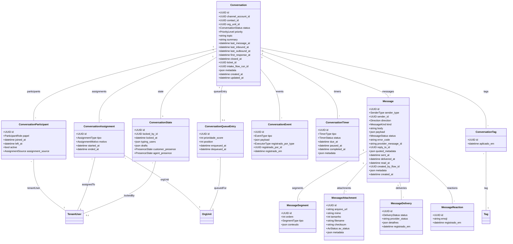

# Módulo `messaging`

## Objetivo
Orquestrar todo o fluxo de conversas omnichannel em tempo real: criação, participantes, mensagens, anexos, status, eventos e integrações com roteamento, automação e análise.

## Responsabilidades
- Criar e manter conversas multi-tenant vinculadas a contas de canal e contatos.
- Registrar participantes (agentes, bots, observadores) com papéis e histórico.
- Persistir mensagens inbound/outbound com payload estruturado, anexos e metadados.
- Controlar status da conversa (ativa, aguardando, encerrada, arquivada) e métricas (última interação, tempo de espera).
- Emitir eventos em tempo real (Channels) e manter histórico para auditoria.
- Integrar com módulos de tickets, automação e analytics (SLAs, tags, segmentação).

## Entidades

### Entidade `conversation`

| Campo | Tipo | Obrigatório | Índice | Notas |
| --- | --- | --- | --- | --- |
| `id` | UUID | Sim | PK | |
| `tenant_id` | FK -> tenant | Sim | IDX | |
| `channel_account_id` | FK -> channel_account | Sim | IDX | Determina origem.
| `contact_id` | FK -> contact | Sim | IDX | |
| `org_unit_id` | FK -> org_unit | Não | IDX | Unidade responsável atual.
| `status` | Enum(active, pending, waiting, closed, archived) | Sim | | |
| `priority` | Enum(low, normal, high, urgent) | Sim | | |
| `topic` | String | Não | | |
| `summary` | Text | Não | | Gerado por agente/AI.
| `last_message_at` | DateTime | Não | | |
| `last_inbound_at` | DateTime | Não | | |
| `last_outbound_at` | DateTime | Não | | |
| `first_response_at` | DateTime | Não | | SLA FRT.
| `closed_at` | DateTime | Não | | |
| `ticket_id` | FK -> ticket | Não | | Conversa vinculada a ticket.
| `intake_flow_run_id` | FK -> automation_run | Não | | Execução intake inicial.
| `metadata` | JSONB | Não | | Qualquer extra (CSAT, tags AI).
| `created_at` | DateTime | Sim | | |
| `updated_at` | DateTime | Sim | | |

### Entidade `conversation_participant`

| Campo | Tipo | Obrigatório | Índice | Notas |
| --- | --- | --- | --- | --- |
| `id` | UUID | Sim | PK | |
| `conversation_id` | FK -> conversation | Sim | IDX | |
| `tenant_user_id` | FK -> tenant_user | Sim | IDX | |
| `papel` | Enum(owner, collaborator, observer, bot) | Sim | | |
| `joined_at` | DateTime | Sim | | |
| `left_at` | DateTime | Não | | |
| `active` | Bool | Sim | | |
| `assignment_source` | Enum(manual, auto, escalation, automation) | Sim | | |

### Entidade `conversation_assignment`

| Campo | Tipo | Obrigatório | Índice | Notas |
| --- | --- | --- | --- | --- |
| `id` | UUID | Sim | PK | |
| `conversation_id` | FK -> conversation | Sim | IDX | |
| `assigned_to_id` | FK -> tenant_user | Sim | IDX | |
| `org_unit_id` | FK -> org_unit | Sim | IDX | Unidade da atribuição.
| `tipo` | Enum(primary, shadow, escalation) | Sim | | |
| `motivo` | Enum(manual, auto, reassign, shift_change, overflow) | Sim | | |
| `started_at` | DateTime | Sim | | |
| `ended_at` | DateTime | Não | | |

### Entidade `conversation_state`

| Campo | Tipo | Obrigatório | Índice | Notas |
| --- | --- | --- | --- | --- |
| `id` | UUID | Sim | PK | |
| `conversation_id` | FK -> conversation | Sim | Índice único | |
| `locked_by_id` | FK -> tenant_user | Não | | Para bloquear edição simultânea.
| `locked_at` | DateTime | Não | | |
| `typing_users` | JSONB | Não | | Lista de usuários digitando.
| `drafts` | JSONB | Não | | Rascunhos por participante.
| `customer_presence` | Enum(online, offline, typing) | Não | | |
| `agent_presence` | Enum(online, offline) | Não | | |

### Entidade `message`

| Campo | Tipo | Obrigatório | Índice | Notas |
| --- | --- | --- | --- | --- |
| `id` | UUID | Sim | PK | |
| `conversation_id` | FK -> conversation | Sim | IDX | |
| `sender_type` | Enum(contact, tenant_user, system, bot) | Sim | | |
| `sender_id` | UUID | Sim | IDX | Mapeia para contact/tenant_user/bot.
| `direction` | Enum(inbound, outbound, internal) | Sim | | |
| `kind` | Enum(text, media, template, reaction, system_notice) | Sim | | |
| `body` | Text | Não | | Conteúdo texto/HTML.
| `payload` | JSONB | Sim | | Estrutura normalizada (buttons, template params).
| `status` | Enum(pending, sent, delivered, read, failed, queued) | Sim | | |
| `error_code` | String | Não | | Erro retorno provedor.
| `provider_message_id` | String | Não | IDX | ID externo.
| `reply_to_id` | FK -> message | Não | IDX | Thread/resposta.
| `quoted_metadata` | JSONB | Não | | Snapshot mensagem citada.
| `sent_at` | DateTime | Não | | Horário de envio.
| `delivered_at` | DateTime | Não | | |
| `read_at` | DateTime | Não | | |
| `created_by_flow_id` | FK -> automation_flow | Não | | Automatização originadora.
| `metadata` | JSONB | Não | | Ex.: linguagem detectada.
| `created_at` | DateTime | Sim | | |

### Entidade `message_segment`

| Campo | Tipo | Obrigatório | Índice | Notas |
| --- | --- | --- | --- | --- |
| `id` | UUID | Sim | PK | |
| `message_id` | FK -> message | Sim | IDX | |
| `ordem` | Integer | Sim | | Segmentos de template/botões.
| `tipo` | Enum(text, image, file, button, quick_reply, rich_link) | Sim | | |
| `conteudo` | JSONB | Sim | | Dados estruturados.

### Entidade `message_attachment`

| Campo | Tipo | Obrigatório | Índice | Notas |
| --- | --- | --- | --- | --- |
| `id` | UUID | Sim | PK | |
| `message_id` | FK -> message | Sim | IDX | |
| `arquivo_url` | String | Sim | | Presigned URL.
| `mime` | String | Sim | | |
| `tamanho` | Integer | Sim | | |
| `filename` | String | Não | | |
| `checksum` | String | Não | | |
| `av_status` | Enum(pending, scanned, infected, failed) | Sim | | Estado antivírus.
| `metadata` | JSONB | Não | | |

### Entidade `message_delivery`

| Campo | Tipo | Obrigatório | Índice | Notas |
| --- | --- | --- | --- | --- |
| `id` | UUID | Sim | PK | |
| `message_id` | FK -> message | Sim | IDX | |
| `status` | Enum(pending, sent, delivered, failed, read) | Sim | | |
| `provider_status` | String | Não | | Código textual provedor.
| `detalhes` | JSONB | Não | | Dados extras (ex.: device info).
| `registrado_em` | DateTime | Sim | | |

### Entidade `message_reaction`

| Campo | Tipo | Obrigatório | Índice | Notas |
| --- | --- | --- | --- | --- |
| `id` | UUID | Sim | PK | |
| `message_id` | FK -> message | Sim | IDX | |
| `tenant_user_id` | FK -> tenant_user | Sim | IDX | |
| `emoji` | String | Sim | | |
| `registrado_em` | DateTime | Sim | | |

### Entidade `conversation_event`

| Campo | Tipo | Obrigatório | Índice | Notas |
| --- | --- | --- | --- | --- |
| `id` | UUID | Sim | PK | |
| `conversation_id` | FK -> conversation | Sim | IDX | |
| `tipo` | Enum(status_changed, assignment_changed, tag_added, tag_removed, message_sent, note_added, sla_updated) | Sim | | |
| `payload` | JSONB | Sim | | Dados específicos do evento.
| `registrado_por_type` | Enum(system, user, automation) | Sim | | |
| `registrado_por_id` | UUID | Não | | |
| `registrado_em` | DateTime | Sim | | |

### Entidade `conversation_timer`

| Campo | Tipo | Obrigatório | Índice | Notas |
| --- | --- | --- | --- | --- |
| `id` | UUID | Sim | PK | |
| `conversation_id` | FK -> conversation | Sim | IDX | |
| `tipo` | Enum(response_sla, resolution_sla, idle_autoclose, follow_up) | Sim | | |
| `status` | Enum(active, paused, completed, canceled) | Sim | | |
| `due_at` | DateTime | Sim | | |
| `paused_at` | DateTime | Não | | |
| `completed_at` | DateTime | Não | | |
| `metadata` | JSONB | Não | | |

### Entidade `conversation_queue_entry`

| Campo | Tipo | Obrigatório | Índice | Notas |
| --- | --- | --- | --- | --- |
| `id` | UUID | Sim | PK | |
| `conversation_id` | FK -> conversation | Sim | IDX único | |
| `org_unit_id` | FK -> org_unit | Sim | IDX | Unidade responsável.
| `queue_rule_id` | FK -> queue_rule | Não | | Regra que encaminhou.
| `prioridade_score` | Integer | Sim | | Para ordenação.
| `position` | Integer | Não | | Snapshot da posição.
| `enqueued_at` | DateTime | Sim | | |
| `dequeued_at` | DateTime | Não | | |

### Entidade `conversation_tag`

| Campo | Tipo | Obrigatório | Índice | Notas |
| --- | --- | --- | --- | --- |
| `id` | UUID | Sim | PK | |
| `conversation_id` | FK -> conversation | Sim | IDX | |
| `tag_id` | FK -> tag | Sim | IDX | |
| `aplicado_por_id` | FK -> tenant_user | Não | | |
| `aplicado_em` | DateTime | Sim | | |

> Nota: `conversation_tag` pode ser substituída por `tag_link` (escopo conversation) para reutilização; manter alias para otimizar queries.

## Diagrama de Classes

## Regras de Negócio
- Criar conversa exige `channel_account_id`, `contact_id` e status inicial `pending` ou `active`.
- `org_unit_id` pode ser definido via `channel_account.org_unit_id` ou regras de roteamento; atualização gera evento `assignment_changed`.
- `conversation_participant` com `papel = owner` deve ser único por conversa (último assignment ativo).
- Mensagens outbound devem passar por `channel_capability`; se feature não habilitada, rejeitar envio.
- `conversation_state.locked_by_id` evita colisão de respostas; locks expiram automaticamente após timeout configurável.
- `message.payload` deve seguir schema por tipo (template, media, buttons); validações nos serializers.
- `message_delivery` registra histórico multi-status; `status` em `message` reflete o estágio mais avançado.
- `conversation_timer.tipo = response_sla` vincula-se ao respectivo `sla_event`; atualização sincronizada.
- `conversation_queue_entry` existe apenas enquanto a conversa aguarda atribuição; remoção ao atribuir agente.
- `conversation_tag` deve espelhar `tag_link` (manter sincronização via triggers/serializers).

## Eventos & Integração
- Eventos Channels: `conversation.updated`, `message.created`, `typing.started`, `typing.stopped`.
- Integração com `tickets`: criação automática quando `conversation` gera `ticket_id` (sync bidirecional).
- Automação: hooks para `conversation_event` alimentam regras (transbordo, tag automática, follow-up).
- Analytics: snapshots de mensagens e tempos são enviados para `analytics_snapshot` agregações.

## Segurança & LGPD
- Conteúdo de mensagens pode conter PII; criptografar payload sensível e limitar logs.
- Logs e eventos de auditoria (ex.: transferência, encerramento) enviados ao `audit_log`.
- Controle de acesso baseado em `org_unit` e permissões (visualizar apenas conversas autorizadas).
- Implementar retenção configurável por canal (ex.: apagar conversas após X dias se exigido).

## Testes Recomendados
- Unitários: serializers de mensagem (template, media), regras de assignment, timers SLA.
- Integração: ingestão de webhook → criação conversa → roteamento fila → assignment.
- E2E: simular fluxo completo com Channels/WebSocket, incluindo eventos de typing e reactions.
- Performance: stress test para `message`, `message_delivery` e updates em `conversation_state` (uso Redis + Channels).

## Backlog de Evolução
- Sugestão de respostas via IA (resumo, tom, next best action).
- Suporte a threads dentro da conversa (respostas encadeadas multi-nível).
- Visual timeline combinando mensagens, notas, eventos e tickets em uma única view.
- UI para monitoramento em tempo real de fila (`conversation_queue_entry`) por org unit.

## Assunções
- `conversation_queue_entry` é gerenciado pelo motor de roteamento (Celery + Redis) e sincronizado com UI.
- `conversation_state` pode ser armazenado parcialmente em cache (Redis) mas persiste para fallback.
- Templates de mensagem são validados no momento do envio; transcrição/IA ocorre em workers assíncronos.
