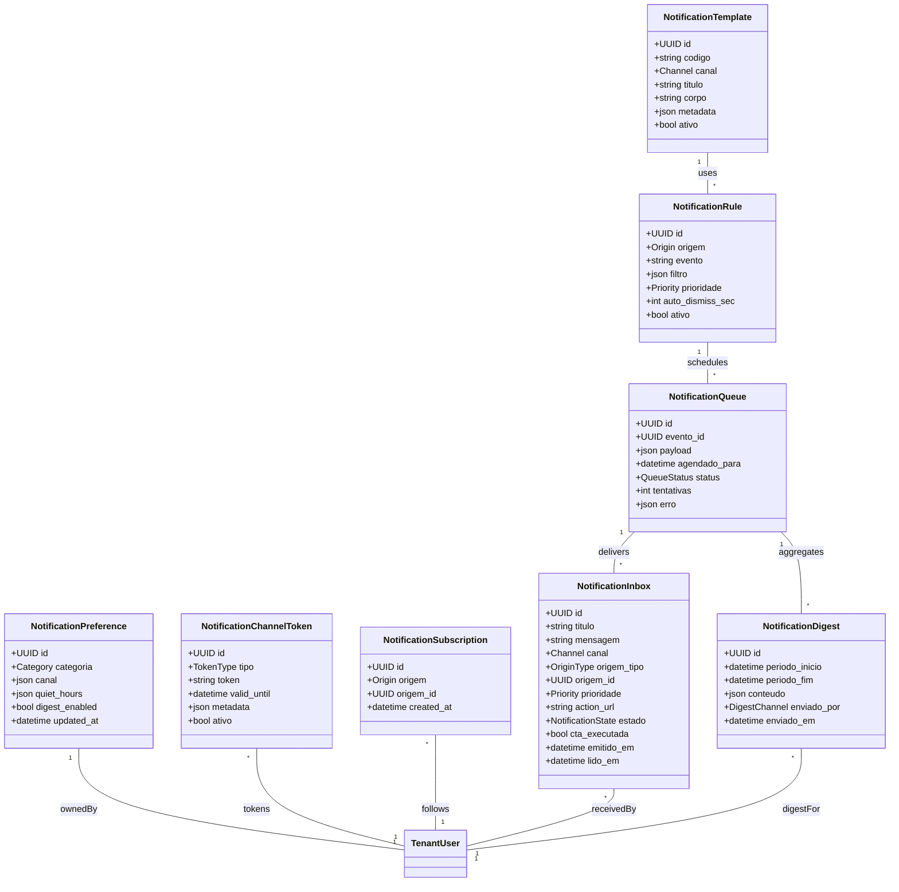

# Módulo `notifications`

## Objetivo
Entregar notificações inteligentes e acionáveis para agentes e colaboradores, consolidando eventos relevantes do sistema (conversas, tickets, automations, gamificação, internal chat) em múltiplos canais (in-app, push, e-mail, internal chat, SMS opcional) com controle de preferências e context-aware throttling.

## Responsabilidades
- Registrar preferências de notificação por usuário, canal, horário e tipo de evento.
- Normalizar eventos recebidos de outros módulos e decidir (via regras) o melhor momento e canal para notificar.
- Gerar notificações in-app (toast/badge), push (web/mobile), e-mail e optionally internal chat/bot.
- Evitar ruído aplicando dedupe, agregação e janelas de silêncio (quiet hours) configuráveis.
- Fornecer histórico e estado (lida, fixada, arquivada) com links rápidos para o contexto.
- Permitir notificações “smart” (ex.: eventos críticos replicados em múltiplos canais, lembretes escalonados).

## Entidades

### Entidade `notification_preference`

| Campo | Tipo | Obrigatório | Índice | Notas |
| --- | --- | --- | --- | --- |
| `id` | UUID | Sim | PK | |
| `tenant_user_id` | FK -> tenant_user | Sim | Único (por categoria) | |
| `categoria` | Enum(conversation, ticket, SLA, automation, analytics, gamification, internal_chat, system) | Sim | | |
| `canal` | JSONB | Sim | | Ex.: `{ "in_app": true, "push": true, "email": false }`.
| `quiet_hours` | JSONB | Não | | Intervalos de silêncio (ex.: `{ "start": "22:00", "end": "07:00", "timezone": "America/Sao_Paulo" }`).
| `digest_enabled` | Bool | Sim | | Receber resumos.
| `updated_at` | DateTime | Sim | | |

### Entidade `notification_template`

| Campo | Tipo | Obrigatório | Índice | Notas |
| --- | --- | --- | --- | --- |
| `id` | UUID | Sim | PK | |
| `tenant_id` | FK -> tenant | Sim | IDX | |
| `codigo` | String | Sim | Único | Ex.: `ticket_assigned`, `sla_warning`.
| `canal` | Enum(in_app, push, email, sms, chat_bot) | Sim | | |
| `titulo` | String | Sim | | |
| `corpo` | Text | Sim | | Suporta placeholders `{{conversation_id}}`.
| `metadata` | JSONB | Não | | Config extra (prioridade, CTA).
| `ativo` | Bool | Sim | | |

### Entidade `notification_rule`

| Campo | Tipo | Obrigatório | Índice | Notas |
| --- | --- | --- | --- | --- |
| `id` | UUID | Sim | PK | |
| `tenant_id` | FK -> tenant | Sim | IDX | |
| `origem` | Enum(conversation, ticket, automation, analytics_alert, gamification, internal_chat, system) | Sim | | |
| `evento` | String | Sim | | Ex.: `conversation.assigned`, `ticket.sla_warning`.
| `filtro` | JSONB | Não | | Ex.: `{"org_unit": "support"}`.
| `template_id` | FK -> notification_template | Sim | | |
| `prioridade` | Enum(low, normal, high, urgent) | Sim | | |
| `auto_dismiss_sec` | Integer | Não | | In-app auto close.
| `ativo` | Bool | Sim | | |

### Entidade `notification_inbox`

| Campo | Tipo | Obrigatório | Índice | Notas |
| --- | --- | --- | --- | --- |
| `id` | UUID | Sim | PK | |
| `tenant_user_id` | FK -> tenant_user | Sim | IDX | |
| `titulo` | String | Sim | | |
| `mensagem` | Text | Sim | | Conteúdo renderizado.
| `canal` | Enum(in_app, push, email, chat_bot) | Sim | | |
| `origem_tipo` | Enum(conversation, ticket, automation_run, analytics_alert, gamification_event, internal_chat_message, system) | Sim | | |
| `origem_id` | UUID | Sim | | |
| `prioridade` | Enum(low, normal, high, urgent) | Sim | | |
| `action_url` | String | Não | | Deep link para app/web.
| `estado` | Enum(unread, read, pinned, archived, dismissed) | Sim | IDX | |
| `cta_executada` | Bool | Sim | | Se usuário clicou.
| `emitido_em` | DateTime | Sim | | |
| `lido_em` | DateTime | Não | | |

### Entidade `notification_digest`

| Campo | Tipo | Obrigatório | Índice | Notas |
| --- | --- | --- | --- | --- |
| `id` | UUID | Sim | PK | |
| `tenant_user_id` | FK -> tenant_user | Sim | IDX | |
| `periodo_inicio` | DateTime | Sim | | |
| `periodo_fim` | DateTime | Sim | | |
| `conteudo` | JSONB | Sim | | Lista de notificações agregadas.
| `enviado_por` | Enum(email, push, chat_bot) | Sim | | |
| `enviado_em` | DateTime | Sim | | |

### Entidade `notification_channel_token`

| Campo | Tipo | Obrigatório | Índice | Notas |
| --- | --- | --- | --- | --- |
| `id` | UUID | Sim | PK | |
| `tenant_user_id` | FK -> tenant_user | Sim | IDX | |
| `tipo` | Enum(push_browser, push_mobile, email, sms, chat_bot) | Sim | | |
| `token` | String | Sim | IDX | Device token / email hashed.
| `valid_until` | DateTime | Não | | |
| `metadata` | JSONB | Não | | Dispositivo, plataforma.
| `ativo` | Bool | Sim | | |

### Entidade `notification_queue`

| Campo | Tipo | Obrigatório | Índice | Notas |
| --- | --- | --- | --- | --- |
| `id` | UUID | Sim | PK | |
| `rule_id` | FK -> notification_rule | Sim | IDX | |
| `tenant_user_id` | FK -> tenant_user | Sim | IDX | |
| `evento_id` | UUID | Sim | | Ref. ao evento de domínio.
| `payload` | JSONB | Sim | | Dados prontos para renderização.
| `agendado_para` | DateTime | Não | | Delay/quiet hours.
| `status` | Enum(pending, sending, sent, failed, canceled) | Sim | | |
| `tentativas` | Integer | Sim | | Retries.
| `erro` | JSONB | Não | | Detalhes falha.

### Entidade `notification_subscription`

| Campo | Tipo | Obrigatório | Índice | Notas |
| --- | --- | --- | --- | --- |
| `id` | UUID | Sim | PK | |
| `tenant_user_id` | FK -> tenant_user | Sim | IDX | |
| `origem` | Enum(ticket, conversation, automation, analytics_alert, gamification_challenge, internal_chat_channel) | Sim | | Subscrições específicas (seguir item).
| `origem_id` | UUID | Sim | | |
| `created_at` | DateTime | Sim | | |

## Diagrama de Classes

## Regras de Negócio
- Preferências por categoria/canal são aplicadas antes de enfileirar a notificação; se canal e quiet hours bloquearem, a notificação é reagendada ou descartada.
- Eventos críticos (SLA breach, ticket reassigned, analytics alert) ignoram quiet hours apenas se configurado (`prioridade = urgent`).
- Notificações in-app são deduplicadas caso múltiplos eventos similares ocorram em curto período (dedupe window configurável).
- Feedbacks anônimos (gamification) são enviados sem revelar o autor; notificações mostram apenas “Colega enviou um kudos”.
- Subscrições (`notification_subscription`) permitem que agentes sigam ticket/conversa específica e sejam notificados de updates.
- Digests diários/semanais consolidam eventos de baixa prioridade, evitando spam; preferências controlam ativação.
- Push/email falho é re-tentado até `tentativas` limite; depois gera entrada em `notification_queue` com status `failed` e alerta para suporte.
- In-app badges (contador) atualizados em tempo real; desktop/mobile usam service worker para push quando permitido.

## Momentos-chave para Notificações
1. **Conversation Intake**: agente recebedor (ou watchers) quando conversa é atribuída/transferida, especialmente se urgente.
2. **SLA Warning/Breach**: responsáveis e supervisores recebem alerta vários minutos antes do prazo e no momento da violação.
3. **Ticket Assignment/Status Change**: agente atribuído, supervisores e watchers configurados via `notification_subscription`.
4. **Ticket Reopened/Customer Reply**: responsável recebe push/email fora do horário comercial (se permitir) para evitar espera.
5. **Automation Failure**: responsáveis pelo fluxo (owners) e equipe de suporte recebem alerta com contexto e link para run.
6. **Analytics Alert**: quando KPI excede threshold (ex.: backlog alto), equipe relevante é avisada com insight e CTA.
7. **Gamification Feedback**: agente notificado quando receber kudos (anônimo) ou avaliação de cliente (não anônima) com resumo.
8. **Internal Chat Mentions/Stage Requests**: agente/papel específico recebe in-app/push quando mencionado ou quando convidado a falar em stage.
9. **Knowledge Portal Updates**: autores/revisores e org_units inscritos recebem notificação ao publicar/revisar artigo.
10. **System Maintenance/Incidents**: broadcast a todos/roles específicos com instruções e links.

## Eventos & Integração
- Consome eventos dos módulos (via `analytics_event`/bus interno) e aplica regras (`notification_rule`).
- `automation_flow` pode disparar notificações custom (ex.: “ticket aguardando aprovação”) via API.
- Integra com push providers (FCM/APNs), e-mail (SES/SendGrid), SMS opcional (Twilio) e internal chat bot.
- Exposição API: `POST /notifications/send` (admin/automation), `GET /notifications/inbox`, `PATCH /notifications/{id}/read`, `POST /notifications/preferences`.
- UI Ionic exibe inbox em tempo real; ícone de sino mostra contador badges.

## Segurança & LGPD
- Conteúdo sensível mascarado conforme categoria; e-mails não exibem dados de cliente se política restringir.
- Guardar logs de envio (tentativas, canais) e permitir export de histórico auditável.
- Respeitar opt-in/out e quiet hours por usuário/tenant.
- Dados de push tokens criptografados em repouso (pgcrypto/KMS).

## Testes Recomendados
- Unitários para regras e preferências (quiet hours, dedupe, prioridade).
- Integração: fluxo ticket reassigned → notificação multi canal → marcar como lida.
- E2E: agente recebe trio de alertas (SLA, gamification, analytics) e verifica estado no app.
- Performance: stress test com 1000 notificações/minuto garantindo ordenação e dedupe.

## Backlog de Evolução
- Notificações inteligentes baseadas em IA (priorização pelo contexto, resumo multi-evento).
- Snooze pós-clique (reminder se ticket não resolvido em X min).
- Inbox compartilhada por time/supervisão com filtro colaborativo.
- Integração com ferramentas externas (Slack/MS Teams) via webhooks custom.

## Assunções
- In-app e push são os canais padrão; SMS opcional por tenant.
- Eventos críticos podem sobrepor quiet hours mediante configuração explícita.
- Digest diário resumido por tenant; usuários podem pular digest para preferir real-time.
