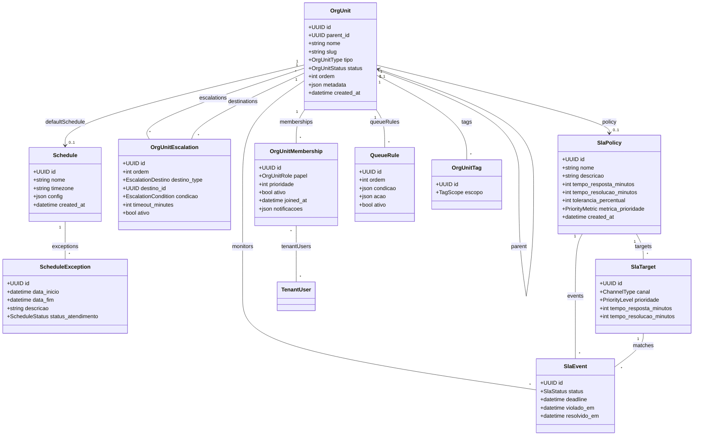

# Módulo `organizations`

## Objetivo
Representar unidades organizacionais dos tenants (departamentos, filas, squads) como um único conceito flexível, controlando memberships, SLAs, agendas e regras de roteamento.

## Responsabilidades
- Cadastrar unidades organizacionais (`org_unit`) com hierarquia opcional, tipos distintos e políticas próprias.
- Gerenciar participação de usuários em cada unidade com papéis, prioridades e preferências.
- Controlar escalonamentos e transbordos entre unidades ou papéis específicos.
- Definir agendas de atendimento, exceções (feriados, plantões) e políticas de SLA.
- Disponibilizar regras de roteamento (filas) que alimentam os módulos de `messaging`, `tickets` e `automation`.

## Entidades

### Entidade `org_unit`

| Campo | Tipo | Obrigatório | Índice | Notas |
| --- | --- | --- | --- | --- |
| `id` | UUID | Sim | PK | |
| `tenant_id` | FK -> tenant | Sim | IDX | |
| `parent_id` | FK -> org_unit | Não | IDX | Hierarquia (ex.: Comercial > Pré-vendas).
| `nome` | String(120) | Sim | | |
| `slug` | String | Sim | Único (tenant, slug) | |
| `descricao` | Text | Não | | |
| `tipo` | Enum(department, squad, queue, project) | Sim | | Determina comportamento padrão.
| `status` | Enum(active, archived) | Sim | | |
| `sla_policy_id` | FK -> sla_policy | Não | | Política padrão da unidade.
| `schedule_id` | FK -> schedule | Não | | Agenda padrão de atendimento.
| `canal_padrao_id` | FK -> channel_account | Não | | Contato principal.
| `ordem` | Integer | Não | IDX | Ordenação custom.
| `metadata` | JSONB | Não | | Campos específicos por tipo.
| `created_at` | DateTime | Sim | | |

### Entidade `org_unit_membership`

| Campo | Tipo | Obrigatório | Índice | Notas |
| --- | --- | --- | --- | --- |
| `id` | UUID | Sim | PK | |
| `org_unit_id` | FK -> org_unit | Sim | IDX | |
| `tenant_user_id` | FK -> tenant_user | Sim | IDX | |
| `papel` | Enum(owner, leader, member, observer) | Sim | | |
| `prioridade` | Integer | Não | | Distribuição ponderada.
| `ativo` | Bool | Sim | | |
| `joined_at` | DateTime | Sim | | |
| `notificacoes` | JSONB | Não | | Preferências por unidade.

### Entidade `org_unit_escalation`

| Campo | Tipo | Obrigatório | Índice | Notas |
| --- | --- | --- | --- | --- |
| `id` | UUID | Sim | PK | |
| `org_unit_id` | FK -> org_unit | Sim | IDX | |
| `ordem` | Integer | Sim | | Sequência do fluxo de escalonamento.
| `destino_type` | Enum(org_unit, role) | Sim | | Destino do transbordo.
| `destino_id` | UUID | Sim | | Referência polimórfica.
| `condicao` | Enum(sla_violation, backlog, manual) | Sim | | |
| `timeout_minutes` | Integer | Não | | Tempo antes de aplicar regra.
| `ativo` | Bool | Sim | | |

### Entidade `schedule`

| Campo | Tipo | Obrigatório | Índice | Notas |
| --- | --- | --- | --- | --- |
| `id` | UUID | Sim | PK | |
| `tenant_id` | FK -> tenant | Sim | IDX | |
| `nome` | String | Sim | | Ex.: “Horário Comercial BR”.
| `timezone` | String | Sim | | |
| `config` | JSONB | Sim | | Horários por dia da semana.
| `created_at` | DateTime | Sim | | |

### Entidade `schedule_exception`

| Campo | Tipo | Obrigatório | Índice | Notas |
| --- | --- | --- | --- | --- |
| `id` | UUID | Sim | PK | |
| `schedule_id` | FK -> schedule | Sim | IDX | |
| `data_inicio` | DateTime | Sim | | |
| `data_fim` | DateTime | Sim | | |
| `descricao` | String | Não | | Ex.: feriado, manutenção.
| `status_atendimento` | Enum(aberto, fechado, parcial) | Sim | | |

### Entidade `sla_policy`

| Campo | Tipo | Obrigatório | Índice | Notas |
| --- | --- | --- | --- | --- |
| `id` | UUID | Sim | PK | |
| `tenant_id` | FK -> tenant | Sim | IDX | |
| `nome` | String | Sim | | |
| `descricao` | Text | Não | | |
| `tempo_resposta_minutos` | Integer | Sim | | Prazo para 1ª resposta.
| `tempo_resolucao_minutos` | Integer | Sim | | Prazo para conclusão.
| `horario_trabalho_id` | FK -> schedule | Não | | Sobrepõe agenda padrão.
| `tolerancia_percentual` | Integer | Não | | Margem antes do transbordo.
| `metrica_prioridade` | Enum(normal, urgente, vip) | Sim | | |
| `created_at` | DateTime | Sim | | |

### Entidade `sla_target`

| Campo | Tipo | Obrigatório | Índice | Notas |
| --- | --- | --- | --- | --- |
| `id` | UUID | Sim | PK | |
| `sla_policy_id` | FK -> sla_policy | Sim | IDX | |
| `canal` | Enum(whatsapp, telegram, email, webchat, interno) | Sim | | |
| `prioridade` | Enum(baixa, normal, alta, urgente) | Sim | | |
| `tempo_resposta_minutos` | Integer | Sim | | |
| `tempo_resolucao_minutos` | Integer | Sim | | |

### Entidade `sla_event`

| Campo | Tipo | Obrigatório | Índice | Notas |
| --- | --- | --- | --- | --- |
| `id` | UUID | Sim | PK | |
| `tenant_id` | FK -> tenant | Sim | IDX | |
| `org_unit_id` | FK -> org_unit | Não | IDX | Unidade responsável.
| `alvo_type` | Enum(conversation, ticket) | Sim | IDX composto (alvo_type, alvo_id).
| `alvo_id` | UUID | Sim | | |
| `sla_policy_id` | FK -> sla_policy | Sim | | |
| `sla_target_id` | FK -> sla_target | Não | | Ajuste por canal/prioridade.
| `status` | Enum(pending, warning, breached, resolved) | Sim | | |
| `deadline` | DateTime | Sim | | |
| `violado_em` | DateTime | Não | | |
| `resolvido_em` | DateTime | Não | | |
| `responsavel_id` | FK -> tenant_user | Não | | Último responsável.

### Entidade `queue_rule`

| Campo | Tipo | Obrigatório | Índice | Notas |
| --- | --- | --- | --- | --- |
| `id` | UUID | Sim | PK | |
| `org_unit_id` | FK -> org_unit | Sim | IDX | |
| `ordem` | Integer | Sim | | Prioridade de avaliação.
| `condicao` | JSONB | Sim | | Ex.: tags, canal, horário.
| `acao` | JSONB | Sim | | Ex.: roteamento, prioridade, escalonamento.
| `ativo` | Bool | Sim | | |

### Entidade `org_unit_tag`

| Campo | Tipo | Obrigatório | Índice | Notas |
| --- | --- | --- | --- | --- |
| `id` | UUID | Sim | PK | |
| `org_unit_id` | FK -> org_unit | Sim | IDX | |
| `tag_id` | FK -> tag | Sim | IDX | |
| `escopo` | Enum(conversation, ticket, contact) | Sim | | Tags sugeridas.

## Diagrama de Classes

## Regras de Negócio
- Cada `org_unit` ativo deve ter ao menos uma `queue_rule` (ou fallback padrão) para receber conversas/tickets.
- `org_unit.tipo` define defaults: `queue` implica distribuição automática; `department` habilita relatórios agregados.
- `org_unit_escalation.destino_type = org_unit` requer que o destino pertença ao mesmo tenant.
- `schedule_exception` com `status_atendimento = fechado` pausa contagem de SLA para unidades associadas.
- `org_unit_membership.prioridade` controla peso na distribuição; ausência → round-robin simples.
- `sla_policy` valida `tempo_resposta_minutos <= tempo_resolucao_minutos`.
- `org_unit_tag` garante unicidade por (`org_unit_id`, `tag_id`, `escopo`).

## Eventos & Integração
- Eventos internos: `org_unit.created`, `org_unit.escalation.triggered`, `sla.event.breached`.
- Atualização de `org_unit` propaga para filtros de RBAC (escopo de papéis).
- Celery tasks recalculam prazos de SLA quando `org_unit` ou `schedule` é alterado.

## Segurança & LGPD
- Apenas papéis com permissão `org_unit.manage` podem criar/editar unidades e SLAs.
- Mudanças críticas geram registro em `audit_log` (módulo `core`).
- Logs de roteamento devem armazenar `org_unit_id` para rastreabilidade.

## Testes Recomendados
- Unitários para cálculo de SLA considerando hierarquia de `org_unit` + `schedule_exception`.
- Integração para escalonamento (`org_unit_escalation` + atualização de `sla_event`).
- Testes de performance em `queue_rule` (uso de índices JSONB).

## Backlog de Evolução
- Construção visual de organograma e filas com drag-and-drop.
- Suporte a unidades temporárias (campanhas) com expiração automática.
- Simulador de impacto ao alterar SLAs/horários.

## Assunções
- `org_unit` atende tanto departamentos formais quanto squads/fias sem distinção extra.
- Métricas agregadas serão consolidadas em `analytics`, usando `org_unit_id` como chave.
