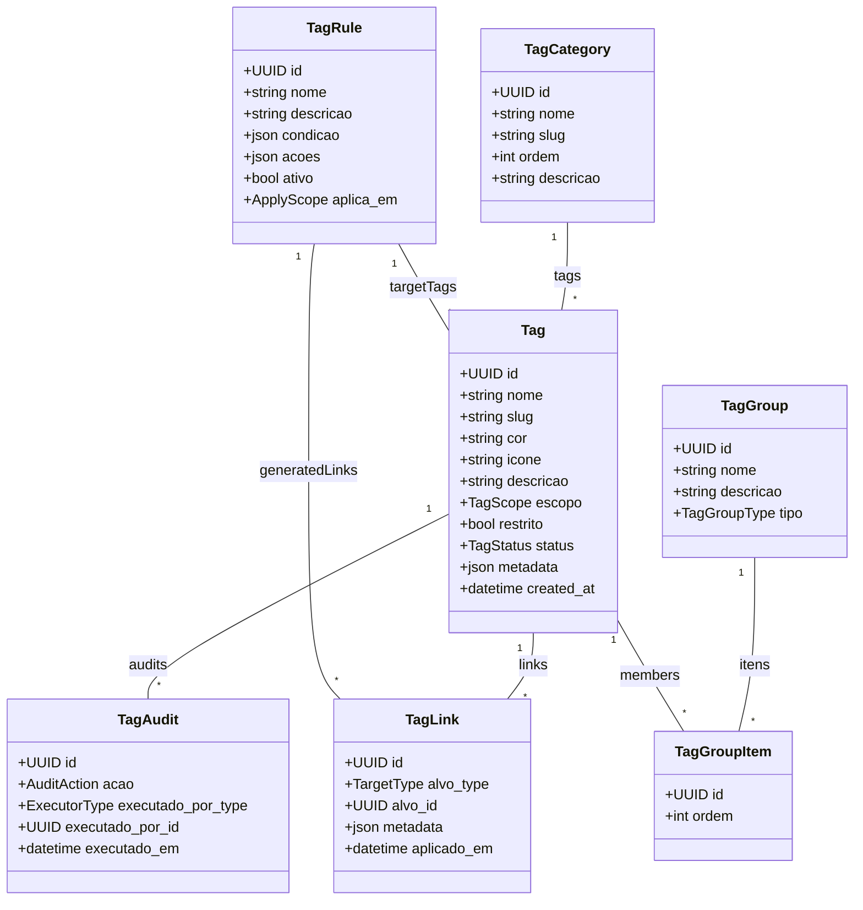

# Módulo `tags`

## Objetivo
Fornecer taxonomia flexível de etiquetas reutilizáveis para classificar contatos, conversas, tickets, artigos de conhecimento e demais entidades, com escopo multi-tenant e governança centralizada.

## Responsabilidades
- Permitir criação e organização de tags por categorias, cores e hierarquia leve.
- Controlar escopo (global, org_unit, canal) e permissões para criação/uso.
- Registrar histórico de aplicação de tags e metadados adicionais.
- Expor APIs consistentes para leitura/escrita de tags por outros módulos.
- Suportar presets e bundles aplicados automaticamente por automações.

## Entidades

### Entidade `tag`

| Campo | Tipo | Obrigatório | Índice | Notas |
| --- | --- | --- | --- | --- |
| `id` | UUID | Sim | PK | |
| `tenant_id` | FK -> tenant | Sim | IDX | |
| `categoria_id` | FK -> tag_category | Não | IDX | Agrupa tags similar.
| `nome` | String(60) | Sim | IDX | Único por categoria.
| `slug` | String | Sim | Único (tenant, slug) | |
| `cor` | String | Não | | Hex + alpha.
| `icone` | String | Não | | Nome de ícone.
| `descricao` | Text | Não | | |
| `escopo` | Enum(global, org_unit, channel, contact, ticket) | Sim | | Limita uso principal.
| `restrito` | Bool | Sim | | Se true, apenas papéis específicos aplicam.
| `status` | Enum(active, hidden, archived) | Sim | | |
| `metadata` | JSONB | Não | | Campos extra.
| `created_at` | DateTime | Sim | | |

### Entidade `tag_category`

| Campo | Tipo | Obrigatório | Índice | Notas |
| --- | --- | --- | --- | --- |
| `id` | UUID | Sim | PK | |
| `tenant_id` | FK -> tenant | Sim | IDX | |
| `nome` | String | Sim | | |
| `slug` | String | Sim | Único (tenant, slug) | |
| `ordem` | Integer | Não | | Ordenação custom.
| `descricao` | Text | Não | | |

### Entidade `tag_group`

| Campo | Tipo | Obrigatório | Índice | Notas |
| --- | --- | --- | --- | --- |
| `id` | UUID | Sim | PK | |
| `tenant_id` | FK -> tenant | Sim | IDX | |
| `nome` | String | Sim | | Conjuntos de tags aplicados juntos.
| `descricao` | Text | Não | | |
| `tipo` | Enum(manual, automation, system) | Sim | | |

### Entidade `tag_group_item`

| Campo | Tipo | Obrigatório | Índice | Notas |
| --- | --- | --- | --- | --- |
| `id` | UUID | Sim | PK | |
| `group_id` | FK -> tag_group | Sim | IDX | |
| `tag_id` | FK -> tag | Sim | IDX | |
| `ordem` | Integer | Não | | |

### Entidade `tag_link`

| Campo | Tipo | Obrigatório | Índice | Notas |
| --- | --- | --- | --- | --- |
| `id` | UUID | Sim | PK | |
| `tag_id` | FK -> tag | Sim | IDX | |
| `alvo_type` | Enum(contact, conversation, ticket, message, knowledge_article, automation_flow, contact_segment) | Sim | IDX composto (tag_id, alvo_type, alvo_id). |
| `alvo_id` | UUID | Sim | | |
| `aplicado_por_id` | FK -> tenant_user | Não | | |
| `aplicado_em` | DateTime | Sim | | |
| `metadata` | JSONB | Não | | Contexto (ex.: automação, manual).

### Entidade `tag_rule`

| Campo | Tipo | Obrigatório | Índice | Notas |
| --- | --- | --- | --- | --- |
| `id` | UUID | Sim | PK | |
| `tenant_id` | FK -> tenant | Sim | IDX | |
| `nome` | String | Sim | | |
| `descricao` | Text | Não | | |
| `condicao` | JSONB | Sim | | DSL de filtros (atributos, canais, SLA).
| `acoes` | JSONB | Sim | | Ex.: aplicar/remover tags, disparar automação.
| `ativo` | Bool | Sim | | |
| `aplica_em` | Enum(conversation, ticket, contact) | Sim | | |

### Entidade `tag_audit`

| Campo | Tipo | Obrigatório | Índice | Notas |
| --- | --- | --- | --- | --- |
| `id` | UUID | Sim | PK | |
| `tenant_id` | FK -> tenant | Sim | IDX | |
| `tag_id` | FK -> tag | Sim | IDX | |
| `alvo_type` | Enum(contact, conversation, ticket, message, knowledge_article) | Sim | | |
| `alvo_id` | UUID | Sim | | |
| `acao` | Enum(added, removed) | Sim | | |
| `executado_por_type` | Enum(user, automation, system) | Sim | | |
| `executado_por_id` | UUID | Não | | |
| `executado_em` | DateTime | Sim | | |

## Diagrama de Classes

## Regras de Negócio
- `tag.slug` deve ser único por tenant; uso de snake-case para links.
- Tags com `escopo = org_unit` só podem ser aplicadas em entidades vinculadas à mesma unidade.
- `tag.restrito = true` exige permissão `tags.manage_restricted` para aplicar/remover.
- `tag_link` garante unicidade por (`tag_id`, `alvo_type`, `alvo_id`).
- `tag_group` do tipo `automation` só pode ser modificado via flows; UI exibe como somente leitura.
- `tag_rule` avaliada pelo motor de automação; múltiplas ações podem aplicar/remover várias tags.
- Auditoria é obrigatória para tags marcadas como `restrito` ou vinculadas a PII.

## Eventos & Integração
- Eventos: `tag.created`, `tag.updated`, `tag.linked`, `tag.unlinked`.
- Automations podem consumir `tag_rule` para aplicar tags automaticamente após gatilhos.
- Exportações (analytics) usam `tag_audit` para reconstruir evolução temporal.

## Segurança & LGPD
- Tags que indicam informações sensíveis (ex.: saúde) devem usar `restrito = true` e exigir justificativa no `metadata`.
- Logs de auditoria são enviados para `audit_log` do core.
- Permissões dedicadas: `tags.manage`, `tags.apply`, `tags.manage_rules`.

## Testes Recomendados
- Unitários para validação de escopo (org_unit/channel) ao aplicar tags.
- Integração cobrindo `tag_rule` + automations disparando tags automáticas.
- Testes de auditoria verificando registros ao aplicar/remover tags restritas.

## Backlog de Evolução
- Suporte a hierarquia profunda (tag pai/filho) com herança opcional.
- Sugestão automática de tags via ML/NLP com feedback dos agentes.
- Dashboard de frequência de tags por canal/org_unit.

## Assunções
- Tags podem ser aplicadas em conversas e tickets simultaneamente; deduplicação fica a cargo de `tag_link`.
- Bundles de tags (`tag_group`) são opcionais, usados principalmente por automações.
- Regras de tags executam no mesmo pipeline de automação (Celery) já existente.
