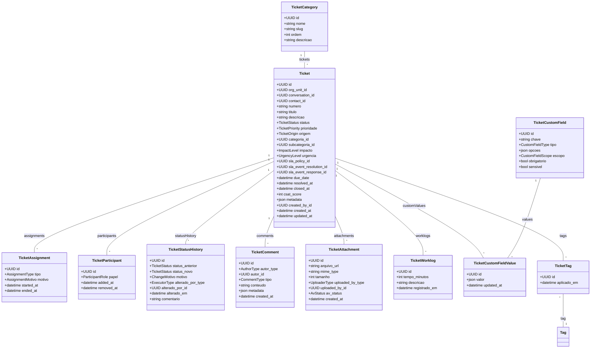

# Módulo `tickets`

## Objetivo
Gerenciar o ciclo de vida de tickets de atendimento/escalamento originados de conversas, e-mail ou solicitações internas, controlando workflow, responsáveis, SLAs, comentários, anexos e integrações com outros módulos.

## Responsabilidades
- Registrar tickets multi-tenant com status, prioridade, origem e vínculo opcional a conversas.
- Controlar atribuições históricas, participações e aprovação de alterações de status.
- Armazenar comentários internos/externos, anexos e worklogs de tempo.
- Integrar com SLAs, filas (`org_unit`), automações e tags para segmentação e relatórios.
- Suportar campos personalizados e integrações com sistemas externos (CRM/ERP).

## Entidades

### Entidade `ticket`

| Campo | Tipo | Obrigatório | Índice | Notas |
| --- | --- | --- | --- | --- |
| `id` | UUID | Sim | PK | |
| `tenant_id` | FK -> tenant | Sim | IDX | |
| `org_unit_id` | FK -> org_unit | Sim | IDX | Unidade responsável.
| `conversation_id` | FK -> conversation | Não | IDX | Link com conversa.
| `contact_id` | FK -> contact | Sim | IDX | Solicitante.
| `numero` | String | Sim | Único (por tenant) | Código amigável (ex.: TK-2024-0001).
| `titulo` | String | Sim | | |
| `descricao` | Text | Não | | |
| `status` | Enum(open, in_progress, waiting_customer, waiting_internal, resolved, closed, canceled) | Sim | | |
| `prioridade` | Enum(low, normal, high, urgent, vip) | Sim | | |
| `origem` | Enum(conversation, email, phone, manual, automation, integration) | Sim | | |
| `categoria_id` | FK -> ticket_category | Não | | |
| `subcategoria_id` | FK -> ticket_category | Não | | |
| `impacto` | Enum(low, medium, high) | Não | | |
| `urgencia` | Enum(low, medium, high) | Não | | |
| `sla_policy_id` | FK -> sla_policy | Não | | Política específica.
| `sla_event_resolution_id` | FK -> sla_event | Não | | SLA de resolução.
| `sla_event_response_id` | FK -> sla_event | Não | | SLA de primeira resposta.
| `due_date` | DateTime | Não | | Prazo prometido.
| `resolved_at` | DateTime | Não | | |
| `closed_at` | DateTime | Não | | |
| `csat_score` | Integer | Não | | Pesquisa de satisfação (1-5).
| `metadata` | JSONB | Não | | Campos adicionais.
| `created_by_id` | FK -> tenant_user | Sim | | Quem abriu (agente interno).
| `created_at` | DateTime | Sim | | |
| `updated_at` | DateTime | Sim | | |

### Entidade `ticket_category`

| Campo | Tipo | Obrigatório | Índice | Notas |
| --- | --- | --- | --- | --- |
| `id` | UUID | Sim | PK | |
| `tenant_id` | FK -> tenant | Sim | IDX | |
| `nome` | String | Sim | | Hierarquia leve.
| `slug` | String | Sim | Único (tenant, slug) | |
| `parent_id` | FK -> ticket_category | Não | | |
| `ordem` | Integer | Não | | |
| `descricao` | Text | Não | | |

### Entidade `ticket_assignment`

| Campo | Tipo | Obrigatório | Índice | Notas |
| --- | --- | --- | --- | --- |
| `id` | UUID | Sim | PK | |
| `ticket_id` | FK -> ticket | Sim | IDX | |
| `assigned_to_id` | FK -> tenant_user | Sim | IDX | |
| `org_unit_id` | FK -> org_unit | Sim | IDX | |
| `tipo` | Enum(owner, collaborator, watcher) | Sim | | |
| `motivo` | Enum(manual, auto, escalation, queue, reassign) | Sim | | |
| `started_at` | DateTime | Sim | | |
| `ended_at` | DateTime | Não | | |

### Entidade `ticket_participant`

| Campo | Tipo | Obrigatório | Índice | Notas |
| --- | --- | --- | --- | --- |
| `id` | UUID | Sim | PK | |
| `ticket_id` | FK -> ticket | Sim | IDX | |
| `tenant_user_id` | FK -> tenant_user | Sim | IDX | |
| `papel` | Enum(requester, assignee, collaborator, observer, reporter) | Sim | | |
| `added_at` | DateTime | Sim | | |
| `removed_at` | DateTime | Não | | |

### Entidade `ticket_status_history`

| Campo | Tipo | Obrigatório | Índice | Notas |
| --- | --- | --- | --- | --- |
| `id` | UUID | Sim | PK | |
| `ticket_id` | FK -> ticket | Sim | IDX | |
| `status_anterior` | Enum(...) | Sim | | |
| `status_novo` | Enum(...) | Sim | | |
| `motivo` | Enum(manual, automation, sla, workflow) | Sim | | |
| `alterado_por_type` | Enum(user, automation, system) | Sim | | |
| `alterado_por_id` | UUID | Não | | |
| `alterado_em` | DateTime | Sim | | |
| `comentario` | Text | Não | | |

### Entidade `ticket_comment`

| Campo | Tipo | Obrigatório | Índice | Notas |
| --- | --- | --- | --- | --- |
| `id` | UUID | Sim | PK | |
| `ticket_id` | FK -> ticket | Sim | IDX | |
| `autor_type` | Enum(tenant_user, contact, automation) | Sim | | |
| `autor_id` | UUID | Sim | | |
| `tipo` | Enum(internal, public, system) | Sim | | |
| `conteudo` | Text | Sim | | |
| `metadata` | JSONB | Não | | Ex.: formatação, citações.
| `created_at` | DateTime | Sim | | |

### Entidade `ticket_attachment`

| Campo | Tipo | Obrigatório | Índice | Notas |
| --- | --- | --- | --- | --- |
| `id` | UUID | Sim | PK | |
| `ticket_id` | FK -> ticket | Sim | IDX | |
| `arquivo_url` | String | Sim | | |
| `mime_type` | String | Sim | | |
| `tamanho` | Integer | Sim | | |
| `uploaded_by_type` | Enum(tenant_user, contact, automation) | Sim | | |
| `uploaded_by_id` | UUID | Sim | | |
| `av_status` | Enum(pending, scanned, infected, failed) | Sim | | |
| `created_at` | DateTime | Sim | | |

### Entidade `ticket_worklog`

| Campo | Tipo | Obrigatório | Índice | Notas |
| --- | --- | --- | --- | --- |
| `id` | UUID | Sim | PK | |
| `ticket_id` | FK -> ticket | Sim | IDX | |
| `tenant_user_id` | FK -> tenant_user | Sim | IDX | |
| `tempo_minutos` | Integer | Sim | | Esforço registrado.
| `descricao` | Text | Não | | |
| `registrado_em` | DateTime | Sim | | |

### Entidade `ticket_custom_field`

| Campo | Tipo | Obrigatório | Índice | Notas |
| --- | --- | --- | --- | --- |
| `id` | UUID | Sim | PK | |
| `tenant_id` | FK -> tenant | Sim | IDX | |
| `chave` | String | Sim | | |
| `tipo` | Enum(string, number, boolean, date, enum, json) | Sim | | |
| `opcoes` | JSONB | Não | | |
| `escopo` | Enum(ticket, ticket_comment) | Sim | | |
| `obrigatorio` | Bool | Sim | | |
| `sensivel` | Bool | Sim | | |

### Entidade `ticket_custom_field_value`

| Campo | Tipo | Obrigatório | Índice | Notas |
| --- | --- | --- | --- | --- |
| `id` | UUID | Sim | PK | |
| `ticket_id` | FK -> ticket | Sim | IDX | |
| `field_id` | FK -> ticket_custom_field | Sim | IDX | |
| `valor` | JSONB | Sim | | Guarda qualquer tipo suportado.
| `updated_at` | DateTime | Sim | | |

### Entidade `ticket_tag`

| Campo | Tipo | Obrigatório | Índice | Notas |
| --- | --- | --- | --- | --- |
| `id` | UUID | Sim | PK | |
| `ticket_id` | FK -> ticket | Sim | IDX | |
| `tag_id` | FK -> tag | Sim | IDX | |
| `aplicado_por_id` | FK -> tenant_user | Não | | |
| `aplicado_em` | DateTime | Sim | | |

> Nota: similar ao módulo messaging, `ticket_tag` pode ser representada por `tag_link` (escopo ticket) para deduplicar lógica.

## Diagrama de Classes

## Regras de Negócio
- `ticket.numero` gerado automaticamente conforme sequências por tenant (configurável em `tenant_setting`).
- Apenas tickets com `status` resolvido podem ser encerrados (`closed_at`); transição controlada por workflow.
- `org_unit_id` define filtros de visibilidade; mudanças geram entrada em `ticket_status_history` ou evento dedicado.
- Atribuição ativa (`ticket_assignment.tipo = owner`) deve ser única; novas atribuições encerram a anterior.
- Comentários `tipo = public` são enviados ao contato (via e-mail/canal) e armazenados no histórico da conversa.
- `ticket_custom_field_value` valida o tipo conforme `ticket_custom_field.tipo` (serializers dedicados).
- Worklogs atualizam horas trabalhadas e alimentam relatórios de produtividade.
- `ticket_tag` sincronizado com `tag_link`; aplicar/remover tags utiliza módulo `tags` e gera `tag_audit`.
- SLA: atualização de status/atribuição deve atualizar `sla_event` associado (via automations/background jobs).

## Eventos & Integração
- Eventos principais: `ticket.created`, `ticket.status.changed`, `ticket.assignment.changed`, `ticket.comment.added`.
- Integração com `automation`: gatilhos para follow-up, escalonamento, notificações.
- Webhooks externos: endpoint `POST /webhooks/tickets` para sincronizar com CRM/ERP.
- Export para analytics: snapshots diários de tickets com status, tempos e worklogs.

## Segurança & LGPD
- Controle de acesso baseado em `org_unit`, roles (`ticket.manage`, `ticket.view_all` etc.).
- Comentários públicos devem ser revisados para remover PII sensível; anexos passam por antivírus.
- Histórico de status e auditoria devem ser imutáveis (no máximo append-only).
- Permitir anonimização de contato mantendo ticket com identificadores genéricos.

## Testes Recomendados
- Unitários: transições de status, validação de custom fields, cálculo de SLA.
- Integração: criação via e-mail → ticket → assignment → comentário público.
- E2E: fluxo completo com automação de escalonamento, avaliação de CSAT e fechamento.
- Performance: listas de tickets com filtros por org_unit, status e tags (uso de índices compostos).

## Backlog de Evolução
- Workflow visual (drag-and-drop) para status e automações por ticket type.
- Integração com calendário para agendar follow-ups e visitas técnicas.
- Satisfação recorrente (CSAT/NPS) com envio automático após fechamento.
- Widgets analíticos em tempo real (tickets por status, backlog por org_unit).

## Assunções
- Tickets podem existir sem conversa associada (ex.: criado manualmente ou via formulário).
- Restrições de visibilidade por `org_unit` substituem conceitos clássicos de fila/departamento.
- `ticket_comment` suporta rich text/markdown; versionamento fica para backlog.
